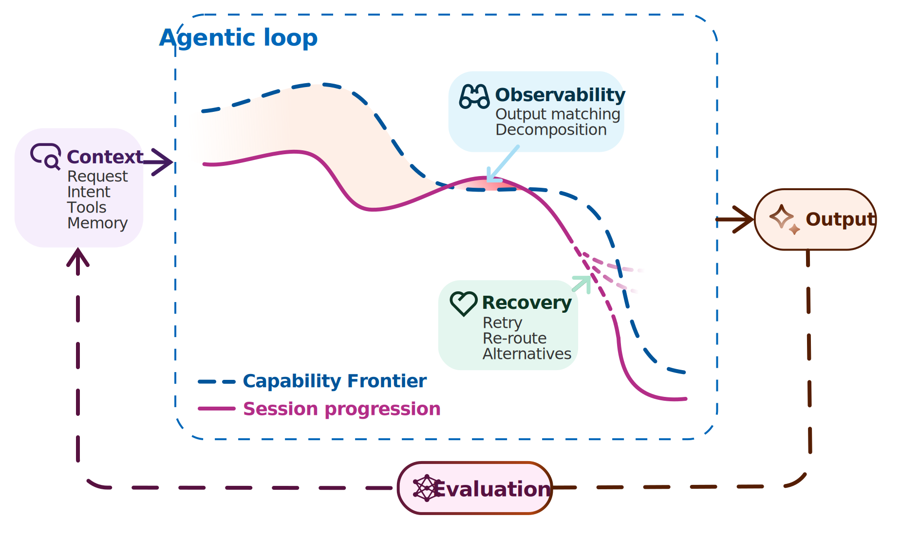

AI Usage
========

For information on Analog Devices Inc. stance on AI usage, please see
:adi:`Responsible AI @ ADI <en/who-we-are/legal-and-risk-oversight/responsible-ai.html>`.

Pull request reviewer
---------------------

The PR Agent is an AI-assisted pull request reviewer integrated into our CI/CD
pipeline. It uses the same tooling already present in the workflow to provide
contextual feedback on pull requests. It combines build checks, static
analysis, style validation, and any other tool that is meaningful for the code
base.
It supports models from multiple vendors, cloud-hosted or self-hosted. The tool
does not approve or merge code; final decisions remain with our reviewers, there
is always a human-in-the-loop.

How it works
~~~~~~~~~~~~

On dispatch, the agent runs in a read-only environment, compiles the code base,
and validates issues and fixes against the actual build output. It then posts
annotated feedback as a GitHub Summary with downloadable git patches and the
agent session.

.. figure:: images/llm-run.svg

   LLM run example.

Usage
~~~~~

Access is available to any user with write access to the ``analogdevicesinc``
GitHub organization. For third-party pull requests, an ADI developer can
request a review on your behalf.

The workflow is included in each repository.

.. tip::

   Adding the ``llm review`` label on the pull request also triggers the llm
   review.

Go to
``github.com/analogdevicesinc/<repository>/actions/workflows/llm.yml``
(for example, :git+documentation:`actions/workflows/llm.yml <actions/workflows/llm.yml+>`
for this repository), click ``Run workflow``, and enter the pull request number,
branch, or Git SHA to review.

.. svg:: images/llm-dispatch.svg

   How to dispatch a LLM run.

Optional inputs include additional prompt instructions and model size selection.
The default prompt is defined in ``.github/workflows/llm.yml`` of each
repository, for example :git+documentation:`.github/workflows/llm.yml`.
The LLM front-end used is `pi.dev <https://pi.dev/>`__.

Once finished, the GitHub Summary contains the review, and the run artifacts
include git patches with suggested changes and a session file to continue
locally. An example run is available
:git+documentation:`here <actions/runs/24085972371+>`.

You can download and apply all patches in one go with :git+doctools:`apply-patches.sh <ci/scripts/apply-patches.sh>`:

.. shell::

   $ apply-patches --repo=documentation 123456789

One liner to install:

.. shell::

   $ curl -fSsL \
     "https://raw.githubusercontent.com/analogdevicesinc/doctools/refs/heads/main/ci/scripts/apply-patches.sh" \
       -o ~/.local/bin/apply-patches.sh && \
     grep -q "/apply-patches.sh" ~/.bashrc || echo "source ~/.local/bin/apply-patches.sh" >> $_ ; . $_

The coding harness
------------------

A coding harness is the software layer that wraps a LLM. It interfaces the
model, manages context usage and compaction, summarizes tools in the context,
and employs observability and recovery strategies.

To ensure quality generation, we build the coding harness to be:

- **Honest**: the agent describes the validation steps it took.
- **Accurate**:  tools to verify implementations and claims.
- **Useful**: fixes are delivered as patches.

During the session, the harness ensures predictability, observes and evaluates
by steering through context injection, and may employ multiple models with
different roles. It steers the model within its own capabilities, while the
context ensures coherence.
Since we collect all collateral generated by the agent, including the
thinking steps, the output can be verified, and in case of issues, can
be traced to pin-point the failing interaction.

Jagged frontier and context
~~~~~~~~~~~~~~~~~~~~~~~~~~~

LLMs are prediction models with attention: Attention constructs weighted graphs
between tokens for every single forward pass. At scale, enables cognitive-like
behaviour emerges. However, models are incredible at creating perfectly
coherent narratives, which may be factually incorrect.

LLMs perform well on tasks within the jagged technology frontier, the uneven
boundary where the model excels at. A study shows that subjects using AI
completed 12.2% more tasks and finished 25.1% faster on tasks inside the model
capabilities frontier, but were 19% less likely to produce correct solutions on
complex tasks
(`Dell'Acqua et al., 2023 <https://www.hbs.edu/ris/Publication%20Files/dell-acqua-et-al-2026-navigating-the-jagged-technological-frontier_5c589c8c-fbb5-458f-b285-c944746cd717.pdf>`__).

Another study shows that performance also degrades over long sessions: frontier
models corrupt roughly 25% of document content by the end of ~20-iteration
workflows, with an extra 3–6% loss per tool call at 2–5× the token cost.
Non-compliance accounts for only ~3% of failures; the dominant causes are tool
misuse and mistake propagation between rounds
(`Laban, 2026 <https://arxiv.org/pdf/2604.15597>`__ pre-print).

To mitigate this nature of the model, we ensure the quality of the context and
tools available for the model, with careful analysis of sessions.
