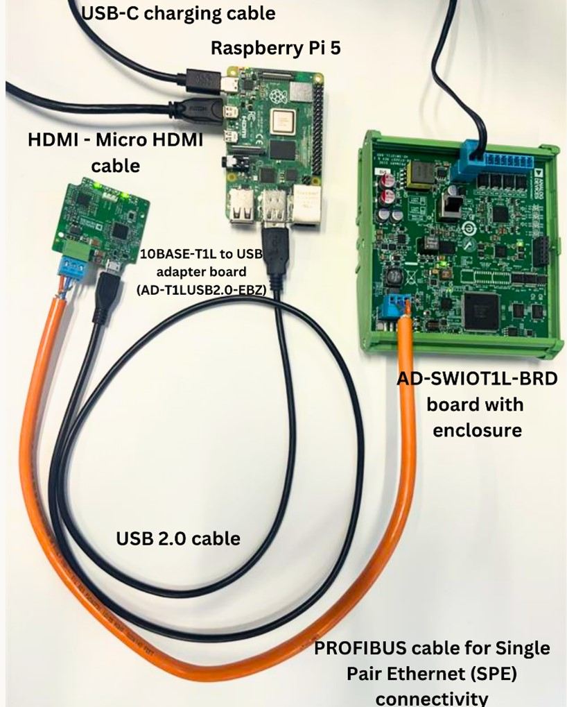
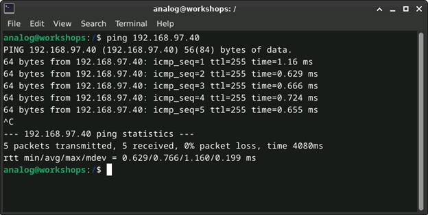

.. collection:: Applied Systems Control
   :subtitle: Overview of industrial control and automation systems.
   :image: industrial.png
   :label: workshop

   Introduction to applied systems control, focusing on practical applications
   and real-world scenarios. Participants will learn about various control
   systems, their design and implementation.

   system-level:
     - .
     - solutions/reference-designs/ad-swiot1l-sl/index

Applied Systems Control Workshop
================================

This workshop provides an introduction to applied systems control, focusing on
practical applications and real-world scenarios. Participants will learn about
various control systems, their design and implementation.

Slide Deck and Booklet
~~~~~~~~~~~~~~~~~~~~~~

Since this tutorial is also designed to be presented as a live, hands-on
workshop, a slide deck is provided here:

.. admonition:: Download

   :download:`Applied Systems Control Slide Deck <../workshops_applied_systems_control/applied_systems_control_workshop.pptx>`

A complete booklet of the hands-on activity is also provided, either as a companion to
following the tutorial yourself:

.. admonition:: Download

   :download:`Applied Systems Control Booklet <../workshops_applied_systems_control/applied_systems_control_workshop_booklet.pdf>`

Theoretical content
~~~~~~~~~~~~~~~~~~~

- Overview of industrial control and automation systems
- Introduction to PWM control
- Introduction to PID control
- AD-SWIOT1L-SL Board Overview

.. image:: industrial.png
   :width: 500
   :align: right

Overview of industrial control and automation systems
~~~~~~~~~~~~~~~~~~~~~~~~~~~~~~~~~~~~~~~~~~~~~~~~~~~~~

- Control systems such as computers, PLCs, and robots are utilized to manage
  industrial processes.
- They enhance efficiency, quality, and safety, while lowering operational
  costs.
- Common applications include automated assembly lines and process control in
  refineries.
- An industrial control system is a group of mechanical and/or electronic
  devices that manage other equipment or systems to control specific devices or
  various process parameters, such as temperature, humidity, or flow.

.. admonition:: Did you know?

    The first programmable logic controller (PLC) was invented in 1968 to
    automate automotive assembly lines, revolutionizing industrial automation.

**Examples of systems:**

#. SCADA (Supervisory Control and Data Acquisition): Designed for monitoring
   and controlling field devices (either locally or remotely). SCADA systems
   collect, process, and visualize real-time data, and interact with sensors
   through SCADA software. Data is typically displayed on an HMI (Human-Machine
   Interface).

#. PLC (Programmable Logic Controllers): Modular devices of various sizes that
   include a microprocessor and a certain number of I/O channels, ranging from
   dozens to hundreds. PLCs are a fundamental component of industrial systems.

#. DCS (Distributed Control Systems): Similar in purpose to PLCs, DCSs control
   and monitor industrial equipment. The main difference is that DCSs use
   multiple controllers to distribute tasks across the entire system, while
   PLCs typically have a single centralized controller, making PLCs suitable
   for simpler control structures and well-defined tasks.

#. PID: Will be discussed in more detail later.

#. PAC (Programmable Automation Controller): Combines the features of a PLC and
   a PC to provide more flexible and high-performance control.

.. grid::
   :widths: 50% 50%

   .. image:: 1.jpg
      :width: 300
   
   .. image:: 2.png
      :width: 350

Industrial automation components
~~~~~~~~~~~~~~~~~~~~~~~~~~~~~~~~

#. Sensors: Devices that detect changes in the environment and convert them
   into signals that can be read by a controller. Examples include temperature
   sensors, pressure sensors, and flow meters.

#. Actuators: Devices that convert control signals into physical actions, such
   as motors, valves, and pumps.

   .. grid::
      :widths: 50% 50%
   
      .. image:: sensors.jpg
         :width: 300
      
      .. image:: actuators.png
         :width: 400

#. Controllers: Devices that process input signals from sensors and send output
   signals to actuators to control the system. Examples include PLCs, DCSs, and
   PACs.

#. Human-Machine Interface (HMI): A user interface that allows operators to
   interact with the control system, monitor its status, and make adjustments
   as needed.

#. Communication protocols: Systems that enable data exchange between different
   components of the control system, such as Ethernet, Modbus, and Profibus.

#. Power supply: Provides the necessary electrical power to the control system components.

#. Software: Programs that run on controllers and HMIs to implement control
   algorithms, monitor system performance, and provide user interfaces.

.. grid::
   :widths: 50% 50%

   .. image:: hmi.jpg
      :width: 300
   
   .. image:: plc.png
      :width: 250

Common control strategies
~~~~~~~~~~~~~~~~~~~~~~~~~~~~~~~

#. PID (Proportional-Integral-Derivative): A widely used control strategy that
   adjusts the output based on the error between the desired setpoint and the
   measured process variable. PID controllers are effective for maintaining
   stable control in various industrial applications.

   .. image:: pid.png
      :width: 450
      :align: center

#. Feed-forward control: A proactive control strategy that anticipates changes
   in the process and adjusts the output accordingly, rather than reacting to
   errors after they occur.

#. Cascade control: A control strategy that uses multiple controllers in a
   hierarchical structure to manage complex processes. Each controller operates
   on a different level, allowing for more precise control and improved system
   performance.

   .. image:: on_off.png
      :width: 300
      :align: right

#. ON/OFF control: A simple control strategy that switches the output between
   two states (on and off) based on the process variable. This method is often
   used in applications where precise control is not required, such as in
   heating systems.

Introduction to PWM control
~~~~~~~~~~~~~~~~~~~~~~~~~~~

.. image:: pwm.png
   :width: 500
   :align: right

Pulse Width Modulation (PWM) is a technique used to control the power delivered
to electrical devices by varying the width of the pulses in a signal. It is
commonly used in applications such as motor control, LED dimming, and heating
systems.
PWM works by switching a signal on and off at a high frequency, with the ratio
of the on time to the total cycle time (duty cycle) determining the average
power delivered to the load. By adjusting the duty cycle, the effective voltage
and current can be controlled, allowing for precise control of devices.

**Applications of PWM control include:**

- Motor speed control: By varying the duty cycle, the speed of DC motors can be
  adjusted, allowing for smooth acceleration and deceleration.

- LED dimming: PWM can be used to control the brightness of LEDs by adjusting
  the duty cycle, providing energy-efficient lighting solutions.

- Heating systems: PWM can be used to control the power delivered to heating
  elements, allowing for precise temperature control in applications such as
  ovens and industrial furnaces.

.. image:: pwm_2.png
   :width: 500
   :align: center

Introduction to PID control
~~~~~~~~~~~~~~~~~~~~~~~~~~~

PID (Proportional-Integral-Derivative) control is a widely used control
strategy in industrial automation systems. It combines three control actions to
maintain a desired setpoint by adjusting the output based on the error between
the setpoint and the measured process variable.
PID control works by continuously calculating the error and applying a
correction based on three terms:

.. image:: pid_1.png
   :width: 500
   :align: center

.. note::

    **Did you know?** The PID control algorithm was first developed in the
    early 20th century for automatic steering of ships—long before it became a
    staple in industrial automation.

#. Proportional (P): The proportional term produces an output that is
   proportional to the current error. It provides a quick response to changes
   in the process variable, but may lead to steady-state errors if used alone.

#. Integral (I): The integral term accumulates the error over time and produces
   an output that is proportional to the total accumulated error. It helps
   eliminate steady-state errors by adjusting the output based on the history
   of the error.

#. Derivative (D): The derivative term predicts future errors based on the rate
   of change of the error. It provides a damping effect, reducing overshoot and
   improving system stability.

PID control is widely used in various applications, including:

- Temperature control: Maintaining a specific temperature in processes such as
  chemical reactions, heating systems, and HVAC systems.

- Speed control: Regulating the speed of motors in applications such as
  conveyor systems, fans, and pumps.

- Position control: Controlling the position of mechanical systems, such as
  robotic arms and CNC machines.

.. image:: pid_2.jpg
   :width: 550
   :align: center

AD-SWIOT1L-SL Board Overview
~~~~~~~~~~~~~~~~~~~~~~~~~~~~
The AD-SWIOT1L-SL board is a versatile platform designed for industrial control
applications. It features a range of components that facilitate the
implementation of control strategies, including PWM and PID control.

.. figure:: swiot.jpg
   :alt: AD-SWIOT1L-SL board
   :width: 400
   :align: center
    
   AD-SWIOT1L-SL board

It includes:

- 4 x software configurable IO channels
- Processing at the edge
- Built-in security
- 10BASE-T1L interface
- 10-Link expansion PMOD connector
- Field and SPE power
- Fully isolated design
- Industry standard form factor for DIN rail installation
- Open-source hardware design and software stack

.. grid::
   :widths: 50% 50%

   .. figure:: block_diagram.png
      :alt: AD-SWIOT1L-SL block diagram

      AD-SWIOT1L-SL Block Diagram

   .. figure:: board_design.png
      :alt: AD-SWIOT1L-SL board design

      AD-SWIOT1L-SL Board Design

Hands-on activity
~~~~~~~~~~~~~~~~~

Pre-requisites
^^^^^^^^^^^^^^

Your workshop kit should contain the following items:

| 1 x 10BASE-T1L TO USB adapter board
| 1 x Profibus cable for single pair Ethernet (SPE) Connectivity
| 1 x USB 2.0 cable
| 1 x cable connector for external 24V power supply
| 1 x cable connector for channels connectivity
| 1 x Raspberry Pi 5
| 1 x Raspberry Pi 5 Type-C power supply

.. figure:: kit.png
   :alt: AD-SWIOT1L-SL kit contents
   :width: 500
   :align: center

   AD-SWIOT1L-SL kit contents

Hardware Connections
""""""""""""""""""""

#. Power on the Raspberry Pi 5 board using a Type-C power supply and boot it.

#. Power the AD-SWIOT1L-SL board by plugging in the power supply.

#. Connect the USB to T1L media converter to your Raspberry Pi 5 board using a
   micro-USB cable.

#. Connect the USB to T1L media converter to the AD-SWIOT1L-SL board using the
   PROFIBUS cable. After a short time, both link status LEDs (on the media
   converter and the board) should be on.

#. Connect the Raspberry Pi 5 to a display using a HDMI to Micro-HDMI cable,
   and connect a keyboard and mouse to the USB ports.

In the end, your setup should look like this:

   System setup with Raspberry Pi 5 and AD-SWIOT1L-SL boards connected

Kuiper Image Setup
""""""""""""""""""

Set up the environment on a Raspberry Pi 5 (or other system running
Linux Ubuntu or Debian).

#. Go to the workshops repository (ask a colleague for a link pointing to it, if you
   were not already provided one!) and download the *datax-workshops-applied-systems-control*
   artifact from the latest workflow run found in the Actions tab of the repository.

#. Write the image to an SD card by following the
   :external+kuiper:ref:`Writing the Image to an SD Card
   <use-kuiper-image>` guide. Put the SD card in your Raspberry Pi.

#. Copy the workshop package artifact from your computer to the Raspberry Pi 5.
   You may use the *scp* command (just ensure that you are on the same network)
   or any other method of your choice.

.. admonition:: Note

   The artifact is a zip file named *datax-workshops-applied-systems-control.zip*.

.. admonition:: Note

   From now on, all steps will be done on your Raspberry Pi 5.

#. Run the following commands, needed for the Visual Studio Code installation,
   if you wish to use it for editing the code. If you prefer to use another editor,
   such as Thonny, Nano, or Vim, you can skip this step:

   .. code-block:: bash

      sudo apt-get install -y gpg
      curl -fsSL https://packages.microsoft.com/keys/microsoft.asc | gpg --dearmor -o /tmp/microsoft.gpg
      sudo install -D -o root -g root -m 644 /tmp/microsoft.gpg /etc/apt/keyrings/packages.microsoft.gpg
      rm /tmp/microsoft.gpg
      echo "deb [arch=amd64,arm64 signed-by=/etc/apt/keyrings/packages.microsoft.gpg] https://packages.microsoft.com/repos/code stable main" \
         | sudo tee /etc/apt/sources.list.d/vscode.list > /dev/null

#. Run the following commands to update the package list:

   .. code-block:: bash

      sudo apt-get update

#. Unzip the artifact:

   .. note:: These steps assume your artifact was copied to ``/home/analog``.

   .. code-block:: bash

      unzip ~/datax-workshops-applied-systems-control.zip

#. Install the Debian package:

   .. code-block:: bash

      sudo apt install ./datax-workshops-applied-systems-control.deb

#. Run the setup script to configure the environment:

   .. code-block:: bash

      datax-workshops-applied-systems-control-setup

#. Reboot the Raspberry Pi so the new USB/serial group membership takes effect.

#. After rebooting, run the setup script to prepare your environment:

   .. code-block:: bash

      ~/Desktop/datax-workshops/applied-systems-control/setup.sh

Testing the Board Connectivity
""""""""""""""""""""""""""""""

#. Open a terminal and run the command: ``ping 192.168.97.40``. This will
   rule out the host (RPi 5) network configuration issues.

#. If the ping command is not successful, run ``sudo ip route add
   192.168.97.40 dev eth0`` to add a route to the board's IP address.

Exercises
^^^^^^^^^

Open a terminal and navigate to the workshop examples directory:

.. code-block:: bash

   cd ~/Desktop/datax-workshops/applied-systems-control/examples/workshop

.. image:: code1.jpg
   :alt: Channel configuration code
   :width: 600
   :align: center

.. figure:: system.jpg
   :alt: System setup
   :width: 600
   :align: center

   System setup

.. admonition:: Note

   You may choose to edit and run exercises using different methods and IDEs.

   **Using Visual Studio Code:** open the exercise in the IDE by running:

   .. code-block:: bash

      code <exercise_name>.py

   To run the code, use the terminal inside VS Code:

   .. code-block:: bash

      python3 <exercise_name>.py

   **Using Thonny:** open the exercise in the IDE by running:

   .. code-block:: bash

      thonny <exercise_name>.py

   To run the code, click the green **Run** button.

   **Using the terminal directly:**

   .. code-block:: bash

      python3 <exercise_name>.py

Exercise 1: Power the RGB LED red, green and blue
"""""""""""""""""""""""""""""""""""""""""""""""""

- Use the connector labeled **1** (with the RGB LED) and plug it into the board.
- Open file **exercise_2.py**.
- Write a for loop to power the LED red, green, and blue in sequence.
- Run your code and observe the colors change.

.. hint::

   The DAC channel raw values range from 0 to 8191 (``AD74413R_DAC_MAX_CODE - 1``).
   The 13-bit DAC resolution of the AD74413R gives 2\ :sup:`13` = 8192 possible
   values (0 to 8191). Using 8192 directly causes an overflow, so use
   ``AD74413R_DAC_MAX_CODE - 1`` for the maximum value.

   You can use ``time.sleep()`` to add a delay between color changes. Not sure
   whether it takes seconds or milliseconds? Check the
   `official Python documentation <https://docs.python.org/3/library/time.html#time.sleep>`_
   to find out!

Exercise 2: Adjust the brightness of an LED using a potentiometer
"""""""""""""""""""""""""""""""""""""""""""""""""""""""""""""""""

- Use the connector labeled **1** (with a potentiometer and LED) and plug it into the board.
- Open file **exercise_3.py**.
- Assign the value of the potentiometer to the ADC channel.
- Run your code. The LED brightness should change as you adjust the potentiometer.

Exercise 3: PID control loop of temperature using a PWM-controlled fan
""""""""""""""""""""""""""""""""""""""""""""""""""""""""""""""""""""""

- Use the connector labeled **2** (with a fan) and plug it into the board.

.. important::

   Place the fan directly above the on-board temperature sensor. The PID loop
   adjusts the fan's duty cycle based on the temperature reading — if the fan
   is not blowing air onto the sensor, the temperature will keep rising and
   the fan will just spin faster without the control loop having any effect.

- Run the **pid_control.py** script and see how the PWM signal and speed adjust
  based on temperature.
- Make the ``pwm_output`` variable an input from the user and see how the
  duty cycle affects fan speed.

.. hint::

   Look for the following lines in the code:

   .. code-block:: python

      # Get the PID-adjusted PWM duty cycle based on the temperature
      pwm_output = pid_control(current_temperature)

   Replace the ``pid_control()`` call with Python's ``input()`` function to
   get the duty cycle value from the user instead.

Workshop Takeaways
~~~~~~~~~~~~~~~~~~

- Gained practical experience with industrial control systems and their components.
- Learned the fundamentals of PWM and PID control strategies and their real-world applications.
- Explored the AD-SWIOT1L-SL board and its capabilities for industrial automation.
- Developed hands-on skills in configuring hardware and running control algorithms.
- Understood the importance of sensors, actuators, controllers, and communication protocols in automation.
- Enhanced understanding of how modern industrial systems are designed, monitored, and controlled.
- Practiced troubleshooting connectivity and implementing control logic in Python.