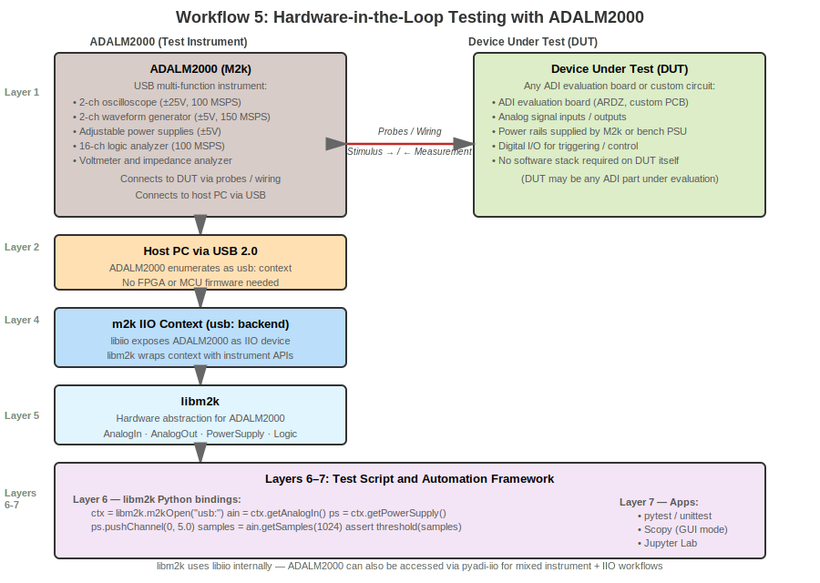

.. _overview_workflows:

Common Development Workflows
===============================================================================

This page shows concrete examples of how ADI ecosystem components work together
in real-world development scenarios. Each workflow demonstrates a complete path
from hardware to application, illustrating which components are used and how
they integrate.

.. contents:: Contents
   :local:
   :depth: 2

Introduction
-------------------------------------------------------------------------------

The ADI ecosystem supports five development workflows, each optimized
for different use cases:

1. **FPGA + High-Speed Data Converter** - For high-performance applications
   requiring GSPS sample rates, custom signal processing, or multiple devices

2. **Microcontroller + Precision ADC** - For cost-effective, low-power
   standalone measurement systems

3. **Raspberry Pi + Evaluation Board** - For rapid prototyping, education,
   and demonstration systems

4. **Remote Multi-Device Setup** - For centralized control of multiple
   networked boards from a host PC via IIOD

5. **Hardware-in-the-Loop Testing** - For automated testing, board bring-up,
   and design verification using ADALM2000 and libm2k

Understanding these workflows will help you choose the right approach for your
project and see how the :doc:`technology stack components <components>` fit together.

Technology Stack Deviations: Linux vs. no-OS
~~~~~~~~~~~~~~~~~~~~~~~~~~~~~~~~~~~~~~~~~~~~~~~~~~~~~~~~~~~~~~~~~~~~~~~~~~~~~~~

Many ADI devices support both a Linux IIO driver and a no-OS bare-metal driver.
The same hardware — for example an AD9081 MxFE connected to a Zynq FPGA — can
be driven by either stack. The right choice depends on where you are in the
development cycle, not just on the final deployment target.

   Linux vs. no-OS development paths: same hardware, different software stacks

Why Start with Linux
^^^^^^^^^^^^^^^^^^^^^^^^^^^^^^^^^^^^^^^^^^^^^^^^^^^^^^^^^^^^^^^^^^^^^^^^^^^^^^^

The Linux IIO driver stack is the **recommended starting point** whenever both
options exist. The reasons are practical rather than ideological:

**Guardrails and error visibility**
   Linux drivers validate register writes, check device states, and surface
   errors through the kernel log (``dmesg``). A misconfigured clock rate or
   an out-of-range gain setting produces an explicit error message rather
   than silent misbehaviour. no-OS drivers are leaner and generally do less
   checking — useful in production but harder to debug during bring-up.

**Rich tooling out of the box**
   With a Linux IIO driver loaded you immediately have access to ``iio_info``,
   ``iio_readdev``, Scopy, IIO Oscilloscope, and pyadi-iio — all without
   writing a line of application code. You can confirm the device initialises
   correctly, check every register attribute, stream sample data, and plot
   frequency spectra before your application logic exists.

**Faster iteration**
   Changing a device parameter under Linux is a file write or a Python one-liner.
   Under no-OS, a configuration change requires editing source, rebuilding, and
   reflashing firmware. During the exploratory phase of a project the Linux
   iteration loop is dramatically faster.

**Shared register maps and HDL designs**
   The Linux driver and no-OS driver for the same device share the same device
   register definitions and initialisation sequences — both are derived from the
   same hardware specification. Work you do validating a configuration under
   Linux transfers directly to the no-OS port.

.. list-table:: Linux vs. no-OS Comparison
   :header-rows: 1
   :widths: 20 40 40

   * - Aspect
     - Linux
     - no-OS (Bare-Metal)
   * - **Best For**
     - Prototyping, validation, algorithm development
     - Production deployment, resource-constrained systems
   * - **Debuggability**
     - | ``dmesg`` for driver errors
       | ``iio_info`` / ``iio_readdev`` / Scopy
       | ``gdb``, ``strace``, ``perf``
       | Remote access via SSH + pyadi-iio
     - | UART / SWD debug console
       | JTAG step-through with IDE
       | Logic analyser on SPI/I2C bus
       | Limited compared to Linux
   * - **Strengths**
     - | - Explicit error messages and return codes
       | - Parameter validation in driver layer
       | - Direct MATLAB/Python/pyadi-iio access
       | - Faster configuration iteration
       | - Large community, extensive documentation
     - | - Minimal footprint, instant boot
       | - Deterministic real-time performance
       | - Lower power consumption
       | - No OS overhead or scheduling jitter
       | - Production-ready, self-contained firmware
   * - **Weaknesses**
     - | - Higher resource usage (RAM, CPU, storage)
       | - Non-deterministic timing due to OS scheduling
       | - Longer boot time
       | - Overkill for simple, standalone deployments
     - | - Steeper learning curve
       | - Limited runtime error checking
       | - Rebuild-and-flash loop for each change
       | - Manual host integration (TinyIIO or custom)

When to Transition to no-OS
^^^^^^^^^^^^^^^^^^^^^^^^^^^^^^^^^^^^^^^^^^^^^^^^^^^^^^^^^^^^^^^^^^^^^^^^^^^^^^^

no-OS is the right choice for the **deployed product**, not the development
process. Consider transitioning once:

- The device is fully characterised and the configuration is stable
- Algorithms are validated and performance requirements are met
- Boot time, power budget, or BOM cost make a full Linux system impractical
- Hard real-time guarantees are required (deterministic interrupt latency,
  precise sample timing)
- The system must operate without a network connection or host PC

The transition is deliberately low-friction. Because the Linux driver and
no-OS driver share the same register definitions and HDL design, the device
configuration you validated under Linux maps directly to the no-OS
initialisation sequence.

Recommended Transition Path
^^^^^^^^^^^^^^^^^^^^^^^^^^^^^^^^^^^^^^^^^^^^^^^^^^^^^^^^^^^^^^^^^^^^^^^^^^^^^^^

1. **Prototype with Linux** — Load the Linux IIO driver, use ``iio_info`` and
   Scopy to confirm the device initialises correctly. Use pyadi-iio or MATLAB
   to develop and validate your signal processing algorithms.

2. **Lock the configuration** — Once the device settings (sample rate, gain,
   filter coefficients, clock configuration) are finalised under Linux, record
   them. These become the initialisation parameters for the no-OS project.

3. **Port to no-OS** — Start from the matching no-OS reference project for
   your device and platform. The device driver API mirrors the Linux driver
   concepts. Swap in your validated configuration parameters.

4. **Validate equivalence** — Run the same stimulus through both stacks and
   compare outputs. The IIO framework's consistent data model makes this
   straightforward.

5. **Optimise for deployment** — With correctness established, tune the
   no-OS firmware for your power, latency, and footprint targets.

Workflow 1: FPGA + High-Speed Data Converter
-------------------------------------------------------------------------------

This workflow targets high-performance applications using Xilinx Zynq/ZynqMP
SoCs with ADI's high-speed data converters like RF transceivers or multi-GSPS
ADCs/DACs.

Use Case Example: AD9081 MxFE Software-Defined Radio
~~~~~~~~~~~~~~~~~~~~~~~~~~~~~~~~~~~~~~~~~~~~~~~~~~~~~~~~~~~~~~~~~~~~~~~~~~~~~~~

**Hardware:**

- Xilinx ZCU102 (Zynq UltraScale+ MPSoC)
- AD9081-FMCA-EBZ evaluation board (Quad 12 GSPS ADC, Quad 12 GSPS DAC)
- JESD204B/C high-speed serial links (up to 15.5 Gbps per lane)

**Application:** Multi-channel wideband transceiver for communications,
radar, or test equipment.

   FPGA workflow: Zynq + AD9081 MxFE via JESD204C

Architecture
~~~~~~~~~~~~~~~~~~~~~~~~~~~~~~~~~~~~~~~~~~~~~~~~~~~~~~~~~~~~~~~~~~~~~~~~~~~~~~~

**Layer 1 - Hardware:**
AD9081 MxFE provides 4 ADC channels (up to 4 GSPS each) and 4 DAC channels
(up to 12 GSPS each) with digital signal processing (NCOs, filters, DDCs, DUCs).

**Layer 2 - Hardware Interface:**
Zynq UltraScale+ MPSoC combines:

- ARM Cortex-A53 processors (4 cores) running Linux
- Programmable logic (FPGA fabric) for JESD204 and signal processing
- High-speed transceivers (GTH) for multi-gigabit serial links

**Layer 3 - HDL:**
The :external+hdl:doc:`AD9081 HDL project <projects/ad9081_fmca_ebz/index>` provides:

- :external+hdl:doc:`JESD204 TPL/Link/PHY <library/jesd204/index>` implementation
- DMA controllers for moving data to/from ARM processors
- Clock management and synchronization
- AXI interfaces to Linux

**Layer 4 - Linux Drivers:**
The ``axi-ad9081`` IIO driver:

- Initializes AD9081 via SPI
- Configures JESD204 link (lane rates, lane count, scrambling)
- Programs digital filters, NCOs, DDCs/DUCs
- Exposes DMA buffers for high-throughput streaming

**Layer 5 - libiio:**
Provides ``local:`` backend for direct access to IIO devices on the Zynq.

**Layer 6 - pyadi-iio:**
The ``adi.ad9081`` Python class:

.. code-block:: python

   import adi
   import numpy as np
   import matplotlib.pyplot as plt

   # Create AD9081 object (on local Zynq)
   mxfe = adi.ad9081(uri="local:")

   # Configure receiver
   mxfe.rx_enabled_channels = [0, 1]  # Enable 2 channels
   mxfe.rx_buffer_size = 2**16

   # Receive data
   data = mxfe.rx()  # Returns complex NumPy array

   # Plot spectrum
   fft = np.fft.fftshift(np.fft.fft(data[0]))
   plt.plot(20*np.log10(np.abs(fft)))
   plt.show()

**Layer 7 - Application:**
MATLAB, GNU Radio, or custom Python/C++ applications for SDR, spectrum monitoring,
or signal intelligence.

Development Steps
~~~~~~~~~~~~~~~~~~~~~~~~~~~~~~~~~~~~~~~~~~~~~~~~~~~~~~~~~~~~~~~~~~~~~~~~~~~~~~~

1. **Hardware Setup:**

   - Mount AD9081-FMCA-EBZ on ZCU102 FMC connector
   - Connect clocks, power, and signal sources
   - Ensure proper termination and grounding

2. **Build HDL Project:**

   Follow :external+hdl:doc:`build instructions <user_guide/build_hdl>`:

   .. code-block:: bash

      git clone https://github.com/analogdevicesinc/hdl
      cd hdl/projects/ad9081_fmca_ebz/zcu102
      make

   This generates a Vivado project and builds the bitstream.

3. **Build Linux Kernel:**

   Use :doc:`Kuiper Linux </linux/kuiper/index>` or build with :doc:`PetaLinux </linux/kernel/petalinux>`.
   The ``axi-ad9081`` driver is included in ADI's kernel.

4. **Program and Boot:**

   - Program FPGA bitstream
   - Copy BOOT.BIN and image.ub to SD card
   - Boot Linux on Zynq

5. **Verify IIO Devices:**

   .. code-block:: bash

      iio_info
      # Should show axi-ad9081 devices

6. **Develop Application:**

   Use pyadi-iio, MATLAB, or C/C++ with libiio to stream data.

When to Use This Workflow
~~~~~~~~~~~~~~~~~~~~~~~~~~~~~~~~~~~~~~~~~~~~~~~~~~~~~~~~~~~~~~~~~~~~~~~~~~~~~~~

Choose FPGA-based workflow when you need:

- **High Sample Rates:** >100 MSPS, up to 12+ GSPS
- **Low Latency:** <1 µs signal processing latency
- **Multiple Devices:** Synchronizing several converters
- **Custom Processing:** FFTs, filtering, beamforming in FPGA fabric
- **High Bandwidth:** JESD204 multi-gigabit links
- **Scalability:** Room to grow with additional logic

**Typical Applications:**

- Software-defined radio platforms
- Phased array radar systems
- 5G/6G test equipment
- Satellite communications
- Medical imaging (MRI, ultrasound)
- High-energy physics instrumentation

**Trade-offs:**

- Higher cost ($1K-$10K+ for evaluation boards)
- More complex (requires FPGA knowledge for customization)
- Higher power consumption (5-50W)
- Longer development time
- Requires specialized tools (Vivado, PetaLinux)

Reference Documentation
~~~~~~~~~~~~~~~~~~~~~~~~~~~~~~~~~~~~~~~~~~~~~~~~~~~~~~~~~~~~~~~~~~~~~~~~~~~~~~~

- **Project Page:** :external+hdl:doc:`AD9081 FMCA EBZ <projects/ad9081_fmca_ebz/index>`
- **HDL User Guide:** `HDL Documentation <https://analogdevicesinc.github.io/hdl/user_guide/index.html>`_
- **Linux Driver:** `axi-ad9081 driver <https://wiki.analog.com/resources/tools-software/linux-drivers/iio-mxfe/ad9081>`_
- **Similar Projects:** :external+hdl:doc:`All HDL Projects <projects/index>`

Workflow 2: Microcontroller + Precision ADC
-------------------------------------------------------------------------------

This workflow targets cost-effective, low-power standalone measurement systems
using bare-metal microcontrollers with precision ADCs.

Use Case Example: AD4080 Precision Data Logger
~~~~~~~~~~~~~~~~~~~~~~~~~~~~~~~~~~~~~~~~~~~~~~~~~~~~~~~~~~~~~~~~~~~~~~~~~~~~~~~

**Hardware:**

- ST Nucleo-H563ZI development board (STM32H563ZI MCU, ARM Cortex-M33, 250 MHz)
- EVAL-AD4080-ARDZ evaluation board (40 MSPS SAR ADC, Arduino form factor)
- SPI interface (up to 80 MHz)
- USB connection to host PC for data streaming

**Application:** Portable seismic sensor, vibration monitor, or precision
measurement instrument.

This example is based on the :doc:`Software Infrastructure Tutorial </learning/sw_infrastructure/index>`.

   Microcontroller workflow: STM32 + AD4080 ADC via SPI and TinyIIO

Architecture
~~~~~~~~~~~~~~~~~~~~~~~~~~~~~~~~~~~~~~~~~~~~~~~~~~~~~~~~~~~~~~~~~~~~~~~~~~~~~~~

**Layer 1 - Hardware:**
AD4080 40 MSPS oversampling SAR ADC with integrated digital filters (SINC5,
SINC5+Comp, Averaging).

**Layer 2 - Hardware Interface:**
STM32H563ZI microcontroller provides:

- High-speed SPI (up to 100 MHz capable)
- USB 2.0 HS device (for TinyIIO over USB CDC)
- DMA controllers for efficient data movement
- 2 MB flash, 640 KB RAM

**Layer 3 - no-OS Firmware:**
The :external+no-OS:doc:`AD4080 no-OS project <index>` provides:

- SPI driver for STM32 HAL
- AD4080 device driver (register configuration, data capture)
- TinyIIO server running on USB CDC (virtual serial port)
- DMA-based circular buffers for continuous capture

**Layer 4 - Drivers:**
*Not used* - TinyIIO on the MCU communicates directly with libiio via serial
protocol, bypassing the need for kernel drivers.

**Layer 5 - libiio:**
Uses ``serial:`` backend to connect to STM32 over USB:

.. code-block:: bash

   # From host PC (Raspberry Pi, laptop, etc.)
   iio_info -u serial:/dev/ttyACM0,230400,8n1

**Layer 6 - pyadi-iio:**
The ``adi.ad4080`` Python class:

.. code-block:: python

   import adi

   # Connect to AD4080 via serial (MCU appears as /dev/ttyACM0)
   adc = adi.ad4080(uri="serial:/dev/ttyACM0,230400,8n1")

   # Configure filter
   adc.filter_type = "sinc5_plus_compensation"
   adc.sampling_frequency = 1000000  # 1 MSPS
   adc.rx_buffer_size = 4096

   # Capture data
   data = adc.rx()  # NumPy array

**Layer 7 - Application:**
Scopy for interactive testing, or custom Python scripts for data logging and
analysis.

Development Steps
~~~~~~~~~~~~~~~~~~~~~~~~~~~~~~~~~~~~~~~~~~~~~~~~~~~~~~~~~~~~~~~~~~~~~~~~~~~~~~~

1. **Hardware Setup:**

   - Mount EVAL-AD4080-ARDZ on ST Nucleo (Arduino headers)
   - Connect signal source (function generator, sensor)
   - Connect Nucleo USB to host PC

2. **Build Firmware:**

   .. code-block:: bash

      git clone https://github.com/analogdevicesinc/no-OS
      cd no-OS/projects/ad4080
      mkdir build && cd build
      cmake .. -DPLATFORM=stm32
      make

   Or use STM32CubeIDE to import project.

3. **Flash Firmware:**

   Use ST-LINK programmer (built into Nucleo):

   .. code-block:: bash

      st-flash write ad4080_project.bin 0x8000000

4. **Verify Connection:**

   From host PC:

   .. code-block:: bash

      iio_info -u serial:/dev/ttyACM0,230400,8n1
      # Should show ad4080 IIO device

5. **Develop Application:**

   Use Scopy, pyadi-iio, or MATLAB to control device and capture data.

When to Use This Workflow
~~~~~~~~~~~~~~~~~~~~~~~~~~~~~~~~~~~~~~~~~~~~~~~~~~~~~~~~~~~~~~~~~~~~~~~~~~~~~~~

Choose microcontroller-based workflow when you need:

- **Low Cost:** MCU boards $10-$50, total BOM $50-$200
- **Low Power:** <1W typical, battery operation feasible
- **Standalone Operation:** No OS, boots instantly
- **Real-Time Performance:** Deterministic timing
- **Simple Deployment:** Single binary, no updates
- **Portability:** Handheld, wearable applications

**Typical Applications:**

- Portable medical devices (ECG, pulse oximetry)
- Industrial sensors (temperature, pressure, vibration)
- Data loggers (environmental monitoring)
- Precision measurement tools
- Battery-powered instrumentation
- Embedded control systems

**Trade-offs:**

- Lower sample rates (<100 MSPS typically)
- Limited processing (no FFTs, complex algorithms)
- Simpler UI (limited display options)
- Serial/USB bottleneck for data streaming
- Manual firmware updates

Reference Documentation
~~~~~~~~~~~~~~~~~~~~~~~~~~~~~~~~~~~~~~~~~~~~~~~~~~~~~~~~~~~~~~~~~~~~~~~~~~~~~~~

- **Tutorial:** :doc:`Software Infrastructure Tutorial </learning/sw_infrastructure/index>`
- **no-OS Framework:** `no-OS Documentation <https://analogdevicesinc.github.io/no-OS/index.html>`_
- **AD4080 Driver:** :external+no-OS:doc:`AD4080 no-OS driver <index>`
- **Similar Designs:** :doc:`Precision ADC Reference Designs </solutions/reference-designs/index>`

Workflow 3: Raspberry Pi + Evaluation Board
-------------------------------------------------------------------------------

This workflow targets rapid prototyping, education, and demonstration using
Raspberry Pi with Arduino-compatible evaluation boards or USB devices.

Use Case Example: Multi-Sensor Data Acquisition
~~~~~~~~~~~~~~~~~~~~~~~~~~~~~~~~~~~~~~~~~~~~~~~~~~~~~~~~~~~~~~~~~~~~~~~~~~~~~~~

**Hardware:**

- Raspberry Pi 4 (4 GB RAM)
- SD card with Kuiper Linux
- Multiple Arduino-shield evaluation boards (ARDZ)
- Optional: ADALM2000 USB multi-function instrument

**Application:** Educational lab setup, proof-of-concept prototyping, or
conference demonstration.

   Raspberry Pi workflow: RPi + Arduino shields and USB devices

Architecture
~~~~~~~~~~~~~~~~~~~~~~~~~~~~~~~~~~~~~~~~~~~~~~~~~~~~~~~~~~~~~~~~~~~~~~~~~~~~~~~

**Layer 1 - Hardware:**
Various ADI devices on Arduino shields:

- AD4052/AD4080 (precision ADCs)
- AD5592R (ADC/DAC/GPIO)
- ADXL345 (accelerometer)
- ADALM2000 (USB multi-function instrument)

**Layer 2 - Hardware Interface:**
Raspberry Pi 4 provides:

- GPIO header (SPI, I2C buses)
- USB 3.0 ports
- Gigabit Ethernet
- ARM Cortex-A72 (4 cores, 1.5 GHz)

**Layer 3 - HDL/Firmware:**
*Not applicable* - Direct SPI/I2C from processor, no FPGA or MCU firmware.

**Layer 4 - Linux IIO Drivers:**
Kuiper Linux includes pre-loaded drivers:

- ``ad4052``/``ad4080`` for precision ADCs
- ``ad5592r`` for mixed-signal device
- ``adxl345`` for accelerometer
- ``m2k`` context for ADALM2000

Devicetree overlays configure SPI chip selects and pin assignments.

**Layer 5 - libiio:**
Multiple backend types on same system:

- ``local:`` for on-board IIO devices (SPI/I2C shields)
- ``usb:`` for ADALM2000
- ``ip:`` for remote devices

**Layer 6 - pyadi-iio:**
Unified Python interface:

.. code-block:: python

   import adi

   # Local SPI device
   adc = adi.ad4080(uri="local:")

   # USB device
   m2k = adi.m2k(uri="usb:")

   # Remote device
   remote_sensor = adi.adxl345(uri="ip:sensor-node.local")

   # Capture from all simultaneously
   adc_data = adc.rx()
   m2k_data = m2k.rx()
   accel_data = remote_sensor.rx()

**Layer 7 - Applications:**
Full desktop Linux environment:

- Scopy for ADALM2000 control
- IIO Oscilloscope for generic devices
- Jupyter Lab for interactive Python
- Custom web servers for remote monitoring

Development Steps
~~~~~~~~~~~~~~~~~~~~~~~~~~~~~~~~~~~~~~~~~~~~~~~~~~~~~~~~~~~~~~~~~~~~~~~~~~~~~~~

1. **Setup Kuiper Linux:**

   - Download image from :doc:`Kuiper Linux page </linux/kuiper/index>`
   - Write to SD card with balenaEtcher or dd
   - Boot Raspberry Pi

2. **Configure Hardware:**

   Mount Arduino shields on GPIO header. For custom boards, enable devicetree
   overlay:

   .. code-block:: bash

      sudo dtoverlay spi0-1cs  # Enable SPI with 1 chip select
      # Edit /boot/config.txt to make permanent

3. **Verify Devices:**

   .. code-block:: bash

      iio_info
      # Should show all connected IIO devices

4. **Install Additional Software:**

   .. code-block:: bash

      pip install additional-libraries
      sudo apt install useful-tools

5. **Develop Application:**

   Use Jupyter Lab, Python scripts, or MATLAB (via remote access) to control
   devices and visualize data.

When to Use This Workflow
~~~~~~~~~~~~~~~~~~~~~~~~~~~~~~~~~~~~~~~~~~~~~~~~~~~~~~~~~~~~~~~~~~~~~~~~~~~~~~~

Choose Raspberry Pi workflow when you need:

- **Rapid Prototyping:** Get running in minutes
- **Education:** Teach data acquisition and signal processing
- **Demonstrations:** Conference booths, customer visits
- **Multi-Device Systems:** Integrate several evaluation boards
- **Familiar Environment:** Standard Linux, Python, web browsers
- **Low Barrier:** Minimal specialized knowledge required

**Typical Applications:**

- University laboratory setups
- Algorithm development and validation
- Proof-of-concept demonstrations
- Trade show exhibits
- Remote monitoring stations
- Hobbyist projects

**Trade-offs:**

- Medium sample rates (<10 MSPS typical on SPI)
- No hard real-time guarantees
- Limited I/O (shared SPI bus, limited chip selects)
- Networking dependencies for remote access
- SD card reliability concerns

Reference Documentation
~~~~~~~~~~~~~~~~~~~~~~~~~~~~~~~~~~~~~~~~~~~~~~~~~~~~~~~~~~~~~~~~~~~~~~~~~~~~~~~

- **Kuiper Linux:** :doc:`Kuiper Linux Guide </linux/kuiper/index>`
- **Raspberry Pi Setup:** :ref:`linux-kernel`
- **Arduino Shields:** :doc:`Evaluation Boards </solutions/reference-designs/index>`
- **Tutorials:** :doc:`Learning Resources </learning/index>`

Workflow 4: Remote Multi-Device Setup
-------------------------------------------------------------------------------

This workflow targets centralized control of multiple embedded boards from a
host PC over a standard Ethernet network, using IIOD (IIO Daemon) as a
network bridge.

Use Case Example: Multi-Board Lab Automation
~~~~~~~~~~~~~~~~~~~~~~~~~~~~~~~~~~~~~~~~~~~~~~~~~~~~~~~~~~~~~~~~~~~~~~~~~~~~~~~

**Hardware:**

- Host workstation (Linux, macOS, or Windows) with libiio installed
- Target 1: Zynq board running Kuiper Linux with AD9081 (high-speed SDR)
- Target 2: Raspberry Pi running Kuiper Linux with precision ADC shields
- Gigabit Ethernet switch

**Application:** Centralized control of physically remote or rack-mounted
instrumentation, multi-channel data collection, or distributed sensor networks.

   Workflow 4: Host PC accessing multiple embedded targets via IIOD over Ethernet

Architecture
~~~~~~~~~~~~~~~~~~~~~~~~~~~~~~~~~~~~~~~~~~~~~~~~~~~~~~~~~~~~~~~~~~~~~~~~~~~~~~~

**Layer 1 - Hardware:**
Multiple ADI devices on separate embedded platforms:

- AD9081 MxFE on Zynq board (RF transceiver, GSPS rates)
- AD4080 / AD4052 precision ADCs on Raspberry Pi via SPI shields

**Layer 2 - Hardware Interface:**
Each embedded target runs independently — Zynq UltraScale+ MPSoC and
Raspberry Pi 4 both running Linux. No direct hardware link between them.

**Layer 3 - HDL/Firmware:**
HDL project loaded on Zynq (standard Workflow 1 setup). Raspberry Pi uses
direct SPI (standard Workflow 3 setup). Nothing changes at this layer.

**Layer 4 - Linux IIO Drivers:**
Standard IIO drivers on each target (same as Workflows 1 and 3). IIOD (IIO
Daemon) runs on each embedded target, exposing the local IIO context over TCP
port 30431:

.. code-block:: bash

   # IIOD is included in Kuiper Linux and starts automatically.
   # On a custom Linux install:
   sudo apt install iiod
   sudo systemctl enable --now iiod

**Layer 5 - libiio:**
The host PC uses the ``ip:`` backend to connect to each remote IIOD server.
No local IIO devices are needed on the host:

.. code-block:: bash

   # Discover devices on remote target
   iio_info -u ip:192.168.1.10
   iio_info -u ip:192.168.1.20

**Layer 6 - pyadi-iio:**
Each remote device is accessed with its ``ip:`` URI — the API is identical
to a local connection:

.. code-block:: python

   import adi

   # Connect to two different remote targets simultaneously
   sdr = adi.ad9081(uri="ip:192.168.1.10")   # Zynq board
   adc = adi.ad4080(uri="ip:192.168.1.20")   # Raspberry Pi

   # Capture data from both — same API as local access
   sdr_data = sdr.rx()
   adc_data = adc.rx()

**Layer 7 - Applications:**
Centralized control application on the host PC: Python scripts, MATLAB, or
Jupyter notebooks. Scopy on the host can connect to remote targets via the
``ip:`` URI field.

Development Steps
~~~~~~~~~~~~~~~~~~~~~~~~~~~~~~~~~~~~~~~~~~~~~~~~~~~~~~~~~~~~~~~~~~~~~~~~~~~~~~~

1. **Ensure targets are running IIOD:**

   Kuiper Linux enables IIOD automatically. Verify it is active:

   .. code-block:: bash

      # On each embedded target
      systemctl status iiod

2. **Verify network connectivity from host:**

   .. code-block:: bash

      ping 192.168.1.10
      iio_info -u ip:192.168.1.10   # Should list IIO devices

3. **Develop application on host:**

   Use pyadi-iio with ``ip:`` URIs. See the code example above.

4. **Optional — use Scopy remotely:**

   In Scopy's connection dialog, enter ``ip:192.168.1.10`` to connect to a
   remote target.

When to Use This Workflow
~~~~~~~~~~~~~~~~~~~~~~~~~~~~~~~~~~~~~~~~~~~~~~~~~~~~~~~~~~~~~~~~~~~~~~~~~~~~~~~

Choose the remote workflow when you need:

- **Multi-Board Control:** Coordinate data from several embedded platforms
- **Physical Separation:** Boards are rack-mounted, in an anechoic chamber,
  or otherwise inaccessible during operation
- **Workstation Development:** Develop on a powerful host PC while the embedded
  target runs headlessly
- **Centralized Logging:** Aggregate data streams from multiple geographically
  distributed nodes

**Typical Applications:**

- Multi-channel phased array demonstrations
- Distributed environmental or structural monitoring
- Automated test equipment (ATE) control
- Lab automation with multiple instruments
- Production-line test rigs

**Trade-offs:**

- Network latency (not suitable for tight real-time feedback loops)
- Requires IP address management and network configuration
- Firewall rules may need updating to allow TCP port 30431
- Host PC is a single point of failure for the entire setup

Reference Documentation
~~~~~~~~~~~~~~~~~~~~~~~~~~~~~~~~~~~~~~~~~~~~~~~~~~~~~~~~~~~~~~~~~~~~~~~~~~~~~~~

- **IIOD basics:** Appendix A of :doc:`Software Infrastructure Tutorial </learning/sw_infrastructure/index>`
- **libiio ip: backend:** `libiio Documentation <https://analogdevicesinc.github.io/libiio/v0.26/index.html>`_
- **Kuiper Linux (IIOD pre-installed):** :doc:`Kuiper Linux Guide </linux/kuiper/index>`
- **Workflow 1 (FPGA target setup):** See Workflow 1 above
- **Workflow 3 (RPi target setup):** See Workflow 3 above

Workflow 5: Hardware-in-the-Loop Testing
-------------------------------------------------------------------------------

This workflow uses the ADALM2000 multi-function USB instrument with the libm2k
library for automated hardware testing, board bring-up, and design verification.
Unlike the other workflows where ADALM2000 is one of many connected devices,
here it acts as the primary **test instrument** driving and measuring a
device under test (DUT).

Use Case Example: Automated Board Bring-Up with ADALM2000
~~~~~~~~~~~~~~~~~~~~~~~~~~~~~~~~~~~~~~~~~~~~~~~~~~~~~~~~~~~~~~~~~~~~~~~~~~~~~~~

**Hardware:**

- ADALM2000 (USB multi-function instrument):

  - 2-channel oscilloscope (±25V, 100 MSPS)
  - 2-channel arbitrary waveform generator (±5V, 150 MSPS)
  - Adjustable power supplies (±5V)
  - Logic analyzer (16 channels, 100 MSPS)
  - Voltmeter

- Device Under Test (DUT): ADI evaluation board or custom circuit
- Host PC (Linux, macOS, or Windows) with libm2k installed

**Application:** Scripted board bring-up verification, production test
automation, analog circuit characterization, or educational lab experiments.

   Workflow 5: ADALM2000 as test instrument in a hardware-in-the-loop setup

Architecture
~~~~~~~~~~~~~~~~~~~~~~~~~~~~~~~~~~~~~~~~~~~~~~~~~~~~~~~~~~~~~~~~~~~~~~~~~~~~~~~

This workflow uses libm2k rather than libiio/pyadi-iio as the primary host
library, though libm2k is itself built on libiio internally.

**Layer 1 - Hardware:**
ADALM2000 connected to the DUT via probes or custom wiring. The ADALM2000
simultaneously generates stimulus signals and captures the DUT's response.

**Layer 2 - Hardware Interface:**
Host PC via USB 2.0. The ADALM2000 appears as a USB device; no FPGA or MCU
is required.

**Layer 3 - HDL/Firmware:**
ADALM2000 runs its own onboard firmware (updated via Scopy or ``adalm2000-fw``).
No user HDL or firmware is required.

**Layer 4 - IIO Context:**
The ADALM2000 exposes an IIO context over USB (``usb:`` backend). libm2k
wraps this context and adds instrument-level abstractions (AnalogIn,
AnalogOut, PowerSupply, LogicAnalyzer).

**Layer 5 - libm2k:**
libm2k provides the hardware abstraction layer:

.. code-block:: bash

   pip install libm2k

**Layer 6 - libm2k Language Bindings:**
Python is the most common choice; C++, C#, LabVIEW, and MATLAB bindings are
also available:

.. code-block:: python

   import libm2k

   ctx = libm2k.m2kOpen("usb:")
   ctx.calibrate()

   ain  = ctx.getAnalogIn()
   aout = ctx.getAnalogOut()
   ps   = ctx.getPowerSupply()

   # Power the DUT
   ps.enableChannel(0, True)
   ps.pushChannel(0, 5.0)   # +5 V rail

   # Generate a 10 kHz sine wave on channel 0
   import math
   N = 1024
   sine = [math.sin(2 * math.pi * i / N) for i in range(N)]
   aout.setSampleRate(0, 750000)
   aout.push(0, sine)

   # Capture DUT output on channel 0
   ain.setSampleRate(1000000)
   ain.setRange(0, libm2k.PLUS_MINUS_25)
   samples = ain.getSamples(1024)

   libm2k.contextClose(ctx)

**Layer 7 - Test Framework:**
Python's ``pytest`` or ``unittest`` are commonly used to structure pass/fail
criteria, generate test reports, and integrate into CI pipelines.

Development Steps
~~~~~~~~~~~~~~~~~~~~~~~~~~~~~~~~~~~~~~~~~~~~~~~~~~~~~~~~~~~~~~~~~~~~~~~~~~~~~~~

1. **Install libm2k:**

   .. code-block:: bash

      pip install libm2k
      # Or build from source: https://github.com/analogdevicesinc/libm2k

2. **Connect ADALM2000:**

   Plug ADALM2000 into the host PC via USB. Wire the probes/cables to your DUT.

3. **Verify connection:**

   .. code-block:: bash

      iio_info -u usb:           # Shows m2k IIO context
      python -c "import libm2k; print(libm2k.m2kOpen('usb:'))"

4. **Write and run a test script:**

   Use the code example above as a starting point. Add pass/fail assertions
   around the measurement results.

5. **Integrate with pytest (optional):**

   .. code-block:: python

      # test_dut.py
      import libm2k, pytest

      @pytest.fixture(scope="session")
      def m2k():
          ctx = libm2k.m2kOpen("usb:")
          ctx.calibrate()
          yield ctx
          libm2k.contextClose(ctx)

      def test_output_voltage(m2k):
          vm = m2k.getVoltmeter()
          voltage = vm.getVoltage(0)
          assert 4.9 < voltage < 5.1, f"Rail out of range: {voltage} V"

When to Use This Workflow
~~~~~~~~~~~~~~~~~~~~~~~~~~~~~~~~~~~~~~~~~~~~~~~~~~~~~~~~~~~~~~~~~~~~~~~~~~~~~~~

Choose hardware-in-the-loop testing when you need:

- **Automated Bring-Up:** Scripted power-on verification without manual probing
- **Stimulus + Measurement:** Generate known signals and measure DUT response
  in the same script
- **Regression Testing:** Catch analog regressions in CI before hardware ships
- **Production Testing:** Repeatable pass/fail tests on every board

**Typical Applications:**

- Board bring-up and factory acceptance tests
- Frequency response and distortion measurements
- Power supply sequencing validation
- Educational labs requiring signal injection
- Design verification for ADI evaluation boards

**Trade-offs:**

- ADALM2000 bandwidth limited to 25 MHz (not suitable for RF; use ADALM-PLUTO instead)
- USB bandwidth constrains continuous streaming rates
- libm2k API differs from libiio/pyadi-iio (separate programming model)
- Requires host PC — not a standalone embedded solution

Reference Documentation
~~~~~~~~~~~~~~~~~~~~~~~~~~~~~~~~~~~~~~~~~~~~~~~~~~~~~~~~~~~~~~~~~~~~~~~~~~~~~~~

- **libm2k:** :doc:`libm2k Documentation </software/libm2k/index>`
- **ADALM2000:** `ADALM2000 Wiki <https://wiki.analog.com/university/tools/m2k>`_
- **libm2k GitHub:** `github.com/analogdevicesinc/libm2k <https://github.com/analogdevicesinc/libm2k>`_
- **Scopy (GUI for ADALM2000):** :external+scopy:doc:`Scopy Documentation <index>`

Choosing the Right Workflow
-------------------------------------------------------------------------------

Quick Decision Guide
~~~~~~~~~~~~~~~~~~~~~~~~~~~~~~~~~~~~~~~~~~~~~~~~~~~~~~~~~~~~~~~~~~~~~~~~~~~~~~~

The table below compares the three **platform workflows** (1–3). Workflows 4
(Remote) and 5 (HIL Testing) are complementary to any of these — see the note
after the table.

.. list-table::
   :header-rows: 1
   :widths: 30 25 25 20

   * - Your Requirement
     - Workflow 1 (FPGA)
     - Workflow 2 (MCU)
     - Workflow 3 (RPi)
   * - Sample Rate > 100 MSPS
     - ✅ Yes
     - ❌ No
     - ❌ No
   * - Custom Signal Processing
     - ✅ FPGA fabric
     - ⚠️ Limited
     - ⚠️ Software only
   * - Low Power (<1W)
     - ❌ No
     - ✅ Yes
     - ⚠️ ~5W
   * - Low Cost (<$100)
     - ❌ No ($1K+)
     - ✅ Yes
     - ✅ Yes
   * - Rapid Prototyping
     - ❌ Weeks
     - ⚠️ Days
     - ✅ Hours
   * - Standalone Operation
     - ⚠️ Possible
     - ✅ Yes
     - ❌ Needs OS
   * - Python/MATLAB Support
     - ✅ Yes
     - ✅ Yes (via serial)
     - ✅ Yes (native)
   * - GUI Applications
     - ✅ Via network
     - ✅ Via serial
     - ✅ Native
   * - Learning Curve
     - ⚠️ Steep
     - ⚠️ Moderate
     - ✅ Easy

Workflows 4 and 5 are complementary to the three platform workflows above.
**Workflow 4** (Remote) can be layered on top of Workflows 1–3: once a board
is running Linux with IIOD, any libiio ``ip:`` client can talk to it.
**Workflow 5** (HIL Testing) is independent — use it when you need automated
stimulus and measurement, regardless of which primary workflow your DUT uses.

Migration Paths
~~~~~~~~~~~~~~~~~~~~~~~~~~~~~~~~~~~~~~~~~~~~~~~~~~~~~~~~~~~~~~~~~~~~~~~~~~~~~~~

The layered architecture enables smooth migration between workflows:

**Prototype → Production:**

1. Start with **Workflow 3** (Raspberry Pi) for proof of concept
2. Validate algorithms and user requirements
3. Move to **Workflow 2** (MCU) for cost reduction and standalone operation
4. Or move to **Workflow 1** (FPGA) for performance scaling

**The application code (Layers 5-7) remains largely unchanged**, just switch the
libiio URI.

**Development → Deployment:**

- Develop on desktop with ``ip:`` backend (remote Zynq/RPi via Workflow 4)
- Deploy same code on embedded Zynq with ``local:`` backend
- No code changes needed beyond URI configuration

See Also
-------------------------------------------------------------------------------

**Next Steps:**

- :doc:`components` - Detailed component documentation
- :doc:`versioning-support` - Version compatibility for your chosen workflow
- :doc:`architecture` - Understanding the layered architecture

**Learning Resources:**

- :doc:`Software Infrastructure Tutorial </learning/sw_infrastructure/index>` - Workflow 2 hands-on
- :doc:`FPGA Integration Journey </learning/workshop_a_precision_converter_fpga_integration_journey/index>` - Workflow 1 deep dive
- :doc:`Kuiper Linux Guide </linux/kuiper/index>` - Workflow 3 setup

**Reference Designs:**

- :external+hdl:doc:`HDL Projects <projects/index>` - FPGA designs (Workflow 1)
- :external+no-OS:doc:`no-OS Projects <index>` - MCU firmware (Workflow 2)
- :doc:`Evaluation Boards </solutions/reference-designs/index>` - Arduino shields (Workflow 3)
