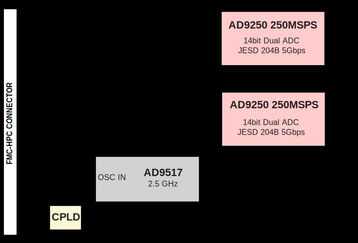
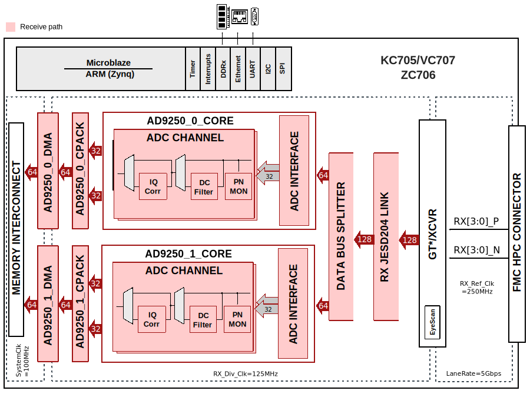

.. imported from: https://wiki.analog.com/resources/eval/user-guides/ad-fmcjesdadc1-ebz

.. _ad-fmcjesdadc1-ebz:

AD-FMCJESDADC1-EBZ
===================

.. warning::

   Support for the AD-FMCJESDADC1-EBZ is discontinued starting with the
   2022_R2 ADI Kuiper Linux release and it will not be supported in future
   releases. The last release with pre-built files is **2021_r2**. Check the
   :doc:`Kuiper Linux </linux/kuiper/index>` page for all releases.
   The HDL project source code can still be found on the
   :git-hdl:`hdl_2021_r2 <hdl_2021_r2:projects/fmcjesdadc1>` release branch.

The :adi:`AD-FMCJESDADC1-EBZ` is a high speed data acquisition board
(4 channels at 245.76 MSPS), in an FMC form factor which supports the
JESD204B high speed serial interface. This board meets all the FMC
specifications in terms of mechanical size and mounting hole locations.

This board is targeted to use the ADI reference designs that work with both
Altera and Xilinx development systems. The analog I/O on this board uses
micro-miniature coaxial (MMCX) connectors. To connect to SMA-based test
equipment, an adapter such as the Molex 89761-6810 is needed.

.. image:: ad-fmcjesdadc1-ebz_top.png
   :align: center
   :width: 400

.. image:: ad-fmcjesdadc1-ebz_bottom.png
   :align: center
   :width: 400

Contains
--------

The card contains:

- :adi:`AD9250` two 14-bit ADCs with sampling speeds of up to 250 MSPS,
  with a JESD204B digital interface
- :adi:`AD9517-1` multi-output clock distribution device with subpicosecond
  jitter performance, along with an on-chip PLL and VCO
- :adi:`ADP151` ultralow noise, low dropout linear regulator, 2.2 V to 5.5 V,
  up to 200 mA output current
- :adi:`ADP1753` low dropout linear regulator, 1.6 V to 3.6 V input, up to
  800 mA output current
- :adi:`AD7291` 12-bit, low power, 8-channel, SAR ADC with internal
  temperature sensor
- :adi:`ADP2301` compact, constant-frequency, current-mode, step-down
  DC-to-DC regulator
- :adi:`ADG3304` bidirectional logic level translator with four channels

Supported Devices
-----------------

- :adi:`AD9250`

Supported Carriers
------------------

- :xilinx:`KC705 <products/boards-and-kits/ek-k7-kc705-g.html>` HPC Slot
- :xilinx:`VC707 <products/boards-and-kits/ek-v7-vc707-g.html>` HPC Slot (FMC1)
- :xilinx:`ZC706 <products/boards-and-kits/ek-z7-zc706-g.html>` HPC Slot

HDL Reference Design
--------------------

The reference design is built on a Microblaze-based system. The reference
design consists of a single JESD204B core and two identical instances of
AD9250 cores. The AD9250 core consists of three functional modules: the ADC
interface, a PN9/PN23 monitor, and a DMA interface. The ADC interface
captures and buffers data from the JESD204B core. The DMA interface then
transfers the samples to the external DDR-DRAM.

All cores have an AXI-Lite interface that allows control and monitoring of
data generation and capture. The reference design also includes HDMI cores
for GTX eye scan support.

Block Diagrams
~~~~~~~~~~~~~~

   AD-FMCJESDADC1-EBZ block diagram

   Xilinx block diagram

HDL Source Code
~~~~~~~~~~~~~~~

- :git-hdl:`hdl_2021_r2:projects/fmcjesdadc1/kc705`
- :git-hdl:`hdl_2021_r2:projects/fmcjesdadc1/vc707`
- :git-hdl:`hdl_2021_r2:projects/fmcjesdadc1/zc706`

Changing ADC Sample Rates
~~~~~~~~~~~~~~~~~~~~~~~~~

The ADC sampling rate can vary from 40 MHz to 250 MHz. However, there are
limitations imposed by the FPGA that may lower this range. In some cases,
the cores may need to be regenerated for a different range. The reference
design uses GTX (channel PLL) primitives and Xilinx's JESD204B core IP.
The default design runs at 250 MHz clock (5 Gbps rate).

The reference clock has a range of 60 MHz to 670 MHz, which limits the
minimum sampling clock to 60 MHz. Though not recommended, it is possible to
use the AD9517 to generate a 40 MHz sampling clock to the AD9250 and an
80 MHz reference clock to the FPGA.

The CPLL supports rates between 0.5 Gbps and 6.6 Gbps. The core may need
to be reconfigured for rates below 3.2 Gbps (sampling rate 160 MHz). It is
also possible to run the device on a single lane at a higher rate rather than
two lanes at a lower rate to circumvent some line rate dependency issues.

Clocking
--------

The AD-FMCJESDADC1-EBZ uses the :adi:`AD9517-0`. This is a small
(7.0 mm x 6.75 mm), low power (~1.4 W) multi-output clock distribution
function with subpicosecond jitter performance, along with an on-chip PLL and
VCO. It is driven by a single 30.72 MHz crystal, and generates the necessary
clocks for the system (2.4576 GHz, 245.760 MHz, 30.72 MHz).

The ADIsimCLK tool reports the following data for the 245.760 MHz outputs
driving the AD9250:

.. code-block:: none

   Broadband Jitter (>1kHz) = 516fs (rms)
      SNR = 69.79dB ENOB = 11.63bits
      at IF Freq = 100 MHz
   Integrated Phase Noise from 100kHz to 1.25MHz
     Timing Jitter = 304fs rms
     Phase Jitter EVM = 0.05% rms
     Phase Jitter = 0.027 degrees rms
     ACI/ACR = -69.6dBc
   Delay from Ref to OUT2 is 420ps

This matches the datasheet performance when using the internal VCO. An
external VCXO could decrease the jitter to approximately 54 fs rms, but
this would violate the FMC height requirements.

Specifications
--------------

The AD-FMCJESDADC1-EBZ board's primary purpose is to easily understand,
validate, and verify the JESD204B interface with various FPGA manufacturers.

When putting things into the small FMC form factor, various tradeoffs were
made which limit the performance to the first Nyquist zone. The specific
transformer used (Minicircuits TC4-1W) is specified from 3 to 800 MHz, but is
only linear in terms of insertion loss and input return loss within +/- 0.5 dB
from 10 to 100 MHz.

Front End
---------

The AD9250 datasheet recommends a Differential Double Balun Input
Configuration for input frequencies in the second Nyquist zone and above.
The AD-FMCJESDADC1-EBZ card uses a single differential transformer
(Minicircuits TC4-1W) due to its smaller size (reduced footprint). This
transformer is a good trade-off of size (3.8 mm x 3.8 mm x 3.8 mm), power
(250 mW of RF), and impedance ratio (4:1 secondary/primary) for operation
in the first Nyquist zone.

Quick Start
-----------

Required Hardware
~~~~~~~~~~~~~~~~~

- :xilinx:`ZC706 <products/boards-and-kits/ek-z7-zc706-g.html>`,
  :xilinx:`KC705 <products/boards-and-kits/ek-k7-kc705-g.html>`, or
  :xilinx:`VC707 <products/boards-and-kits/ek-v7-vc707-g.html>` board
- AD-FMCJESDADC1-EBZ FMC board
- Signal generators for ADC inputs
- USB keyboard/mouse and HDMI display (for ZC706)
- USB JTAG cable (Micro USB) for KC705/VC707

Required Software
~~~~~~~~~~~~~~~~~

- :doc:`Kuiper Linux </linux/kuiper/index>` (for ZC706)
- Pre-built MicroBlaze bitfile and Linux ELF image (for KC705/VC707)
- A UART terminal (Tera Term or similar), baud rate 115200 (8N1)
- :doc:`IIO Oscilloscope </software/iio-oscilloscope/index>`

ZC706 (Zynq, Linux)
~~~~~~~~~~~~~~~~~~~~

1. Prepare a Kuiper Linux SD card following the instructions at
   :doc:`Kuiper Linux </linux/kuiper/index>`. This generic image supports the
   AD-FMCJESDADC1-EBZ on the ZC706.
2. Insert the SD card into the ZC706 SD card slot (J30).
3. Plug the AD-FMCJESDADC1-EBZ into the HPC FMC connector (J37).
4. Connect an HDMI display to the HDMI video connector (P1).
5. Connect a USB keyboard/mouse to the USB 2.0 connector (J21).
6. Set boot mode switch SW11: pins 1-2 Down, 3-4 Up, 5 Down.
7. Connect the power supply to the 12 V power input connector (J22) and
   turn on the board.
8. Wait approximately 30 seconds for the DONE LED to turn green, then
   another 30 seconds for the HDMI display to show the desktop.

.. note::

   The specifications of the AD9250 converter are better than most signal
   generators. Spurs or performance issues may result from an insufficiently
   clean source signal.

Once the system has booted, the IIO Oscilloscope application can be used
to visualize ADC data:

.. figure:: fmcjesdadc1-scope.png
   :align: center

   IIO Oscilloscope showing AD9250 ADC channels

KC705 / VC707 (MicroBlaze, Linux)
~~~~~~~~~~~~~~~~~~~~~~~~~~~~~~~~~~

1. Download the pre-built MicroBlaze bitfile and Linux ELF image for the
   target board.
2. Connect the AD-FMCJESDADC1-EBZ to the HPC connector of the KC705
   (HPC slot) or VC707 (FMC1 HPC connector).
3. Connect a USB JTAG cable (Micro USB) to the host PC.
4. Power on the FPGA board.
5. Open the XMD console to configure the FPGA and download the ELF image.
   Set the UART terminal to 115200 baud (8N1).
6. After boot, the board will obtain an IP address via DHCP. Connect the
   IIO Oscilloscope on a network-enabled host PC to the target's IP address
   via Settings -> Connect.

.. note::

   The IIO Oscilloscope can be used remotely by building and running the
   application on a network-enabled Linux host and connecting to the target
   board's IP address.

FMC-176 Compatibility
---------------------

The reference design is also compatible with the 4DSP FMC-176 board and its
variations. The FMC-176 is a high speed data acquisition (4 ADC channels at
250 MSPS) and conversion (2 DAC channels at 5.6 GSPS) card, featuring two
:adi:`AD9250` and two :adi:`AD9129` DACs.

.. list-table::
   :header-rows: 1

   * - Part Number
     - ADC Channels
     - DAC Channels
   * - FMC-176
     - 4 (2x AD9250)
     - 2 (2x AD9129)
   * - FMC-230
     -
     - 2 (2x AD9129)
   * - AD-FMCJESDADC1-EBZ
     - 4 (2x AD9250)
     -

To fully support both DACs of the FMC-176, a carrier must have a fully
populated HPC connector. The KC705 does not have a fully populated HPC
connector, so only one DAC channel is available on that carrier.

Software Support
----------------

Linux Drivers
~~~~~~~~~~~~~

- :git-linux:`AD9250 Linux Driver <drivers/iio/adc/ad9467.c>`
- :git-linux:`AXI ADC HDL Linux Driver <drivers/iio/adc/cf_axi_adc_core.c>`

No-OS Drivers
~~~~~~~~~~~~~

- :git-no-OS:`JESD204B Driver <drivers/axi_core/jesd204>`
- :git-no-OS:`Xilinx Platform Drivers <drivers/platform/xilinx>`

Eye Scan
~~~~~~~~

The JESD204B eye scan for this board can be found at
:dokuwiki:`JESD Eye Scan <resources/tools-software/linux-software/jesd_eye_scan>`.

.. figure:: jesdadc1_eyescan.png
   :align: center

   JESD204B eye scan example

Visual Analog
~~~~~~~~~~~~~

`VisualAnalog <https://www.analog.com/en/design-center/interactive-design-tools/visualanalog.html>`__
is a software package combining simulation and data analysis tools with a
graphical interface, allowing designers to measure ADC performance with real
input waveforms.

To use Visual Analog with the ZC706:

1. Ensure both the ZC706 and the host PC running Visual Analog are on the
   same network. This can be done using a crossover cable or by plugging both
   into a common network with DHCP.
2. Find the IP address of the ZC706 by opening a terminal on the board
   (Ctrl+Alt+T) and running ``ip addr show``.
3. Enter this IP address in the IIO client settings within Visual Analog.

.. figure:: iio_command_client_settings.png
   :align: center
   :width: 300

   IIO client settings in Visual Analog

More Information
----------------

- :doc:`AD-FMCJESDADC1-EBZ User Guide </solutions/reference-designs/ad-fmcjesdadc1-ebz/index>`
- `VITA FMC Standard <http://www.vita.com/fmc>`__
- `ADI Reference Designs HDL User Guide <https://analogdevicesinc.github.io/hdl/user_guide/introduction.html>`__
- `JESD204B High-Speed Serial Interface Support <https://analogdevicesinc.github.io/hdl/library/jesd204/index.html>`__

Support
-------

Analog Devices will provide limited online support for anyone using the core
with Analog Devices components (ADC, DAC, Video, Audio, etc) via the
:ez:`FPGA Reference Designs Forum <fpga>`.

For questions about the AD-FMCJESDADC1-EBZ hardware or the HDL reference
design, use the :ez:`FPGA Reference Designs <community/fpga>` sub-community.

For questions about the ADI Linux distribution, Linux drivers, or device
trees, use the
:ez:`Linux Software Drivers <community/linux-device-drivers/linux-software-drivers>`
sub-community.

For questions about the no-OS drivers, use the
:ez:`Microcontroller and No-OS Driver <community/linux-device-drivers/microcontroller-no-os-drivers>`
sub-community.

For general AD9250 questions, use the
:ez:`High Speed ADCs <community/data_converters/high-speed_adcs>` sub-community.
