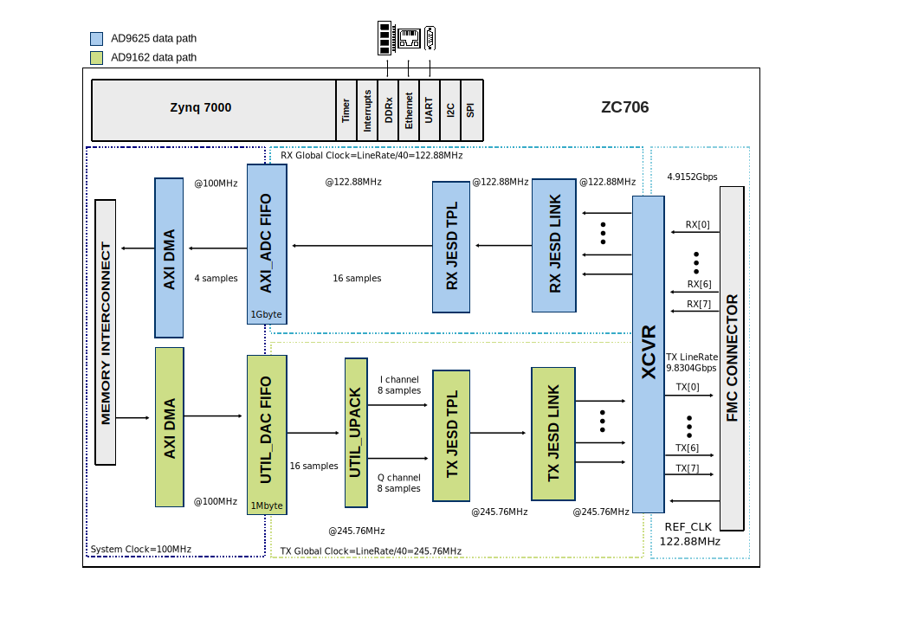

Software and HDL
================

HDL Reference Design
--------------------

The HDL reference design is an embedded system built around a processor core
(ARM). The high speed digital interface of the converters is handled by the
JESD204B framework. Due to the system's memory interface bandwidth limitation,
there are intermediary buffers in both TX and RX data paths, in order to save
and push data using high data rates. On the ZC706 carrier board, the RX
buffer depth is 1 Gbyte and the TX buffer depth is 1 Mbyte. These depths
can be swapped if required.

By default the :adi:`AD9162` is configured in complex mode with 8 lanes, and
the :adi:`AD9625` is configured in generic operation mode with 8 lanes. Both
JESD204 interfaces run in Subclass 0.

Other configurations can be used, but the user must ensure that all parties
(clock chip, converters and FPGA JESD204 IPs) are reconfigured accordingly.

Block Diagram
~~~~~~~~~~~~~

   AD-FMCOMMS11-EBZ block diagram

JESD204B Configuration
~~~~~~~~~~~~~~~~~~~~~~

.. list-table:: TX JESD204B Parameters (DAC Path)
   :header-rows: 1

   * - Parameter
     - Value
   * - Number of Lanes (L)
     - 8
   * - Number of Converters (M)
     - 2
   * - Samples per Frame (S)
     - 2
   * - Sample Width (N/N')
     - 16
   * - Lane Rate
     - 9.83 Gbps
   * - Core Clock
     - 245.76 MHz

.. list-table:: RX JESD204B Parameters (ADC Path)
   :header-rows: 1

   * - Parameter
     - Value
   * - Number of Lanes (L)
     - 8
   * - Number of Converters (M)
     - 1
   * - Samples per Frame (S)
     - 4
   * - Sample Width (N/N')
     - 16
   * - Lane Rate
     - 4.92 Gbps
   * - Core Clock
     - 122.88 MHz

Lane Mapping
~~~~~~~~~~~~

To relax PCB design constraints, the physical lanes are not connected
directly to the logical lanes. Both ADC and DAC sides use the same
remapping scheme: the n-th logical lane is mapped to the ``{0, 1, 2, 3, 7,
4, 6, 5}`` physical lane.

CPU/Memory Interconnect Addresses
~~~~~~~~~~~~~~~~~~~~~~~~~~~~~~~~~

.. list-table::
   :header-rows: 1

   * - Instance
     - Address
   * - axi_ad9162_xcvr
     - 0x44A6_0000
   * - axi_ad9162_core
     - 0x44A0_0000
   * - axi_ad9162_jesd
     - 0x44A9_0000
   * - axi_ad9162_dma
     - 0x7C42_0000
   * - axi_ad9625_xcvr
     - 0x44A5_0000
   * - axi_ad9625_core
     - 0x44A1_0000
   * - axi_ad9625_jesd
     - 0x44AA_0000
   * - axi_ad9625_dma
     - 0x7C40_0000

HDL Source Code
~~~~~~~~~~~~~~~

- :git-hdl:`projects/fmcomms11`

Linux Drivers
-------------

- :git-linux:`AD9625 Linux Driver <drivers/iio/adc/ad9467.c>`
- :git-linux:`AD9162 Linux Driver <drivers/iio/frequency/ad9162.c>`
- :git-linux:`AXI ADC HDL Linux Driver <drivers/iio/adc/cf_axi_adc_core.c>`
- :git-linux:`AXI DAC DDS Linux Driver <drivers/iio/frequency/cf_axi_dds.c>`

Device Trees
~~~~~~~~~~~~

- :git-linux:`ZC706 DTS <arch/arm/boot/dts/xilinx/zynq-zc706-adv7511-fmcomms11.dts>`

IIO Oscilloscope Plugin
------------------------

The FMCOMMS11 plugin for the IIO Oscilloscope is divided into five sections:

**ADC**

- **Sampling frequency (MHz):** Displays the sample rate of the ADC
- **Input Scales / Reference:** Sets the scale of the signal input
- **Channel 0 Test mode:** Controls the JESD204B interface test injection
  points

**Input Attenuator**

- **Gain (dB):** Controls RX signal attenuation

**DDS (axi-ad9162-hpc)**

The plugin provides several options for how transmitted data is generated.
It is possible to use the built-in two tone Direct Digital Synthesizer (DDS)
to transmit a bi-tonal signal on channels I and Q of the DAC, or to use
the Direct Memory Access (DMA) facility to transmit custom data from a file.

Available DDS modes:

- **One CW Tone** - One continuous wave tone outputted. The same signal with
  90 degree phase offset is outputted on Channel Q.
- **Two CW Tone** - Two continuous wave tones with configurable frequencies,
  amplitudes and phases for both tones.
- **Independent I/Q Control** - Full independent control of frequencies,
  amplitudes and phases for both tones on both I and Q channels.
- **DAC Buffer Output** - Transmit custom data loaded from a file
  (.txt or .mat). Data files are available in the IIO Oscilloscope waveforms
  directory.
- **Disable** - Both DDS and DMA are disabled, DAC channels stop
  transmitting.

**DAC**

- **Sampling frequency (MHz):** Displays the sample rate of the DAC
- **NCO Frequency (MHz):** Sets the frequency for NCO to enable digital
  frequency shifts with near infinite precision
- **Filter Settings:** Enable/disable finite impulse response filter with
  85 dB digital attenuation that implements 2x NRZ mode

**Output VGA**

- **Gain (dB):** Sets the TX gain output
