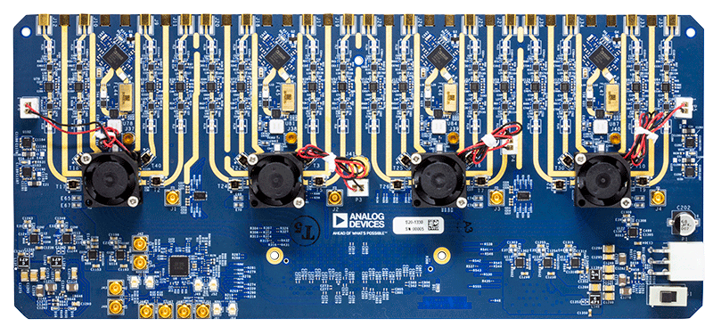

.. imported from: https://wiki.analog.com/resources/eval/user-guides/ad_quadmxfe1_ebz/ad_quadmxfe1_ebz_hdl

.. _ad-quadmxfe1-ebz:

Quad-MxFE Prototyping Platform User Guide
==========================================

Product Details
---------------

The :adi:`Quad-MxFE System Development Platform <en/design-center/evaluation-hardware-and-software/evaluation-boards-kits/Quad-MxFE.html>`
contains four :adi:`MxFE <en/products/digital-to-analog-converters/high-speed-da-converters/mixed-signal-frontends.html>`
software defined, direct RF sampling transceivers, as well as associated RF
front-ends, clocking, and power circuitry. The target application is phased
array radars, electronic warfare, and ground-based SATCOM, specifically a
**16 transmit/16 receive channel** direct sampling phased array at L/S/C band
(0.1 GHz to ~5GHz). The Rx & Tx RF front-end has drop-in configurations that
allow for customized frequency ranges, depending on the user's application.

The Quad-MxFE System Development Platform highlights a complete system solution.
It is intended as a testbed for demonstrating multi-chip synchronization as well
as the implementation of system level calibrations, beamforming algorithms, and
other signal processing algorithms. The system is designed to mate with a
:xilinx:`VCU118 <products/boards-and-kits/vcu118.html>` Evaluation Board from Xilinx, which features the Virtex
UltraScale+ XCVU9P FPGA, with provided reference software, HDL code, and MATLAB
system-level interfacing.

In addition to the Quad-MxFE Digitizing Card, the kit also contains a
:doc:`16Tx/16Rx Calibration Board <calboard>` that is used to develop
system-level calibration algorithms, or otherwise more easily demonstrate
power-up phase determinism in situations pertinent to their own use case. The
Calibration Board also allows the user to demonstrate combined-channel dynamic
range, spurious, and phase noise improvements and can also be controlled via a
free MATLAB add-on when connected to the PMOD interface of the :xilinx:`VCU118 <products/boards-and-kits/vcu118.html>`.

The system can be used to enable quick time-to-market development programs for
applications like:

- ADEF (Phased-Array, RADAR, EW, SATCOM)
- Communications Infrastructure (Multiband 5G and mmWave 5G)
- Electronic Test and Measurement

.. toctree::
   :hidden:

   quickbringup
   quick_start
   hardware_details
   reference_hdl
   multichip_sync
   calboard

User Resources
--------------

#. High-Level Overview

   #. :ref:`Features <quadmxfe-features>`
   #. :ref:`General Description <quadmxfe-general-description>`

#. :doc:`Getting Started <quickbringup>` --- **Install Fan/Heat Sinks Prior To First Use!**

   #. :ref:`Equipment Needed <quadmxfe-equipment-needed>`
   #. :ref:`Required Software <quadmxfe-software-needed>`

      #. :ref:`Download Supported Bitstreams & Use Cases <quadmxfe-downloads>`
      #. :doc:`IIO Oscilloscope </software/iio-oscilloscope/index>`

   #. :ref:`MATLAB Control Overview <quadmxfe-matlab-control>`

      #. :ref:`Simple Tx & Rx Control <quadmxfe-simpletxrx>`
      #. :ref:`System Phase/Amplitude Alignment Using pFIRs <quadmxfe-systemalignmentfir>`
      #. :ref:`Demonstrate Multi-Chip Synchronization <quadmxfe-mcs-script>`
      #. :ref:`Low-Latency ADC-to-DAC Loopback <quadmxfe-adctodac-loopback>`

#. :doc:`Hardware Information <hardware_details>`

   #. :ref:`Transmit Path <quadmxfe-transmit-path>`
   #. :ref:`Receive Path <quadmxfe-receive-path>`
   #. :ref:`Clocking Architecture <quadmxfe-clocking-architecture>`
   #. :ref:`Digital Interface <quadmxfe-digital-interface>`
   #. :ref:`Control Interfaces <quadmxfe-control-interfaces>`
   #. :ref:`Power Distribution <quadmxfe-power-supplies>`
   #. :ref:`Thermal Considerations <quadmxfe-thermal-considerations>`
   #. :ref:`Schematic <quadmxfe-schematic>`

#. :doc:`HDL Reference Design <reference_hdl>`

   #. :git-hdl:`Rev A/B. Quad-MxFE HDL Reference Design <hdl_2021_r1:projects/ad_quadmxfe1_ebz>`
   #. :git-hdl:`Rev C. Quad-MxFE HDL Reference Design <projects/ad_quadmxfe1_ebz>`

#. :doc:`Multi-Chip Synchronization Guide <multichip_sync>`
#. :doc:`Calibration Board <calboard>`
#. :ref:`Related Documents <quadmxfe-related-documents>`

   #. :ref:`Publications <quadmxfe-publications>`
   #. :ref:`Related Part Pages <quadmxfe-related-parts>`

.. _quadmxfe-features:

Features
--------

- Multi-channel, wideband system development platform for the :adi:`AD9081`
  :adi:`MxFE <en/products/digital-to-analog-converters/high-speed-da-converters/mixed-signal-frontends.html>`
- Mates with Xilinx :xilinx:`VCU118 <products/boards-and-kits/vcu118.html>` Evaluation Board (Not Included)
- 16x RF Receive (Rx) Channels (32x Digital Rx Channels)

  - Total 16x 1.5GSPS to 4GSPS ADC
  - 48x Digital Down Converters (DDCs), Each Including Complex
    Numerically-Controlled Oscillators (NCOs)
  - 16x Programmable Finite Impulse Response Filters (pFIRs)

- 16x RF Transmit (Tx) Channels (32x Digital Tx Channels)

  - Total 16x 3GSPS to 12GSPS DAC
  - 48x Digital Up Converters (DUCs), Each Including Complex
    Numerically-Controlled Oscillators (NCOs)

- Flexible Rx & Tx RF Front-Ends

  - Rx: Filtering, Amplification, Digital Step Attenuation for Gain Control
  - Tx: Filtering, Amplification

- Multiple System Control and Analysis Tools

  - IIO Oscilloscope GUI
  - MATLAB Add-Ons & Example Scripts
  - HDL and Embedded Software Solutions for JESD204b/JESD204c Bring-Up

- Provided Application-Specific Examples

  - Multi-Chip Synchronization for Power-Up Phase Determinism
  - System-Level Amplitude/Phase Alignment Using NCOs
  - Low-Latency ADC-to-DAC Loopback Bypassing JESD Interface
  - pFIR Control for Broadband Channel-to-Channel Amplitude/Phase Alignment
  - Fast-Frequency Hopping

- On-Board Power Regulation from Single 12V Power Adapter (Included)
- Flexible Clock Distribution

  - On-Board Clock Distribution from Single External 500MHz Reference
  - Support for External Converter Clock

.. _quadmxfe-general-description:

General Description
-------------------

This user guide serves as the main source of information for system engineers
and software developers using the Quad-MxFE System Evaluation Board, which
contains four :adi:`AD9081` software defined, direct RF sampling transceivers,
as well as associated RF front-end, clocking, and power circuitry. The target
application is phased array radars, electronic warfare, and ground-based SATCOM,
specifically a 16 transmit/16 receive channel direct sampling phased array at
L/S/C band (0.1 GHz to ~5GHz). The Rx & Tx RF front-end has drop-in
configurations that allow for customized frequency ranges, depending on the
user's application.

The Quad-MxFE System Evaluation Board highlights a complete system solution. It
is intended as a testbed for demonstrating multi-chip synchronization as well as
implementation of system level calibrations, beam forming algorithms, and other
signal processing algorithms. The board is designed to mate with a
:xilinx:`VCU118 <products/boards-and-kits/vcu118.html>` Evaluation Board from Xilinx, which features the Virtex
UltraScale+ XCVU9P FPGA, with provided reference software and HDL code.

High-Level Block Diagram
~~~~~~~~~~~~~~~~~~~~~~~~

.. figure:: quadmxfe_highlevelblockdiagram.png
   :align: center

   Quad-MxFE high-level block diagram

System Integration
~~~~~~~~~~~~~~~~~~

Below is the full integrated system including the :xilinx:`VCU118 <products/boards-and-kits/vcu118.html>`,
ADQUADMXFE1EBZ, and :doc:`ADQUADMXFE-CAL <calboard>` in full operation.

.. image:: quadfull_edit.jpg
   :align: center

Key Component Locations
~~~~~~~~~~~~~~~~~~~~~~~

.. image:: quad_mxfe_labels_top.jpg
   :align: center

.. image:: quad_mxfe_labels_bottom.jpg
   :align: center

LED Status Indicators
~~~~~~~~~~~~~~~~~~~~~

.. image:: quadfullleds.jpg
   :align: center

- :ref:`Quad MxFE Power (Green) LED Information <quadmxfe-power-leds>`
- :ref:`Quad MxFE Clock (Blue) LED Information <quadmxfe-clock-leds>`
- :ref:`Calibration Board LED Information <quadmxfe-calboard-leds>`
- :xilinx:`VCU118 LED Information (pg. 85) <support/documentation/boards_and_kits/vcu118/ug1224-vcu118-eval-bd.pdf>`

.. _quadmxfe-related-documents:

Related Documents
-----------------

.. _quadmxfe-publications:

Publications
~~~~~~~~~~~~

- :adi:`Multichannel RF to Bits Development Platform <en/design-notes/multichannel-rf-to-bits-development-platform.html>`
- :adi:`Power-Up Phase Determinism Using Multichip Synchronization Features in Integrated Wideband DACs and ADCs <en/technical-articles/power-up-phase-determinism-using-multichip-synchronization.html>`
- :adi:`Integrated Hardened DSP on DAC/ADC ICs Improves Wideband Multichannel Systems <en/technical-articles/integrated-hardened-dsp-on-dac-adc-ics-improves-wideband-multichannel-systems.html>`
- :adi:`Multi-Channel System Improvements Using Hardened DSP in Digitizer ICs <en/education/education-library/webcasts/multi-channel-system-improvements-using-hardened-dsp-digitizer-ics.html>`
- :adi:`Empirically Based Multichannel Phase Noise Model Validated in a 16-Channel Demonstrator <en/technical-articles/empirical-based-multichannel-phase-noise-model.html>`

.. _quadmxfe-related-parts:

Related Part Pages
~~~~~~~~~~~~~~~~~~

MxFE
^^^^^

- :adi:`AD9081 <en/products/ad9081.html>`
- :adi:`AD9082 <en/products/ad9082.html>`
- `UG-1578 User Guide <https://www.analog.com/media/en/technical-documentation/user-guides/ad9081-ad9082-ug-1578.pdf>`__

ADF4371
^^^^^^^

- :adi:`ADF4371`

HMC7043
^^^^^^^

- :adi:`HMC7043`

LTM4633
^^^^^^^

- :adi:`LTM4633`

LTM8063
^^^^^^^

- :adi:`LTM8063`

LTM8053
^^^^^^^

- :adi:`LTM8053`

FPGA Evaluation Board Hardware
^^^^^^^^^^^^^^^^^^^^^^^^^^^^^^

- :xilinx:`Xilinx Virtex UltraScale+ FPGA VCU118 <products/boards-and-kits/vcu118.html>`

Questions
---------

For additional questions or support, please visit the Engineering Zone forum at
:ez:`ADEF System Platforms <adef-system-platforms>`.
