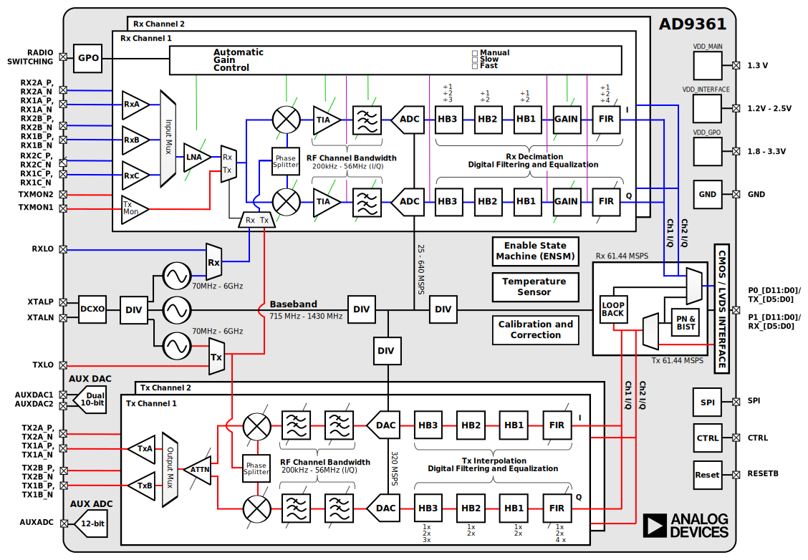

Using the AD-TRXBOOST1-EBZ Board
================================

Although the :adi:`AD-TRXBOOST1-EBZ` board was designed and tested with the
:adi:`AD-FMCOMMS3-EBZ`, this methodology is appropriate for any Rx/Tx signal
chain.

AD9361 Block Diagram
--------------------

This block diagram is shown to help with the discussion below, to better
understand the Tx and Rx signal chain.

Transmit
--------

You would not be using the TRXBOOST board, unless you wanted maximum output
power, so let's understand how to do that without sacrificing dynamic range, or
causing distortion.

Maximum input to the FIRs
~~~~~~~~~~~~~~~~~~~~~~~~~

The first step on understanding what sort of digital input can be provided to
the FIR filters without causing the FIR/Half Bands to saturate/overflow (and
cause distortion). Normally the FIR filter has some small gain to compensate for
losses in the half bands, and analog filters.

Luckily - the `MATLAB Filter Design Wizard for AD9361
<https://wiki.analog.com/resources/eval/user-guides/ad-fmcomms2-ebz/software/filters>`_
will tell you this.

.. image:: images/filterwizard_snip.png
   :alt: filterwizard_snip.png

This gain is required to compensate the losses in the pass band the analog
filters cause. If we just look at the composite response, the overall flatness
is within 0.05 dB (very flat) - even when we zoom in (the next picture), we can
see it is very, very flat (still 0.05dB). However, we can see that in the
passband, the analog filters are causing ~ 0.5dB of droop (which the FIR is
compensating for).

|image1| |image2|

We can clearly see the FIR compensation if we look at the FIR just by itself.
There is a small amount of peaking (0.5683dB) to make up for the droop. Since
this is frequency dependent - with a CW tone at low frequency, we may not notice
it, but with wideband signals - this will cause saturate/overflow and which can
be measured as distortion.

|image3| |image4|

This indicates that the maximum signal that can go into the Tx FIR is either
0.93667 of full scale, or -0.5683 dBFS (assuming 0dBFS is full scale). This
means, that rather than a 12-bit (4096 bits) system, you really have a 3836.6
bit system, or a 11.9056 bit system (loosing those 261 bits out of 4096 bits
doesn't really change the dynamic range much from a practical standpoint).
Backing off a little on the dynamic range (.1 bits) is pretty common for many
sorts of systems, including communications systems.

This specific number will vary for your specific analog RF bandwidth, your
specific half band settings, and overall RF setup. You should check the
`MATLAB Filter Design Wizard for AD9361
<https://wiki.analog.com/resources/eval/user-guides/ad-fmcomms2-ebz/software/filters>`_
for your actual design.

The Digital to Analog Converter (DAC) and modulators
~~~~~~~~~~~~~~~~~~~~~~~~~~~~~~~~~~~~~~~~~~~~~~~~~~~~

Also keep in mind that in this specific case - scaling back 0.93667 ensures that
there isn't any overflow/saturation in the digital sections, and will still
cause full scale signals to be provided to the DAC.

As these Full scale I and Q signals (assume for now ±1), as these baseband
signals are modulated with the LO in phase and quadrature, and added together,
the magnitude of the resulting signals grows to ± :math:`sqrt2` with a phase
of ±π.

This is why there is an attenuation block in the modulators.

To take advantage of the dynamic range in the system, you want to drive as close
to full scale into the DAC, but not overpower the output stage (causing
saturation, and again ultimately distortion). To do this - it's nearly always
required to have some attenuation in the output section.

Receive
-------

.. |image1| image:: images/fvtool_composite.png
   :width: 420
.. |image2| image:: images/fvtool_composite_zoom.png
   :width: 420
.. |image3| image:: images/fvtool_fir.png
   :width: 420
.. |image4| image:: images/fvtool_fir_zoom.png
   :width: 420
