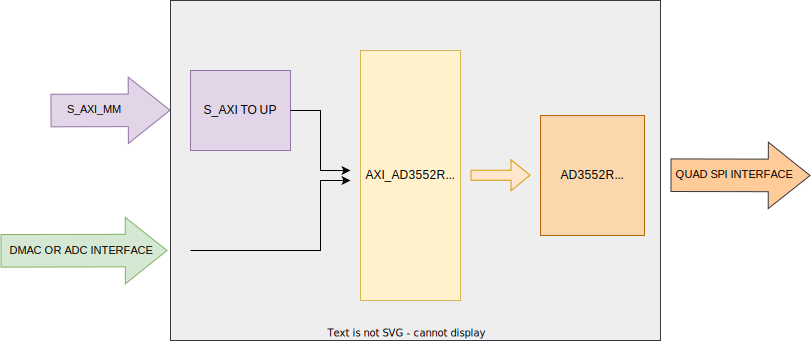
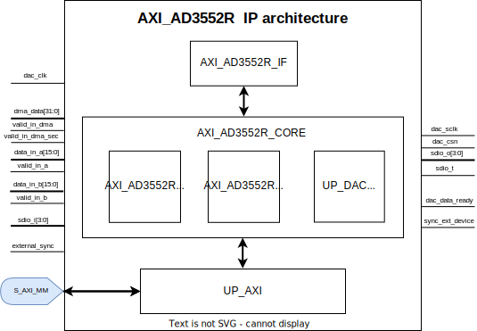

.. imported from: https://wiki.analog.com/resources/eval/eval-ad3552r-user-guide

.. _ad35xxr-evb:

AD35xxR-EVB User Guide
======================

Introduction
------------

The AD35xxR-EVB evaluation board provides a platform for evaluating the
:adi:`AD3552R`, :adi:`AD3551R`, :adi:`AD3542R`, and :adi:`AD3541R` family of
low drift, ultra-fast, 12/16-bit accuracy, current output digital-to-analog
converters (DACs). The board interfaces to an FPGA carrier through a standard
connector and uses the AXI AD35xxR HDL IP core for device control and data
streaming.

Supported Devices
-----------------

- :adi:`AD3541R`
- :adi:`AD3542R`
- :adi:`AD3551R`
- :adi:`AD3552R`

Supported Carriers
------------------

- `ZedBoard <https://digilent.com/reference/programmable-logic/zedboard/start>`__

HDL Reference Design
--------------------

The reference design uses the AXI AD35xxR IP core to interface with the DAC
devices over a quad SPI bus. The core supports multiple data sources including
DMA, ADC loopback, and internal test ramp generation.

Block Diagram
~~~~~~~~~~~~~

   AD35xxR-EVB HDL block diagram

The architecture consists of three primary layers:

- **AXI Slave Interface**: handles register access from the processor
- **Core Module**: manages dual-channel DAC operations with DDS, IQ correction,
  and data formatting
- **Interface Module**: controls quad SPI communication with a state machine

IP Core Architecture
~~~~~~~~~~~~~~~~~~~~

   AXI AD35xxR IP core internal architecture

Key Features
~~~~~~~~~~~~

- AXI-based configuration
- 8-bit and 16-bit register read/write in SDR and DDR modes
- Data stream SDR/DDR with clk_in/8 or clk_in/4 update rate
- Selectable input source: DMA, ADC loopback, or test ramp
- Multiple device synchronization capability
- Maximum reference clock: 132 MHz

Interface Signals
~~~~~~~~~~~~~~~~~

.. list-table::
   :header-rows: 1
   :widths: 20 20 15 45

   * - Category
     - Signal
     - Direction
     - Description
   * - Clock
     - dac_clk
     - Input
     - Reference clock for the DAC interface
   * - DMA Data
     - dma_data[31:0]
     - Input
     - Data from DMAC when input source is DMA
   * - DMA Control
     - valid_in_dma
     - Input
     - DMAC valid signal
   * - DMA Control
     - dac_data_ready
     - Output
     - Data ready signal for DMAC
   * - ADC Data
     - data_in_a[15:0]
     - Input
     - ADC channel A data (for loopback)
   * - ADC Data
     - data_in_b[15:0]
     - Input
     - ADC channel B data (for loopback)
   * - ADC Control
     - valid_in_a
     - Input
     - ADC channel A valid signal
   * - ADC Control
     - valid_in_b
     - Input
     - ADC channel B valid signal
   * - Sync
     - external_sync
     - Input
     - External synchronization flag
   * - Sync
     - sync_ext_device
     - Output
     - Synchronization output to other cores
   * - DAC SPI
     - dac_sclk
     - Output
     - Serial clock
   * - DAC SPI
     - dac_csn
     - Output
     - Chip select (active low)
   * - DAC SPI
     - sdio_o[3:0]
     - Output
     - Serial data out
   * - DAC SPI
     - sdio_i[3:0]
     - Input
     - Serial data in
   * - DAC SPI
     - sdio_t
     - Output
     - I/O buffer direction control

Configuration Parameters
~~~~~~~~~~~~~~~~~~~~~~~~

.. list-table::
   :header-rows: 1

   * - Parameter
     - Description
     - Default
   * - ID
     - Core ID; should be unique for each IP in the system
     - 0
   * - FPGA_TECHNOLOGY
     - Encoded value for FPGA device technology/generation
     - Auto-detected
   * - FPGA_FAMILY
     - Encoded value for FPGA family variant
     - Auto-detected
   * - SPEED_GRADE
     - Encoded value for FPGA speed grade
     - Auto-detected
   * - DEV_PACKAGE
     - Encoded value for device package
     - Auto-detected

Register Map
~~~~~~~~~~~~

Base Registers
^^^^^^^^^^^^^^

.. list-table::
   :header-rows: 1
   :widths: 15 15 15 55

   * - Address
     - Name
     - Type
     - Description
   * - 0x0000
     - VERSION
     - RO
     - Version number, unique to all cores
   * - 0x0001
     - ID
     - RO
     - Instance identifier number
   * - 0x0002
     - SCRATCH
     - RW
     - Scratch register for read/write testing
   * - 0x0007
     - FPGA_INFO
     - RO
     - FPGA technology, family, speed grade, and package information

DAC Common Registers
^^^^^^^^^^^^^^^^^^^^

.. list-table::
   :header-rows: 1
   :widths: 15 15 15 55

   * - Address
     - Name
     - Type
     - Description
   * - 0x0010
     - RSTN
     - RW
     - Reset control (RSTN, MMCM_RSTN, CE_N)
   * - 0x0011
     - CNTRL_1
     - RW
     - Sync control (SYNC, EXT_SYNC_ARM, EXT_SYNC_DISARM, MANUAL_SYNC_REQUEST)
   * - 0x0012
     - CNTRL_2
     - RW
     - Interface mode (SDR/DDR, symbol format, lanes, parity, data format)
   * - 0x0013
     - RATECNTRL
     - RW
     - Sample rate divisor; output samples at 1/RATE of clock
   * - 0x0015
     - STATUS1
     - RO
     - Interface clock frequency (16.16 fixed point)
   * - 0x0017
     - STATUS3
     - RO
     - Interface status (no errors if set)
   * - 0x001A
     - SYNC_STATUS
     - RO
     - DAC synchronization status
   * - 0x0020
     - DAC_CUSTOM_RD
     - RO
     - Custom register read data
   * - 0x0021
     - DAC_CUSTOM_WR
     - RW
     - Custom register write data
   * - 0x0022
     - UI_STATUS
     - RO/RW1C
     - Interface busy, overflow, and underflow status
   * - 0x0023
     - DAC_CUSTOM_CTRL
     - RW
     - Custom control (address, STREAM, TRANSFER_DATA)

DAC Channel Registers
^^^^^^^^^^^^^^^^^^^^^

Each channel has a set of registers starting at 0x0100 (channel 0) and
0x0110 (channel 1).

.. list-table::
   :header-rows: 1
   :widths: 15 15 15 55

   * - Address
     - Name
     - Type
     - Description
   * - 0x0100
     - CNTRL_1
     - RW
     - DDS tone 1 scale (1.1.14 fixed point format)
   * - 0x0101
     - CNTRL_2
     - RW
     - DDS tone 1 phase initialization and frequency
   * - 0x0102
     - CNTRL_3
     - RW
     - DDS tone 2 scale
   * - 0x0103
     - CNTRL_4
     - RW
     - DDS tone 2 phase initialization and frequency
   * - 0x0106
     - CNTRL_7
     - RW
     - DAC_DDS_SEL data source selection

Data Source Selection (DAC_DDS_SEL)
^^^^^^^^^^^^^^^^^^^^^^^^^^^^^^^^^^^

.. list-table::
   :header-rows: 1

   * - Value
     - Source
   * - 0x02
     - DMA input
   * - 0x08
     - ADC loopback
   * - 0x0B
     - 16-bit internal ramp

Synchronization
~~~~~~~~~~~~~~~

The IP core supports both internal and external synchronization:

- **Internal sync**: use the SYNC bit in REG_CNTRL_1[0] to synchronize
  channels within a single core
- **External sync**: use EXT_SYNC_ARM and external_sync signals for
  multi-device synchronization across multiple cores
- **Manual sync**: issue a manual synchronization request via
  MANUAL_SYNC_REQUEST

HDL Source Code
~~~~~~~~~~~~~~~

- :git-hdl:`library/axi_ad35xxr`
- :git-hdl:`projects/ad35xxr_evb`

Building the HDL Project
~~~~~~~~~~~~~~~~~~~~~~~~

The design is built upon ADI's generic HDL reference design framework. ADI
does not distribute pre-built bitstream files, so the project must be built
from source. Clone the HDL repository and, with the correct tools installed,
navigate to the project directory and run ``make``:

.. code-block:: bash

   cd hdl/projects/ad35xxr_evb/zed
   make

Software Support
----------------

Linux Device Driver
~~~~~~~~~~~~~~~~~~~

- :git-linux:`drivers/iio/dac/ad3552r.c`

No-OS Driver
~~~~~~~~~~~~~

- :git-no-OS:`drivers/dac/ad3552r`

More Information
----------------

- `ADI Reference Designs HDL User Guide <https://analogdevicesinc.github.io/hdl/user_guide/introduction.html>`__
- `AXI AD35xxR IP Core Documentation <https://analogdevicesinc.github.io/hdl/library/axi_ad35xxr/index.html>`__

Support
-------

Analog Devices will provide limited online support for anyone using the
reference design with Analog Devices components via the
:ez:`FPGA Reference Designs Forum <fpga>`.
