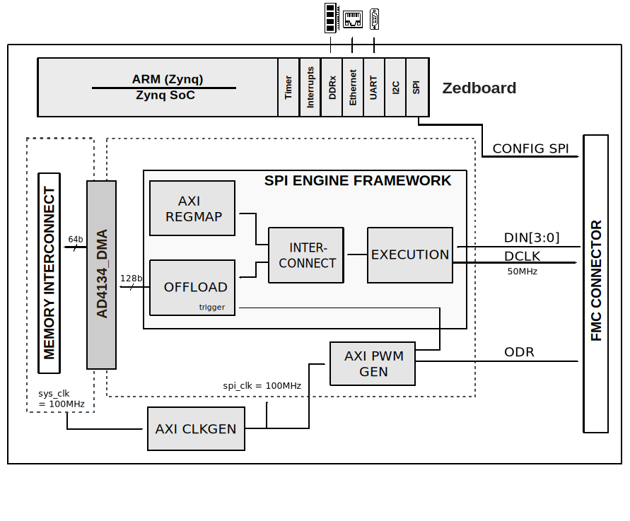

.. imported from: https://wiki.analog.com/resources/eval/user-guides/ad4134/hdl

.. _ad4134-fmc:

AD4134-FMC User Guide
=====================

Introduction
------------

The :adi:`AD4134` is a quad channel, 24-bit, low noise, simultaneous sampling,
precision analog-to-digital converter (ADC), based on the continuous time
sigma-delta (CTSD) modulation scheme. This architecture inherently provides
alias rejection up to 100 dB, with programmable data rates from 10 SPS to
1.496 MSPS and dynamic range of up to 138 dB when using a sinc3 filter at
10 SPS.

The EVAL-AD4134 evaluation board provides all the interfaces necessary to
interact with the device using a Xilinx FPGA development board. The design
supports continuous data capture at approximately 1.2 MSPS data rate (limited
by the 48 MHz maximum data clock on the ZedBoard).

Supported Devices
-----------------

- :adi:`AD4134`
- :adi:`AD7134`

Supported Carriers
------------------

- `ZedBoard <https://digilent.com/reference/programmable-logic/zedboard/start>`__

Hardware
--------

Evaluation Board
~~~~~~~~~~~~~~~~

- `EVAL-AD4134 <https://www.analog.com/en/resources/evaluation-hardware-and-software/evaluation-boards-kits/eval-ad4134.html>`__

Jumper Setup
~~~~~~~~~~~~

.. list-table::
   :header-rows: 1

   * - Jumper
     - Position
     - Description
   * - JP16
     - Mounted
     - Master Mode (default)

HDL Reference Design
--------------------

The HDL reference design uses the
`SPI Engine Framework <https://analogdevicesinc.github.io/hdl/library/spi_engine/index.html>`__
to interface with the :adi:`AD4134` ADC. The design operates in slave mode
with the FPGA generating both DCLK and ODR signals, while the device transmits
data across four DIN lines.

Block Diagram
~~~~~~~~~~~~~

   AD4134-FMC HDL block diagram

HDL Source Code
~~~~~~~~~~~~~~~

- :git-hdl:`projects/ad4134_fmc`

HDL Documentation
~~~~~~~~~~~~~~~~~

- `AD4134-FMC HDL project <https://analogdevicesinc.github.io/hdl/projects/ad4134_fmc/index.html>`__

Building the HDL Project
~~~~~~~~~~~~~~~~~~~~~~~~

The design is built upon ADI's generic HDL reference design framework. ADI
does not distribute pre-built bitstream files, so the project must be built
from source. Clone the HDL repository and, with the correct tools installed,
navigate to the project directory and run ``make``:

.. code-block:: bash

   cd hdl/projects/ad4134_fmc/zed
   make

A comprehensive build guide is available in the
`HDL User Guide <https://analogdevicesinc.github.io/hdl/user_guide/introduction.html>`__.

Software Support
----------------

Linux Device Driver
~~~~~~~~~~~~~~~~~~~

Driver and device tree source files:

- :git-linux:`drivers/iio/adc/ad4134.c`
- :git-linux:`arch/arm/boot/dts/xilinx/zynq-zed-adv7511-ad4134.dts`

No-OS Driver
~~~~~~~~~~~~~

The AD713x No-OS driver provides a platform-independent software layer for
controlling the :adi:`AD4134`/:adi:`AD7134` ADCs from bare-metal applications.

Source code:

- :git-no-OS:`drivers/adc/ad713x`
- :git-no-OS:`projects/ad713x_fmcz`

More Information
----------------

- `ADI Reference Designs HDL User Guide <https://analogdevicesinc.github.io/hdl/user_guide/introduction.html>`__
- `SPI Engine Framework <https://analogdevicesinc.github.io/hdl/library/spi_engine/index.html>`__
- :adi:`AD4134 Product Page <AD4134>`
- :adi:`AD7134 Product Page <AD7134>`

Support
-------

Analog Devices will provide limited online support for anyone using the
reference design with Analog Devices components via the
:ez:`FPGA Reference Designs Forum <fpga>`.
