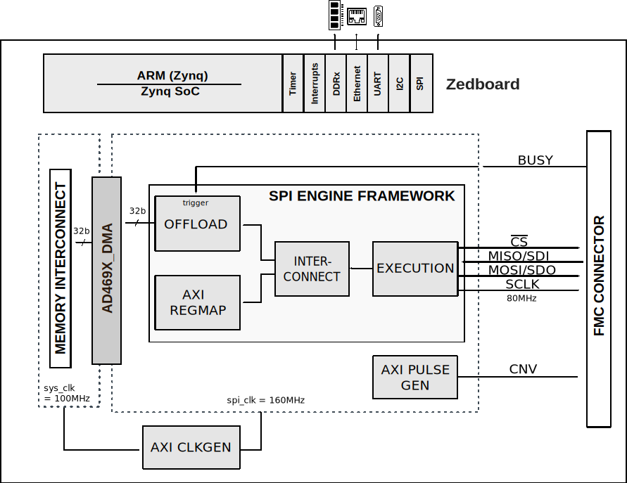

.. imported from: https://wiki.analog.com/resources/tools-software/product-support-software/ad4696_mbed_iio_application

.. _ad469x-fmc:

AD469x-FMC User Guide
=====================

Introduction
------------

The AD469x HDL reference design provides all the interfaces necessary to
interact with the devices on the :adi:`AD4696` evaluation board.

The design uses a SPI Engine instance to control and acquire data from the
AD4696 16-bit precision ADC, providing support to capture continuous samples at
maximum sampling rate. The reference design uses the standard SPI Engine
Framework with the offload module triggered by the BUSY signal of the device.

Supported Devices
-----------------

- :adi:`AD4695`
- :adi:`AD4696`
- :adi:`AD4697`
- :adi:`AD4698`

Supported Carriers
------------------

- `ZedBoard <https://digilent.com/reference/programmable-logic/zedboard/start>`__

Hardware
--------

The EVAL-AD4696FMCZ evaluation board connects to the ZedBoard via an FMC
connector. The evaluation board includes:

- 16 analog input channels with SMA connectors
- A 5 V external precision voltage reference
- Flexible input wiring configuration via jumpers (COM, pseudo-differential,
  fully differential)
- A RESET pin that can be connected to an FPGA GPIO for hardware reset

A typical test setup consists of the EVAL-AD4696FMCZ connected to a ZedBoard.
An :adi:`ADALM2000` (M2K) can be used to generate analog input signals via
coax cables with SMA connectors.

.. figure:: eval-ad4696fmcz-zedboard-m2k.jpg
   :align: center

   Typical EVAL-AD4696FMCZ + ZedBoard + ADALM2000 test setup

HDL Reference Design
--------------------

Block Diagram
~~~~~~~~~~~~~

   AD469x-FMC block diagram

The reference design uses the standard SPI Engine Framework to interface the
AD4696 ADC in single SDO Mode. The SPI offload module, which can be used to
capture continuous data stream at maximum data rate, is triggered by the BUSY
signal of the device.

HDL Source Code
~~~~~~~~~~~~~~~

- :git-hdl:`projects/ad469x_evb`

Software Support
----------------

No-OS Project
~~~~~~~~~~~~~

- :git-no-OS:`projects/ad469x_evb`
- :git-no-OS:`drivers/adc/ad469x`

Linux Device Driver
~~~~~~~~~~~~~~~~~~~

The AD4695 Linux IIO driver supports the AD469x family of 16-channel, 16-bit
multiplexed SAR ADCs with Easy Drive features. The driver is mainlined in the
upstream Linux kernel.

- :git-linux:`drivers/iio/adc/ad4695.c`
- :git-linux:`Documentation/devicetree/bindings/iio/adc/adi,ad4695.yaml`

.. note::

   In order to achieve the maximum sample rate, using a SPI offload such as the
   AXI SPI Engine is required.

Enabling the Driver
^^^^^^^^^^^^^^^^^^^

Pre-compiled kernels from ADI should have this driver already enabled. If
building your own kernel, enable it using the ``CONFIG_AD4695`` option:

.. code-block:: none

   Device Drivers  --->
     Industrial I/O support  --->
       Analog to digital converters  --->
         Analog Devices AD4695 and similar ADCs driver

Sysfs Attributes
^^^^^^^^^^^^^^^^

After the driver probes successfully, the voltage measurement channels are
available as IIO channels. Each voltage input provides the following
attributes:

- ``in_voltageX_raw`` - Reading this triggers a single conversion and returns
  the result.
- ``in_voltageX_scale`` - Based on the reference voltage, this value converts
  ``raw`` to millivolts.
- ``in_voltageX_offset`` - The common mode voltage in raw units.

The measured voltage is calculated as: ``(raw + offset) * scale``.

The internal temperature sensor is available via the ``in_temp`` channel with
similar ``in_temp_scale`` and ``in_temp_offset`` attributes for converting to
millidegrees Celsius.

Calibration
^^^^^^^^^^^

The AD469x family has per-channel calibration features for adjusting offset and
gain:

- ``in_voltageX_calibbias`` - Adjusts the offset calibration for channel X.
- ``in_voltageX_calibscale`` - Adjusts the gain calibration for channel X.
- ``in_voltageX_calibbias_available`` - Shows the range of allowable offset
  values.
- ``in_voltageX_calibscale_available`` - Shows the range of allowable gain
  values.

Device Trees
~~~~~~~~~~~~

- :git-linux:`arch/arm/boot/dts/xilinx/zynq-zed-adv7511-ad4696.dts`

The default devicetree is for the EVAL-AD4696FMCZ board with the FMC connector
using default jumper positions, compiled with ``make SPI_4WIRE=0``.

Devicetree Configuration
~~~~~~~~~~~~~~~~~~~~~~~~~

The ADC is represented as a child node of the SPI controller. The
``compatible`` property selects the specific chip variant.

SPI bus node (SPI offload wiring):

.. code-block:: none

   spi@44a00000 {
       compatible = "adi,axi-spi-engine-1.00.a";
       ...

       adc@0 {
           compatible = "adi,ad4696";
           reg = <0>;

           spi-max-frequency = <80000000>; /* 12.5 ns period */
           spi-cpha;
           spi-cpol;

           /* CNV pin connected to PWM and GPIO for SPI offload */
           cnv-gpios = <&gpio0 88 GPIO_ACTIVE_HIGH>;
           pwms = <&adc_trigger 0 100000>; /* 10 kHz default */

           reset-gpios = <&gpio0 86 GPIO_ACTIVE_LOW>;

           /* Power supplies */
           avdd-supply = <&eval_u5>;
           ldo-in-supply = <&eval_u5>;
           vio-supply = <&eval_u6>;

           /* External 5V reference (default on EVAL-AD4696FMCZ) */
           ref-supply = <&eval_u3>;
       };
   };

For standard SPI wiring (no offload), the CS line is connected to both the CS
and CNV pins on the ADC, so ``cnv-gpios`` and ``pwms`` are omitted.

Reference Supply Configuration
^^^^^^^^^^^^^^^^^^^^^^^^^^^^^^

There are two ways to supply a reference voltage:

- **External reference** - Provide the ``ref-supply`` property and omit
  ``refin-supply``. This is the default on the evaluation board (5 V external
  reference). Optionally, the ``adi,no-ref-high-z`` flag disables Reference
  Input High-Z Mode and the ``adi,no-ref-current-limit`` flag disables
  Overvoltage Reduced Current Mode.
- **Internal reference buffer** - Provide the ``refin-supply`` property and
  omit ``ref-supply`` and ``adi,no-ref-high-z``.

Channel Configuration
^^^^^^^^^^^^^^^^^^^^^

Channel configuration allows specifying the common-mode reference for each
input. By default, all inputs are pseudo-differential referenced to REFGND:

.. code-block:: none

   #address-cells = <1>;
   #size-cells = <0>;

   /* Pseudo-differential channel between IN0 and REFGND (default) */
   channel@0 {
       reg = <0>;
   };

   /* Pseudo-differential channel between IN1 and COM */
   channel@1 {
       reg = <1>;
       common-mode-channel = <AD4695_COMMON_MODE_COM>;
       bipolar;
   };

   /* Pseudo-differential channel between IN2 and IN3 */
   channel@2 {
       reg = <2>;
       common-mode-channel = <3>;
       bipolar;
   };

If the application requires the High-Z Mode feature to be disabled for a
channel, add the ``adi,no-high-z`` flag to that channel node.

Quick Start
-----------

Software Setup
~~~~~~~~~~~~~~

ADI provides a :doc:`Kuiper Linux </linux/kuiper/index>`
distribution with pre-built kernel images that include the AD4695 driver. Flash
Kuiper Linux to an SD card and boot the ZedBoard from it.

After booting, identify the IIO device:

.. code-block:: bash

   root@analog:~# for f in /sys/bus/iio/devices/iio\:device*/name; do echo "${f%/name} $(cat $f)"; done
   /sys/bus/iio/devices/iio:device0 xadc
   /sys/bus/iio/devices/iio:device1 ad4695

Read a single sample (triggers a single conversion):

.. code-block:: bash

   root@analog:~# cat /sys/bus/iio/devices/iio:device1/in_voltage0_raw
   32734

Buffered Capture
~~~~~~~~~~~~~~~~

The buffer interface is available in the ``buffer0`` sysfs directory for
efficiently reading multiple samples.

.. list-table:: Buffered Capture: SPI Offload vs Standard SPI
   :header-rows: 1

   * - Feature
     - With SPI Offload
     - Without SPI Offload
   * - Sample data width
     - Always 32-bit
     - 32-bit with oversampling, 16-bit without
   * - Sample rate control
     - ``in_voltage0_sampling_frequency`` attribute
     - Requires manual trigger configuration (e.g., ``hrtimer``)
   * - Maximum rate
     - Achievable (with proper wiring)
     - Limited by Linux host CPU
   * - Channel restrictions
     - At least 2 voltage channels must be enabled
     - No restrictions

Buffered capture with SPI offload (minimum 2 voltage channels required):

.. code-block:: bash

   # Set sample rate to 10 kHz
   root@analog:~# echo 10000 > /sys/bus/iio/devices/iio:device1/in_voltage0_sampling_frequency
   # Set buffer length
   root@analog:~# echo 8 > /sys/bus/iio/devices/iio:device1/buffer0/length
   # Enable two voltage channels
   root@analog:~# echo 1 > /sys/bus/iio/devices/iio:device1/buffer0/in_voltage0_en
   root@analog:~# echo 1 > /sys/bus/iio/devices/iio:device1/buffer0/in_voltage1_en
   # Enable buffer and read samples
   root@analog:~# echo 1 > /sys/bus/iio/devices/iio:device1/buffer0/enable
   root@analog:~# hexdump -n $((8 * 2 * 2)) -e'2/4 "%04X " "\n"' /dev/iio:device1

.. note::

   When using SPI offload, at least 2 voltage channels must always be enabled.
   The temperature channel does not count toward this minimum.

IIO Oscilloscope
~~~~~~~~~~~~~~~~

:doc:`IIO Oscilloscope </software/iio-oscilloscope/index>` can be used to
capture and visualize ADC samples. For setups with SPI offload support, set
the sample rate via the *Debug* tab by selecting the device, an input voltage
channel, and the ``sampling_frequency`` attribute.

For setups without SPI offload support, a trigger source must be configured
manually and cannot be controlled via the IIO Oscilloscope application.

More Information
----------------

- `ADI Reference Designs HDL User Guide <https://analogdevicesinc.github.io/hdl/user_guide/introduction.html>`__
- `AD4695 Linux Kernel Documentation <https://docs.kernel.org/iio/ad4695.html>`__
- :adi:`EVAL-AD4696FMCZ User Guide <en/technical-documentation/user-guides/eval-ad4696fmcz-ug-1882.pdf>`

Support
-------

Analog Devices will provide limited online support for anyone using the
reference design with Analog Devices components via the
:ez:`FPGA Reference Designs Forum <fpga>`.
