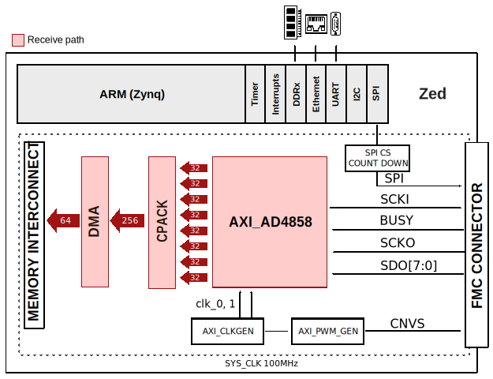

.. imported from: https://wiki.analog.com/resources/eval/user-guides/ad4858_fmcz/ad4858_fmcz_hdl

.. _ad4858-fmc:

AD4858-FMC User Guide
=====================

Introduction
------------

The :adi:`AD4858` is a 20-bit, low noise, 8-channel simultaneous sampling
successive approximation register (SAR) ADC with buffered differential, wide
common range picoamp inputs.

The :adi:`EVAL-AD4858` evaluation board supports pin-selectable SPI CMOS and
LVDS serial interfaces. In CMOS mode, applications may employ between 1-8 lanes
of serial output data, allowing the user to optimize bus width and data
throughput. In LVDS mode, pins SDO+/-, SCKI+/- and SCKO+/- function as
differential serial data input, clock output and clock input pins respectively
(from the FPGA's point of view).

Supported Devices
-----------------

- :adi:`AD4858`
- :adi:`AD4857`
- :adi:`AD4856`
- :adi:`AD4855`
- :adi:`AD4854`
- :adi:`AD4853`
- :adi:`AD4852`
- :adi:`AD4851`

Supported Carriers
------------------

- `ZedBoard <https://digilent.com/reference/programmable-logic/zedboard/start>`__

Hardware Requirements
---------------------

- :adi:`EVAL-AD4858` evaluation board
- `ZedBoard <https://digilent.com/reference/programmable-logic/zedboard/start>`__
- Signal generator
- 1x Ethernet cable
- 1x Micro-B USB cable for UART connectivity (optional)
- 1x SD card (at least 16 GB); follow the
  :doc:`Kuiper Linux guide </linux/kuiper/index>`
  to set up the card

HDL Reference Design
--------------------

Build Parameters
~~~~~~~~~~~~~~~~

.. list-table::
   :header-rows: 1

   * - Parameter
     - Default
     - Description
   * - LVDS_CMOS_N
     - 0
     - Interface type: 0 - CMOS, 1 - LVDS

To build the project, navigate to the
:git-hdl:`projects/ad485x_fmcz/zed <projects/ad485x_fmcz/zed>` directory and
run the ``make`` command with the desired configuration:

- CMOS version: ``make LVDS_CMOS_N=0``
- LVDS version: ``make LVDS_CMOS_N=1``

Block Diagram
~~~~~~~~~~~~~

The data path and clock domains are depicted in the following diagram:

   AD4858-FMC block diagram

The AXI_AD4858 IP core contains two configuration modes: CMOS and LVDS.
Depending on which is selected at build time via the ``LVDS_CMOS_N`` parameter,
different files are used for the project.

The AD4858 chip has three modes of configuration regarding the packet format:
20/24/32-bit format, which is configurable at runtime.

Clock Scheme
^^^^^^^^^^^^

Depending on the configuration used (CMOS or LVDS), the clock scheme differs.
Due to limitations of the evaluation board, an internal clock from the FPGA is
used:

.. figure:: ad4858_fmcz_clock_path.jpg
   :align: center

   AD4858-FMC clock path

- In LVDS mode: ``external_clk`` = 200 MHz (F_CLK0),
  ``external_fast_clk`` = 400 MHz (F_CLK1)
- In CMOS mode: ``external_clk`` = 100 MHz (F_CLK0)

For custom systems where the AD4858 chip is used, it is recommended to use an
external clock rather than a clock from the FPGA as done in this reference
design.

For more details regarding the MMCM clock frequencies, refer to
:xilinx:`UG472 (7 Series Clocking) <content/dam/xilinx/support/documents/user_guides/ug472_7Series_Clocking.pdf>`
and
:xilinx:`UG572 (UltraScale/+ Clocking) <support/documents/user_guides/ug572-ultrascale-clocking.pdf>`.

Limitations
^^^^^^^^^^^

The period of the SCKI clock signal is limited to a minimum of 2.5 ns (at most
400 MHz). With the SCKI frequency constrained, the case where the conversion
time is maximum (715 ns) is not achievable with the 24 and 32-bit packet
formats.

If maximum conversion rate of 400 MHz is required, only the 20-bit packet
format can be used.

IP List
^^^^^^^

- :git-hdl:`AXI_AD485x <library/axi_ad485x>`
- :git-hdl:`AXI_PWM_GEN <library/axi_pwm_gen>`
- :git-hdl:`AXI_CLKGEN <library/axi_clkgen>`
- :git-hdl:`AXI_DMAC <library/axi_dmac>`
- :git-hdl:`UTIL_CPACK2 <library/util_pack/util_cpack2>`

CPU/Memory Interconnect Addresses
^^^^^^^^^^^^^^^^^^^^^^^^^^^^^^^^^

.. list-table::
   :header-rows: 1

   * - Instance
     - Address
   * - axi_ad4858
     - 0x43C0_0000
   * - axi_pwm_gen
     - 0x43D0_0000
   * - ad4858_dma
     - 0x43E0_0000
   * - adc_clkgen
     - 0x4400_0000

Interrupts
^^^^^^^^^^

.. list-table::
   :header-rows: 1

   * - Instance
     - HDL
     - Linux Zynq
     - Actual Zynq
   * - ad4858_dma
     - 10
     - 54
     - 86

HDL Source Code
~~~~~~~~~~~~~~~

- :git-hdl:`projects/ad485x_fmcz`

System Setup
------------

.. figure:: ad4858_fmcz_zed_setup.jpg
   :align: center

   AD4858-FMC ZedBoard system setup

Connections:

- AD4858-FMCZ connected to the FMC port of the ZedBoard
- 1x Micro-B USB cable for UART connectivity on the ZedBoard
- 1x Ethernet cable for network connectivity

A signal generator is needed to provide analog input. For example, an
:adi:`ADALM2000` with a
`BNC adapter board <https://wiki.analog.com/university/tools/m2k/accessories/bnc>`__
can be used as a signal generator. Connect 2x BNC to SMA cables from the
SMA0+/- connectors on the AD4858-FMCZ to the W1/W2 connectors on the BNC
adapter board.

More Information
----------------

- `ADI Reference Designs HDL User Guide <https://analogdevicesinc.github.io/hdl/user_guide/introduction.html>`__
- :git-hdl:`AD4858-FMC HDL Project <projects/ad485x_fmcz>`
- :doc:`How to prepare an SD card </linux/kuiper/index>`

Support
-------

Analog Devices will provide limited online support for anyone using the
reference design with Analog Devices components via the
:ez:`FPGA Reference Designs Forum <fpga>`.
