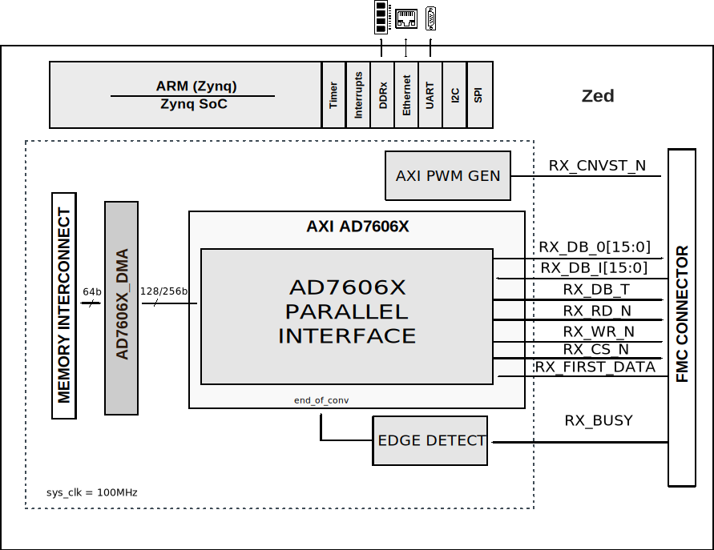

.. imported from: https://wiki.analog.com/resources/eval/user-guides/ad7606x-fmc/hdl

.. _ad7606x-fmc:

AD7606x-FMC User Guide
=======================

Introduction
------------

The :adi:`EVAL-AD7606B-FMCZ` and :adi:`EVAL-AD7606C-18` evaluation boards are
designed to help users evaluate the features of the :adi:`AD7606B`,
:adi:`AD7606C-16`, and :adi:`AD7606C-18` analog-to-digital converters (ADCs).

The data path of the HDL design supports both parallel and serial interfaces:

- The parallel interface is controlled by the axi_ad7606x IP core
- The serial interface is controlled by the SPI Engine Framework
- Data is written into memory by a DMA (axi_dmac core)
- All control pins of the device are driven by GPIOs

Supported Devices
-----------------

- :adi:`AD7606B`
- :adi:`AD7606C-16`
- :adi:`AD7606C-18`

Supported Carriers
------------------

- `ZedBoard <https://digilent.com/reference/programmable-logic/zedboard/start>`__

HDL Reference Design
--------------------

The design is built upon ADI's generic HDL reference design framework. For an
in-depth presentation of the HDL design framework, refer to the
`ADI Reference Designs HDL User Guide <https://analogdevicesinc.github.io/hdl/user_guide/introduction.html>`__.

Build Parameters
~~~~~~~~~~~~~~~~

.. list-table::
   :header-rows: 1

   * - Parameter
     - Default
     - Description
   * - DEV_CONFIG
     - 0
     - Device selection: 0 - AD7606B, 1 - AD7606C-16, 2 - AD7606C-18
   * - SIMPLE_STATUS_CRC
     - 0
     - ADC read mode: 0 - Simple, 1 - STATUS, 2 - CRC, 3 - STATUS_CRC
   * - EXT_CLK
     - 0
     - External clock option: 0 - No, 1 - Yes

Before board power-up, choose the device type, operation mode, and clocking
option. Depending on the operation mode, hardware modifications may be needed
on the board and/or Tcl script. Examples:

- For the **AD7606C-16** device: ``make DEV_CONFIG=1``
- For **STATUS** operation mode: ``make SIMPLE_STATUS_CRC=1``

Block Diagram
~~~~~~~~~~~~~

   AD7606x-FMC block diagram (parallel interface)

GPIO Signals
~~~~~~~~~~~~

PS7 EMIO offset = 54.

.. list-table::
   :header-rows: 1

   * - GPIO Signal
     - GPIO
     - HDL GPIO EMIOn
   * - adc_serpar
     - 93
     - 39
   * - adc_refsel
     - 92
     - 38
   * - adc_reset
     - 91
     - 37
   * - adc_stby
     - 90
     - 36
   * - adc_range
     - 89-87
     - 35-33
   * - adc_os
     - 86-84
     - 32-30

Interrupts
~~~~~~~~~~

Below are the Programmable Logic interrupts used in this project.

.. list-table::
   :header-rows: 1

   * - Instance
     - HDL
     - Linux ZynqMP
   * - axi_ad7606x_dma
     - 13
     - 109

AXI_AD7606x IP Core
~~~~~~~~~~~~~~~~~~~

The ``axi_ad7606x`` IP core interfaces the :adi:`AD7606B`, :adi:`AD7606C-16`,
and :adi:`AD7606C-18` devices using the FPGA parallel data interface and
provides a FIFO interface for the DMA.

.. list-table:: IP Core Configuration Parameters
   :header-rows: 1

   * - Name
     - Default
     - Description
   * - ``ID``
     - 0
     - Core ID, used when multiple cores are instantiated in a system
   * - ``DEV_CONFIG``
     - 0
     - Device selection: 0 - AD7606B, 1 - AD7606C-16, 2 - AD7606C-18
   * - ``ADC_TO_DMA_N_BITS``
     - 16
     - Number of bits transmitted to DMA: 16 for AD7606B/C-16, 32 for
       AD7606C-18
   * - ``ADC_N_BITS``
     - 16
     - Number of bits per device: 16 for AD7606B/C-16, 18 for AD7606C-18
   * - ``ADC_READ_MODE``
     - 0
     - ADC read mode: 0 - Simple, 1 - STATUS, 2 - CRC, 3 - CRC_STATUS
   * - ``EXTERNAL_CLK``
     - 0
     - External clock option for the ADC clock: 0 - No, 1 - Yes

The IP core can be configured in various operation modes through the device
register map. The ``adc_config_ctrl`` signal in the ``up_adc_common`` module
controls register access: bit 1 selects read (1) or write (0), and bit 0
enables the read/write operation.

For the AD7606x register mode, the parallel interface uses: DB[15] for
read (0) or write (1) selection, DB[14:8] for the register address, and
DB[7:0] for register data. The WR_N and RD_N signals control write and read
requests to the device.

.. note::

   For the :adi:`AD7606C-18`, the DB pin numbering is offset by +2 compared
   to the :adi:`AD7606B` and :adi:`AD7606C-16` (e.g., DB0 on AD7606B/C-16
   corresponds to DB2 on AD7606C-18).

For detailed IP core documentation, refer to the
`AXI_AD7606x IP core documentation <https://analogdevicesinc.github.io/hdl/library/axi_ad7606x/index.html>`__.

HDL Source Code
~~~~~~~~~~~~~~~

- :git-hdl:`projects/ad7606x_fmc`

Software
--------

Linux Driver
~~~~~~~~~~~~

- :git-linux:`AD7606 Linux driver <drivers/iio/adc/ad7606.c>`
- :git-linux:`AD7606 SPI interface <drivers/iio/adc/ad7606_spi.c>`
- :git-linux:`AD7606 parallel interface <drivers/iio/adc/ad7606_par.c>`

No-OS Driver
~~~~~~~~~~~~~

- :git-no-OS:`AD7606 No-OS driver <drivers/adc/ad7606>`
- :git-no-OS:`AD7606x-FMC No-OS project <projects/ad7606x-fmc>`

More Information
----------------

- `ADI Reference Designs HDL User Guide <https://analogdevicesinc.github.io/hdl/user_guide/introduction.html>`__
- :git-hdl:`AD7606x-FMC HDL Project <projects/ad7606x_fmc>`
- :git-hdl:`AXI_AD7606x IP Core <library/axi_ad7606x>`

Support
-------

Analog Devices will provide limited online support for anyone using the
reference design with Analog Devices components via the
:ez:`FPGA Reference Designs Forum <fpga>`.
