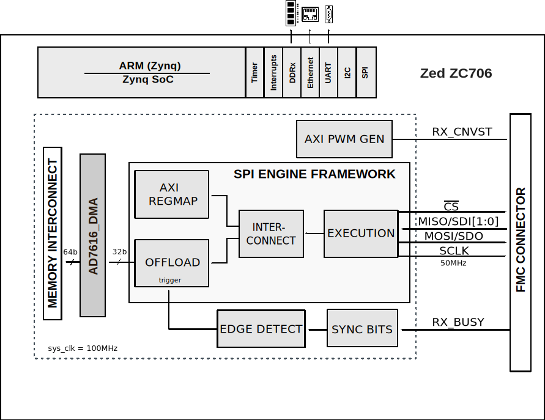
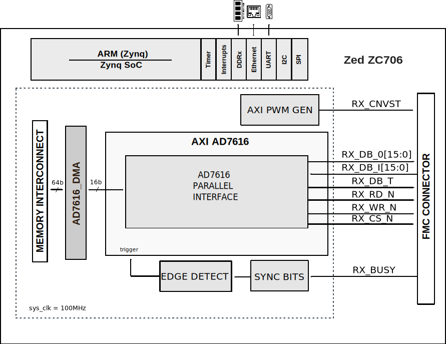

.. imported from: https://wiki.analog.com/resources/eval/user-guides/ad7616-sdz

.. _ad7616-sdz:

AD7616-SDZ User Guide
=====================

Introduction
------------

The :adi:`AD7616` is a 16-bit, dual simultaneous sampling, data acquisition
system (DAS) that operates from a single 5 V supply and supports bipolar input
ranges of +/-10 V, +/-5 V, and +/-2.5 V.

The AD7616 features 16 channels with dual 16-bit successive approximation
ADCs, throughput up to 1 MSPS per channel pair, 90 dB SNR (92 dB with 2x
oversampling), input clamp protection tolerating +/-20 V, 1 MOhm analog input
impedance, on-chip filtering, and a 2.5 V reference buffer.

Applications include powerline monitoring, protective relays, multiphase motor
control, instrumentation and control systems, and data acquisition systems.

The HDL reference design supports both parallel and serial interfaces. The
parallel interface is controlled by the axi_ad7616 IP core, while the serial
interface uses the SPI Engine Framework. Data is written into memory via DMA.

Supported Devices
-----------------

- :adi:`AD7616`

Evaluation Boards
-----------------

- :adi:`EVAL-AD7616`

Supported Carriers
------------------

.. list-table::
   :header-rows: 1

   * - Carrier
     - Setup Type
   * - `ZedBoard <https://digilent.com/reference/programmable-logic/zedboard/start>`__
     - FPGA + Linux
   * - :xilinx:`ZC706 <products/boards-and-kits/ek-z7-zc706-g.html>`
     - FPGA + Linux
   * - :adi:`SDP-K1`
     - Microcontroller (No-OS)

Other Required Hardware
~~~~~~~~~~~~~~~~~~~~~~~

- `SDP-I-FMC <https://www.analog.com/en/design-center/evaluation-hardware-and-software/evaluation-boards-kits/EVAL-SDP-I-FMC.html>`__
  interposer when using ZedBoard
- `STLINK-V3 <https://www.st.com/en/development-tools/stlink-v3set.html>`__
  debugger/programmer when using :adi:`SDP-K1`

ZedBoard Setup
--------------

Required Software
~~~~~~~~~~~~~~~~~

- Xilinx tools matching the version in the
  `HDL releases <https://github.com/analogdevicesinc/hdl/releases>`__
- A UART terminal (e.g. Tera Term or PuTTY) with baud rate set to 115200

EVAL-AD7616 Jumper Configuration
~~~~~~~~~~~~~~~~~~~~~~~~~~~~~~~~~

.. list-table::
   :header-rows: 1

   * - Jumper
     - Position
     - Description
   * - SL1
     - Unmounted
     - Channel Sequencer Enable
   * - SL2
     - Unmounted
     - RC Enable Input
   * - SL3
     - Mounted
     - Selects 2 MISO mode
   * - SL4
     - Unmounted
     - Oversampling Ratio Selection OS2
   * - SL5
     - Mounted
     - Selects serial interface
   * - SL6
     - Unmounted
     - Oversampling Ratio Selection OS1
   * - SL7
     - Unmounted
     - Oversampling Ratio Selection OS0
   * - LK40
     - A
     - Onboard 5V power supply selected
   * - LK41
     - A
     - Onboard 3.3V power supply selected

Building the HDL
~~~~~~~~~~~~~~~~

The interface type is selected at build time:

- Serial interface: ``make SER_PAR_N=1``
- Parallel interface: ``make SER_PAR_N=0``

.. note::

   For the SDP-I-FMC adapter, set VADJ on the carrier board to 3.3 V.

SDP-K1 Setup
-------------

.. figure:: ad7616_sdp-k1_setup.jpg
   :align: center
   :width: 600

   EVAL-AD7616 connected to SDP-K1 via fly-wire

The :adi:`EVAL-AD7616` is connected to :adi:`SDP-K1` via fly-wire. An
`STLINK-V3 <https://www.st.com/en/development-tools/stlink-v3set.html>`__
is required to flash the SDP-K1. Power both the :adi:`EVAL-AD7616` and
:adi:`SDP-K1` via the barrel jack connector.

EVAL-AD7616 Jumper Configuration (SDP-K1)
~~~~~~~~~~~~~~~~~~~~~~~~~~~~~~~~~~~~~~~~~~

.. list-table::
   :header-rows: 1

   * - Jumper
     - Position
     - Description
   * - SL1
     - Unmounted
     - Channel Sequencer Enable
   * - SL2
     - Unmounted
     - RC Enable Input
   * - SL3
     - Unmounted
     - Selects 1 MISO mode
   * - SL4
     - Unmounted
     - Oversampling Ratio Selection OS2
   * - SL5
     - Mounted
     - Selects serial interface
   * - SL6
     - Unmounted
     - Oversampling Ratio Selection OS1
   * - SL7
     - Unmounted
     - Oversampling Ratio Selection OS0
   * - LK40
     - A
     - Onboard 5V power supply selected
   * - LK41
     - A
     - Onboard 3.3V power supply selected

Fly-Wire Connections
~~~~~~~~~~~~~~~~~~~~

.. list-table::
   :header-rows: 1

   * - EVAL-AD7616
     - SDP-K1 Arduino
   * - SCLK
     - D13
   * - DB10/SDI
     - D11
   * - DB12/SDOA
     - D12
   * - CS
     - D10
   * - CONVST
     - D5
   * - RESET
     - D7
   * - BUSY
     - D6

Building and Flashing (SDP-K1)
~~~~~~~~~~~~~~~~~~~~~~~~~~~~~~

To build the No-OS project:

.. code-block:: bash

   make

To flash the firmware:

.. code-block:: bash

   make run

The project provides an IIO device over the serial interface at 230400 baud.
Use `IIO Oscilloscope <https://analogdevicesinc.github.io/iio-oscilloscope/>`__
to view captured data. For further details, refer to the
`No-OS Build Guide <https://analogdevicesinc.github.io/no-OS/build/>`__.

HDL Reference Design
--------------------

Block Diagrams
~~~~~~~~~~~~~~

   AD7616-SDZ block diagram (serial interface)

   AD7616-SDZ block diagram (parallel interface)

CPU/Memory Interconnect Addresses
~~~~~~~~~~~~~~~~~~~~~~~~~~~~~~~~~~

.. list-table::
   :header-rows: 1

   * - Instance
     - Address
   * - axi_ad7616_dma
     - 0x44A30000
   * - ad7616_pwm_gen
     - 0x44B00000
   * - spi_ad7616_axi_regmap
     - 0x44A00000 (serial mode only)
   * - axi_ad7616
     - 0x44A80000 (parallel mode only)

PL Interrupts
~~~~~~~~~~~~~

.. list-table::
   :header-rows: 1

   * - Instance
     - HDL Interrupt
     - Linux PS7 Interrupt
   * - axi_ad7616
     - 10
     - 106 (parallel mode only)
   * - spi_ad7616
     - 12
     - 108 (serial mode only)
   * - axi_ad7616_dma
     - 13
     - 109

GPIO Signals
~~~~~~~~~~~~

PS7 EMIO offset = 54

.. list-table::
   :header-rows: 1

   * - GPIO Signal
     - GPIO
     - HDL GPIO EMIOn
   * - adc_reset_n
     - 97
     - 43
   * - adc_hw_rngsel
     - 96-95
     - 42-41
   * - adc_os
     - 94-92
     - 40-38
   * - adc_seq_en
     - 91
     - 37
   * - adc_burst
     - 90
     - 36
   * - adc_chsel
     - 89-87
     - 35-33
   * - adc_crcen
     - 86
     - 32

HDL Source Code
~~~~~~~~~~~~~~~

- :git-hdl:`projects/ad7616_sdz`

Software Support
----------------

No-OS Project
~~~~~~~~~~~~~

- :git-no-OS:`projects/ad7616-sdz` (ZedBoard)
- :git-no-OS:`projects/ad7616-st` (SDP-K1)
- :git-no-OS:`drivers/adc/ad7616`

The No-OS driver supports SPI and parallel interface modes, software and
hardware operation modes, per-channel input range selection (+/-2.5 V, +/-5 V,
+/-10 V), oversampling ratios (2x through 128x), and channel sequencer
configuration.

No-OS Driver API
~~~~~~~~~~~~~~~~

The following table summarizes the key functions provided by the AD7616 No-OS
driver:

.. list-table::
   :header-rows: 1
   :widths: 40 60

   * - Function
     - Description
   * - ``ad7616_setup``
     - Initialize the device
   * - ``ad7616_read`` / ``ad7616_write``
     - SPI read/write from/to device
   * - ``ad7616_read_mask`` / ``ad7616_write_mask``
     - SPI read/write using a bitmask
   * - ``ad7616_reset``
     - Perform a full device reset
   * - ``ad7616_set_range``
     - Set analog input range for a channel
   * - ``ad7616_set_mode``
     - Set operation mode (software or hardware)
   * - ``ad7616_set_oversampling_ratio``
     - Set the oversampling ratio
   * - ``ad7616_read_data_serial``
     - Read conversion data in serial mode
   * - ``ad7616_select_channel_source``
     - Select input source for a channel
   * - ``ad7616_setup_sequencer``
     - Configure the channel sequencer
   * - ``ad7616_disable_sequencer``
     - Disable the channel sequencer

No-OS IIO Driver
~~~~~~~~~~~~~~~~

The AD7616 IIO driver provides IIO-compatible device access for use with tools
such as IIO Oscilloscope and pyadi-iio:

.. list-table::
   :header-rows: 1
   :widths: 40 60

   * - Function
     - Description
   * - ``ad7616_iio_init``
     - Initialize AD7616 for IIO interfacing
   * - ``ad7616_iio_remove``
     - Remove AD7616 IIO device

More Information
----------------

- `ADI Reference Designs HDL User Guide <https://analogdevicesinc.github.io/hdl/user_guide/introduction.html>`__

Support
-------

Analog Devices will provide limited online support for anyone using the
reference design with Analog Devices components via the
:ez:`FPGA Reference Designs Forum <fpga>`.

For microcontroller and No-OS driver questions, visit the
:ez:`Microcontroller No-OS Drivers Forum <microcontroller-no-os-drivers>`.
