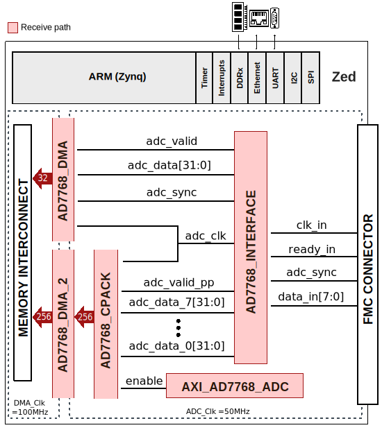
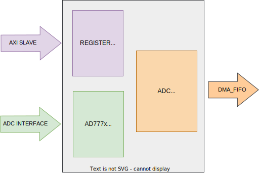
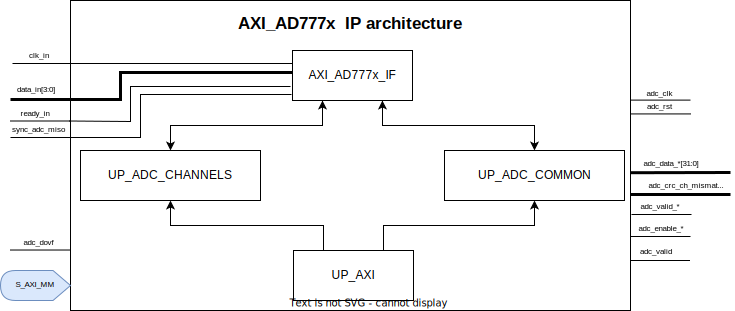

.. imported from: https://wiki.analog.com/resources/eval/user-guides/circuits-from-the-lab/cn0584

.. _ad777x-fmcz:

AD777x-FMCZ User Guide
=======================

Introduction
------------

The :adi:`AD7771`, :adi:`AD7779`, and :adi:`AD7770` are 8-channel,
simultaneous sampling, 24-bit sigma-delta (Σ-Δ) analog-to-digital converters
(ADCs). All eight Σ-Δ ADC channels include an independent modulator and
digital filter, enabling synchronized, simultaneous sampling of AC and DC
signals across all channels.

Each input channel has a programmable gain stage supporting gains of 1, 2, 4,
and 8, allowing lower amplitude sensor outputs to be mapped into the full-scale
ADC input range and maximizing the dynamic range of the signal chain. The
devices accept a voltage reference (VREF) from 1 V to 3.6 V, and the analog
inputs accept unipolar (0 V to VREF) or true bipolar (±VREF/2 V) signals with
3.3 V or ±1.65 V analog supply voltages respectively. The analog inputs can be
configured to accept true differential or single-ended signals to match
different sensor output configurations.

Each channel contains an ADC modulator and a sinc3 low latency digital filter.
A sample rate converter (SRC) provides fine resolution control over the output
data rate (ODR), useful in applications requiring coherency with line frequency
changes. The devices implement two separate interfaces: a data output interface
for transmitting ADC conversion results and a SPI control interface for
configuration registers and SAR ADC readback.

The :adi:`AD7779` includes a 12-bit SAR ADC that can be used for diagnostics
without decommissioning any of the Σ-Δ ADC channels. With an external
multiplexer controlled via GPIO pins, the SAR ADC can validate Σ-Δ ADC
measurements in functional safety applications.

The devices offer two modes of operation:

- **High resolution mode** - higher dynamic range, 10.75 mW per channel
- **Low power mode** - reduced dynamic range, 3.37 mW per channel

Typical applications include circuit breakers, general-purpose data
acquisition, electroencephalography (EEG), and industrial process control.

Supported Devices
-----------------

- :adi:`AD7770`
- :adi:`AD7771`
- :adi:`AD7779`

Evaluation Boards
~~~~~~~~~~~~~~~~~

- :adi:`EVAL-AD7770-AD7779`

Supported Carriers
------------------

- `ZedBoard <https://digilent.com/reference/programmable-logic/zedboard/start>`__
  (FMC LPC)

HDL Reference Design
--------------------

The HDL reference design interfaces the AD777x evaluation board with the
ZedBoard using the custom ``axi_ad777x`` IP core. The data path uses an
AXI-based DMA (``axi_dmac``) to transfer captured ADC samples to DDR memory.
A ``util_cpack2`` channel packing module aggregates all 8 channels before the
DMA transfer. The AD777x is controlled via the Zynq-7000 SPI 0 interface.

The ``axi_ad777x`` IP core supports 1, 2, or 4 active serial data lanes and
includes a parallel CRC check algorithm for data integrity validation. The
core provides real-time access to per-channel data headers and CRC mismatch
flags.

   AD777x-FMCZ HDL system block diagram

IP Cores Used
~~~~~~~~~~~~~

.. list-table::
   :header-rows: 1

   * - IP Core
     - Instance Name
     - Description
   * - axi_ad777x
     - axi_ad777x_adc
     - AD777x ADC interface and register control
   * - axi_dmac
     - ad777x_dma
     - DMA for moving ADC data to DDR memory
   * - util_cpack2
     - ad777x_adc_pack
     - Channel packing (8 channels, 32-bit samples)

AXI_AD777x Block Diagram
~~~~~~~~~~~~~~~~~~~~~~~~~

   AXI_AD777x IP core block diagram

AXI_AD777x Interface
~~~~~~~~~~~~~~~~~~~~

.. list-table::
   :header-rows: 1
   :widths: 15 20 15 50

   * - Interface
     - Pin
     - Type
     - Description
   * - ADC data
     - ``clk_in``
     - input
     - Input clock
   * -
     - ``ready_in``
     - input
     - Input ready signal
   * -
     - ``data_in[3:0]``
     - input
     - Serial input data (1, 2, or 4 lanes active)
   * -
     - ``sync_adc_miso``
     - input
     - Synchronization input signal
   * -
     - ``sync_adc_mosi``
     - output
     - Synchronization output signal
   * -
     - ``adc_dovf``
     - input
     - Data overflow input from the DMA
   * - FIFO
     - ``adc_clk``
     - output
     - Clock domain for the core modules
   * -
     - ``adc_rst``
     - output
     - Output reset on the ``adc_clk`` domain
   * -
     - ``adc_enable_*``
     - output
     - Channel enable, activated by software
   * -
     - ``adc_valid_*``
     - output
     - Valid data available on the bus
   * -
     - ``adc_data_*[31:0]``
     - output
     - Channel output data
   * -
     - ``adc_crc_ch_mismatch[7:0]``
     - output
     - Per-channel CRC mismatch flags

AXI_AD777x Detailed Architecture
~~~~~~~~~~~~~~~~~~~~~~~~~~~~~~~~~

   AXI_AD777x IP core detailed architecture

Memory Map
~~~~~~~~~~

.. list-table::
   :header-rows: 1

   * - Instance
     - Address
   * - axi_ad777x_adc
     - 0x43C0_0000
   * - ad777x_dma
     - 0x7C48_0000

GPIO Signals
~~~~~~~~~~~~

PS7 EMIO offset = 54.

.. list-table::
   :header-rows: 1

   * - GPIO Signal
     - GPIO
     - HDL GPIO EMIOn
     - Direction
   * - alert
     - 86
     - 32
     - Input
   * - start_n
     - 87
     - 33
     - Output
   * - sdp_convst
     - 88
     - 34
     - Output
   * - sdp_mclk
     - 89
     - 35
     - Output
   * - reset_n
     - 90
     - 36
     - Output
   * - gpio2
     - 91
     - 37
     - Bidirectional

Design Guidelines
~~~~~~~~~~~~~~~~~

The control of the AD777x chip is done through a SPI interface, which is needed
at system level. The ADC interface signals must be connected directly to the top
file of the design, as IO primitives are part of the IP.

The example design uses a DMA to move the data from the output of the IP to
memory. If the data needs to be processed in HDL before being moved to memory,
it can be done at the output of the IP (at system level) or inside the ADC
interface module (at IP level).

The example design uses a processor to program all the registers. If no
processor is available in your system, you can create your own IP starting from
the interface module.

HDL Source Code
~~~~~~~~~~~~~~~

- :git-hdl:`projects/ad777x_fmcz`

HDL Documentation
~~~~~~~~~~~~~~~~~

- `AD777x-FMCZ HDL project documentation <https://analogdevicesinc.github.io/hdl/projects/ad777x_fmcz/index.html>`__
- `AXI_AD777x IP core documentation <https://analogdevicesinc.github.io/hdl/library/axi_ad777x/index.html>`__

Software Support
----------------

Linux Driver
~~~~~~~~~~~~

The AD7768 Linux driver supports the AD777x family of devices. It provides IIO
buffer support for continuous data capture from all 8 channels.

- :git-linux:`drivers/iio/adc/ad7768.c`
- :git-linux:`arch/arm/boot/dts/xilinx/zynq-zed-adv7511-ad7768.dts`

Device Tree
^^^^^^^^^^^

Required properties:

- ``compatible``: Must be one of ``"adi,ad7768"`` or ``"adi,ad7768-4"``
- ``reg``: SPI chip select number for the device
- ``clocks``: Phandle to master clock of the device
- ``clock-names``: Must be ``"mclk"``
- ``spi-max-frequency``: Maximum SPI frequency
- ``dmas``: DMA specifier, consisting of a phandle to the DMA controller node
- ``dma-names``: Must be ``"rx"``
- ``vref-supply``: Phandle to the regulator for ADC reference voltage

Optional properties:

- ``reset-gpios``: Reset GPIO
- ``adi,data-lines``: Number of DOUTx pins on which channel data is output
  (default: 1). This value is determined by the configuration of the
  FORMAT pins, which are read on power-up.

IIO Attributes
^^^^^^^^^^^^^^

Once the driver is loaded, the IIO device is accessible at
``/sys/bus/iio/devices/iio:deviceX/``. Key attributes include:

.. list-table::
   :header-rows: 1
   :widths: 35 65

   * - Attribute
     - Description
   * - ``name``
     - Device name (``ad7768``)
   * - ``in_voltage_scale``
     - Scale factor to convert raw values to millivolts
   * - ``sampling_frequency``
     - Current sampling frequency
   * - ``sampling_frequency_available``
     - Available sampling frequencies
   * - ``power_mode``
     - Current power mode
   * - ``power_mode_available``
     - Available power modes
   * - ``filter_type``
     - Current digital filter type
   * - ``filter_type_available``
     - Available digital filter types

No-OS Driver
~~~~~~~~~~~~

The no-OS AD7779 driver supports the AD7770, AD7771, and AD7779 devices. It
provides full SPI register access, per-channel gain and decimation rate
configuration, power mode selection, reference type and buffer control, and
SAR ADC single-conversion support. The :adi:`AD7771` additionally supports
enabling a sinc5 digital filter.

- :git-no-OS:`drivers/adc/ad7779`

More Information
----------------

- `ADI Reference Designs HDL User Guide <https://analogdevicesinc.github.io/hdl/user_guide/introduction.html>`__

Support
-------

Analog Devices will provide limited online support for anyone using the
reference design with Analog Devices components via the
:ez:`FPGA Reference Designs Forum <fpga>`.
