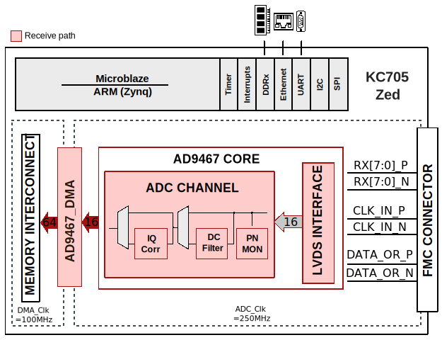
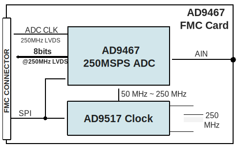

.. imported from: https://wiki.analog.com/resources/eval/ad9467-fmc-250ebz

.. _ad9467-fmc:

AD9467-FMC User Guide
=====================

Introduction
------------

The :adi:`AD9467` is a 16-bit, monolithic, IF sampling analog-to-digital
converter (ADC) with a conversion rate of up to 250 MSPS. This reference design
includes a data capture interface and the external DDR-DRAM interface for
sample storage. It allows programming the device and monitoring its internal
status registers. The board also provides other options to drive the clock and
analog inputs of the ADC. This can be done by programming the :adi:`AD9517-4`
clock chip and/or setting up the ADL5565 differential amplifier respectively.

The LVDS interface captures and buffers data from the ADC. The DMA interface
then transfers the samples to the external DDR-DRAM. The capture is initiated
by software.

.. figure:: ad9467_board.png
   :align: center

   AD9467-FMC-250EBZ evaluation board

Features
~~~~~~~~

- Full featured evaluation board for the :adi:`AD9467`
- SPI interface for setup and control
- Uses 12 V supply; 3.3 V from the FMC connection
- Internal and external reference options
- VisualAnalog and SPI Controller software interfaces

Supported Devices
-----------------

- :adi:`AD9467`

Supported Carriers
------------------

- :xilinx:`KC705 <products/boards-and-kits/ek-k7-kc705-g.html>` LPC Slot
- `ZedBoard <https://digilent.com/reference/programmable-logic/zedboard/start>`__

HDL Reference Design
--------------------

Block Diagrams
~~~~~~~~~~~~~~

   AD9467-FMC Xilinx block diagram

   AD9467-FMC card block diagram

Clock Selection
~~~~~~~~~~~~~~~

The AD9467-FMC-250EBZ board provides three possible clock paths for the
:adi:`AD9467`:

**Default clock input:**
  The default clock path uses a transformer-coupled circuit with a high
  bandwidth 1:1 impedance ratio transformer (T201). The clock input (J201)
  is 50 Ohm terminated and AC-coupled for single-ended sine wave inputs.

**Crystal oscillator (Y200):**
  The board can be clocked from the on-board low phase noise 250 MHz
  oscillator (Vectron VCC6-QCD-250M000). To use this option, install C205
  and C206, remove C202, and set jumper P200 to the **On** position.

**Clock generator (AD9517-4):**
  A differential LVPECL or LVDS clock can be generated using the on-board
  :adi:`AD9517-4`. Populate C304 and C305 (LVPECL) or C306 and C307
  (LVDS) with 0.1 uF capacitors, and remove C209 and C210 to disconnect
  the default clock path.

Design Notes
~~~~~~~~~~~~

- The PN9/PN23 sequences used in the reference design are **not** compatible
  with O.150. They follow the same polynomial equations but only the MSB is
  inverted.
- The AD9467 drives the interleaved first byte (D15:D1) on the rising edge
  and second byte (D14:D0) on the falling edge of the DCO clock. At certain
  frequencies, captured data may appear reversed. If this occurs, try setting
  the "capture select" bit (register 0x0A, bit 0).

HDL Source Code
~~~~~~~~~~~~~~~

- :git-hdl:`projects/ad9467_fmc`

Software Support
----------------

No-OS Project
~~~~~~~~~~~~~

- :git-no-OS:`projects/ad9467`
- :git-no-OS:`drivers/adc/ad9467`

Linux Device Driver
~~~~~~~~~~~~~~~~~~~

- :git-linux:`drivers/iio/adc/ad9467.c`

Device Trees
~~~~~~~~~~~~

- :git-linux:`arch/arm/boot/dts/xilinx/zynq-zed-adv7511-ad9467-fmc-250ebz.dts`
- :git-linux:`arch/microblaze/boot/dts/kc705_ad9467_fmc.dts`

Evaluating the AD9467 (SDP-H1)
-------------------------------

This section describes how to evaluate the AD9467-FMC-250EBZ board using
the :adi:`EVAL-SDP-CH1Z <SDP-H1>` (SDP-H1) data capture board with
VisualAnalog and SPIController software on a Windows PC.

Equipment Needed
~~~~~~~~~~~~~~~~

- :adi:`AD9467` (AD9467-FMC-250EBZ) evaluation board
- :adi:`EVAL-SDP-CH1Z <SDP-H1>` (SDP-H1) data capture board
- Analog signal source and antialiasing filter
- Sample clock source
- 12 V, 2.5 A switching power supply
- USB 2.0 cable (Mini-B)
- PC running Windows

Software Needed
~~~~~~~~~~~~~~~

- `VisualAnalog <https://www.analog.com/en/design-center/interactive-design-tools/visualanalog.html>`__
- `SPI Controller <https://www.analog.com/en/design-center/interactive-design-tools/spicontroller.html>`__

Typical Measurement Setup
~~~~~~~~~~~~~~~~~~~~~~~~~

.. figure:: ad9467_datacapture.png
   :align: center

   Evaluation board connection -- AD9467-FMC-250EBZ (left) and
   SDP-H1 (right)

Configuring the Board
~~~~~~~~~~~~~~~~~~~~~

Before using the software for testing, configure the evaluation board
as follows:

1. Connect the AD9467-FMC-250EBZ evaluation board to the SDP-H1 data capture
   board as shown in the figure above.
2. Connect one 12 V, 2.5 A switching power supply to the SDP-H1 board.
   Connect the Mini-B USB port of the SDP-H1 board to the PC with the
   supplied USB cable.
3. The SDP-H1 should appear in the Windows Device Manager. If it does not,
   unplug all USB devices, reinstall SPIController and VisualAnalog, and
   restart the hardware setup from step 1.
4. On the ADC evaluation board, provide a clean, low jitter 250 MHz clock
   source to connector **J201** and set the amplitude to 16 dBm. This is the
   ADC sample clock.
5. On the ADC evaluation board, provide a clean, low jitter signal to
   connector **J100**. Use a shielded, RG-58, 50 Ohm coaxial cable. For best
   results, use a narrow-band band-pass filter with 50 Ohm terminations and
   an appropriate center frequency.

.. note::

   When connecting the ADC clock and analog source, use clean signal
   generators with low phase noise, such as Rohde & Schwarz SMA or HP8644B
   signal generators or equivalent.

VisualAnalog Setup
~~~~~~~~~~~~~~~~~~

1. Start **VisualAnalog**.
2. On the **New Canvas** window, select **ADC > Single > AD9467 > FFT**.
3. If VisualAnalog opens with a collapsed view, click the **Expand Display**
   icon.
4. Click the **Settings** button in the **ADC Data Capture** block.
5. On the **General** tab, set the clock frequency to **250 MHz** (or the
   actual clock frequency being used).
6. Click on the **Capture Board** tab and browse to the ``ad9467_sdp_h1.bin``
   file. Click the **Program** button. The **FPGA_DONE** LED should
   illuminate on the SDP-H1 board.
7. Click **OK**.

SPIController Setup
~~~~~~~~~~~~~~~~~~~

1. Start **SPIController**.
2. Select the ``AD9467_16Bit_250MSspiR03.cfg`` file if prompted.
3. If necessary, click **File > Cfg Open** and load
   ``AD9467_16Bit_250MSspiR03.cfg``.
4. To enable SPI communications, click **Config > Controller Dialog** and
   uncheck the **SDO Active** button.

Obtaining an FFT
~~~~~~~~~~~~~~~~

1. Click the **Run** button in VisualAnalog. The captured data should appear
   similar to the figure below.
2. Adjust the amplitude of the input signal so that the fundamental is at the
   desired level (examine the **Fund Power** reading in the left panel of the
   FFT window). Usually about 16 dBm of signal power from the signal
   generator produces a -1 dBFS fundamental signal.
3. To save the FFT plot, click the **Float Form** button in the FFT window,
   then use **File > Save Form As** to save it.

.. figure:: sma_100a_5mhz.jpg
   :align: center

   AD9467-FMC-250EBZ FFT at 5 MHz analog input

AD9517-4 Configuration (Optional)
~~~~~~~~~~~~~~~~~~~~~~~~~~~~~~~~~~

The AD9467-FMC-250EBZ is configured from the factory to use an external
clock connected to J201. Alternatively, the board can be configured to use
the on-board 250 MHz oscillator and :adi:`AD9517-4` clock generator to
produce the 250 MSPS clock input.

**Hardware modifications:**

- Remove: R209, R210, C209, C210
- Add: C205, C206, C300, C301, C304, C305
- Set jumper P200 to the **On** position

**Setup instructions:**

1. Ensure that a clock source is **not** connected to J201.
2. Configure SPIController and VisualAnalog as described above.
3. Launch a second instance of **SPIController**.
4. Load the ``AD9517spiR03.cfg`` configuration file.
5. Click **Config > Controller Dialog**, select **2** under **FIFO Chip
   Sel#**, then click **Apply** and **OK**.
6. Click **File > Macro Group Open** and select the
   ``configure_ad9517_AD9467-FMC-250EBZ.mgp`` file.
7. Check the **Enable** checkbox and click **Run Macros**.
8. Verify that LED CR300 is illuminated on the AD9467-FMC-250EBZ board.
9. Click the **Run** button in VisualAnalog to obtain an FFT.

Troubleshooting (SDP-H1)
~~~~~~~~~~~~~~~~~~~~~~~~~

**FFT plot appears abnormal:**

- If a normal noise floor is visible when the signal generator is
  disconnected, the ADC may be overdriven. Reduce the input level.
- In **VisualAnalog**, click **Settings** in the **Input Formatter** block
  and verify that **Number Format** is set to the correct encoding (offset
  binary by default).

**FFT appears normal but performance is poor:**

- Verify that an appropriate band-pass filter is used on the analog input.
- Verify that the signal generators for clock and analog input are clean
  (low phase noise).
- If using non-coherent sampling, change the analog input frequency slightly,
  or use coherent frequencies.
- Verify that the SPI configuration file matches the product being evaluated.
- Ensure there is no extra stress or torque on the clock and analog input
  connectors.

**FFT window remains blank after clicking Run:**

- Verify that the evaluation board is securely connected to the SDP-H1.
- Verify that the FPGA has been programmed by checking that the **FPGA_DONE**
  LED is illuminated on the SDP-H1. If not, reprogram the FPGA through
  VisualAnalog. If the LED still does not illuminate, disconnect the USB
  and power cord for 15 seconds, reconnect, and repeat the setup process.
- Verify the correct FPGA bin file was used.
- Verify that the correct sample rate is configured in the **ADC Data
  Capture** block settings.
- Ensure that the ADC has a valid clock input.

Evaluating the AD9467 (ZedBoard + Linux)
-----------------------------------------

This section describes how to evaluate the AD9467-FMC-250EBZ board using
a `ZedBoard <https://digilent.com/reference/programmable-logic/zedboard/start>`__
with ADI Kuiper Linux and the ACE Generic IIO plugin.

Equipment Needed
~~~~~~~~~~~~~~~~

- :adi:`AD9467` (AD9467-FMC-250EBZ) evaluation board
- `ZedBoard <https://digilent.com/reference/programmable-logic/zedboard/start>`__
- Analog signal source and antialiasing filter
- Sample clock source
- 2 x SMA cables
- 12 V / 5 A power supply with AC adapter
- SD card (16 GB or larger)
- 2 x USB-A to Micro-USB-B cables
- PC running Windows 10 or later
- (Optional) Gigabit Ethernet cable

Software Needed
~~~~~~~~~~~~~~~

- `ADI Kuiper Linux <https://wiki.analog.com/resources/tools-software/linux-software/kuiper-linux>`__
- `ACE Software <https://www.analog.com/en/resources/evaluation-hardware-and-software/evaluation-development-platforms/ace-software.html>`__
  with the **ADGenericIIO** plugin

Preparing the SD Card
~~~~~~~~~~~~~~~~~~~~~~

1. Download the
   `ADI Kuiper Linux image <https://wiki.analog.com/resources/tools-software/linux-software/kuiper-linux>`__.
2. Verify the image integrity using a checksum tool such as WinMD5.
3. Format the SD card using
   `SD Card Formatter <https://www.sdcardformatter.com/>`__ if needed.
4. Flash the ADI Kuiper Linux image to the SD card using
   `Win32DiskImager <https://sourceforge.net/projects/win32diskimager/>`__
   or a similar tool.
5. After flashing, copy the following files to the root directory (BOOT FAT32
   partition) of the SD card:

   - ``target/zynq-zed-adv7511-ad9467-fmc-250ebz/BOOT.BIN``
   - ``target/zynq-zed-adv7511-ad9467-fmc-250ebz/devicetree.dtb``
   - ``target/zynq-common/uImage``

6. Safely eject the SD card.

Hardware Setup
~~~~~~~~~~~~~~

.. figure:: ad9467_evaluation_board_connection.png
   :align: center

   AD9467-FMC-250EBZ (right) and ZedBoard (left) setup

1. On the ZedBoard, set the boot mode jumpers for **SD card boot**:

   .. list-table::
      :header-rows: 1

      * - Jumper
        - Position
      * - JP7
        - GND
      * - JP8
        - GND
      * - JP9
        - 3V3
      * - JP10
        - 3V3
      * - JP11
        - GND

2. Insert the SD card into the ZedBoard SD card slot (**J12**).
3. Connect the AD9467-FMC-250EBZ to the ZedBoard FMC connector (**J1**).
4. Connect the 12 V / 5 A power supply to the ZedBoard barrel jack (**J20**).
5. On the AD9467-FMC-250EBZ, provide a clean, low jitter 250 MHz clock source
   to connector **J201** at 16 dBm.
6. Provide a clean analog input signal to connector **J100**. For best
   results, use a narrow-band band-pass filter with 50 Ohm terminations.
7. Connect a USB-A to Micro-USB-B cable from the PC to the ZedBoard USB-UART
   port (**J14**) for terminal access.
8. Turn on the power switch (**SW8**). The green Power LED (**LD13**) should
   illuminate, followed by the blue Done LED (**LD12**) after boot completes.
9. For device connectivity, either:

   - Connect another USB cable to USB-OTG port (**J13**), or
   - Connect a Gigabit Ethernet cable to port **J11**.

10. If using USB-OTG, open a terminal emulator (such as PuTTY) with the
    serial configuration: baud rate 115200, 8 data bits, 1 stop bit, no
    parity, no flow control. Then enable the USB-OTG port:

    .. code-block:: bash

       usb_otg.sh enable
       usb_otg.sh status
       reboot

ACE Software Setup
~~~~~~~~~~~~~~~~~~

1. Install
   `ACE Software <https://www.analog.com/en/resources/evaluation-hardware-and-software/evaluation-development-platforms/ace-software.html>`__
   if not already installed.
2. Open the **Plug-In Manager** in ACE and install the **ADGenericIIO**
   plugin from the **Available Packages** list.
3. Return to the ACE **Home** screen. The connected hardware should be
   detected automatically.
4. Click the detected hardware, then in the **System** tab uncheck
   **Operate without Hardware** and click **Acquire**.
5. Return to **Home**, click the detected hardware again, then click **Find
   Devices**. Select device **cf-ad9467-core-lpc**, click **Get IIO Info**,
   and click **Go to Detected Chip**.

Obtaining an FFT
~~~~~~~~~~~~~~~~

1. Set the signal sources:

   - Clock input: 250 MHz at 16 dBm on **J201**
   - Analog input: desired frequency on **J100**

2. In ACE, set the **Sampling Frequency** to **250000000**.
3. Verify SPI communication by reading register **0x00** under **Direct
   Register Access** (expected default value: **0x18**).
4. Click **Proceed to Analysis** and set the sample frequency to **250 MHz**.
5. Click **FFT**, then **Run Once** to perform a single capture. Adjust the
   analog input signal level until the fundamental power reaches
   approximately **-1 dBFS**.
6. To save results, click the **Export** button in the **Results** tab.

.. figure:: ad9467_fft.png
   :align: center

   AD9467-FMC-250EBZ sample FFT capture using ACE on ZedBoard

More Information
----------------

- `ADI Reference Designs HDL User Guide <https://analogdevicesinc.github.io/hdl/user_guide/introduction.html>`__
- :adi:`AD9467 Product Page <AD9467>`
- :adi:`AD9517-4 Product Page <AD9517-4>`

Support
-------

Analog Devices will provide limited online support for anyone using the
reference design with Analog Devices components via the
:ez:`FPGA Reference Designs Forum <fpga>`.
