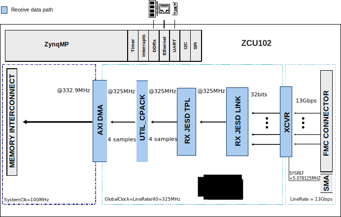

.. imported from: https://wiki.analog.com/resources/eval/ad9695-1300ebz

.. _ad9695-fmc:

AD9695-FMC User Guide
=====================

Introduction
------------

The :adi:`AD9695` is a dual 14-bit, 1300/625 MSPS analog-to-digital converter
(ADC) featuring an on-chip buffer and a sample-and-hold circuit designed for
low power, small size, and ease of use. The dual ADC cores feature a
multistage, differential pipelined architecture with integrated output error
correction logic. Each ADC features wide bandwidth inputs supporting a variety
of user-selectable input ranges. The :adi:`AD9697` ADC can also be evaluated
using the AD9695-1300EBZ evaluation board, as the performance is identical
except for power consumption.

The AD9695-FMC reference design is a processor-based (e.g. MicroBlaze)
embedded system. The design consists of a receive chain that transports the
captured samples from the ADC to the system memory (DDR). All cores in the
receive chain are programmable through an AXI-Lite interface.

Features
~~~~~~~~

- Full-featured evaluation board for the :adi:`AD9695`
- JESD204B coded serial digital outputs with support for lane rates up to
  16 Gbps/lane
- Wide full-power bandwidth supports IF sampling of signals up to 2 GHz
- Four integrated wideband decimation filter and NCO blocks supporting
  multi-band receivers
- Flexible SPI interface controls various product features and functions
- Programmable fast over-range detection and signal monitoring

Supported Devices
-----------------

- :adi:`AD9695`
- :adi:`AD9697`

Supported Carriers
------------------

- :xilinx:`ZCU102 <products/boards-and-kits/ek-u1-zcu102-g.html>` -- HPC1 Slot

Hardware
--------

Required Hardware
~~~~~~~~~~~~~~~~~

- AD9695-1300EBZ evaluation board
- :xilinx:`ZCU102 <products/boards-and-kits/ek-u1-zcu102-g.html>` carrier
- :doc:`AD-SYNCHRONA14-EBZ </solutions/reference-designs/ad-synchrona14-ebz/index>`
  clock board
- 5 x SMA to SMA cable
- 3 x 50 Ohm DC to 12 GHz SMA termination

Clock Selection
~~~~~~~~~~~~~~~

The AD9695-FMC reference design uses the
:doc:`AD-SYNCHRONA14-EBZ </solutions/reference-designs/ad-synchrona14-ebz/index>`
as an external clock source.

- SYSREF clocks are LVDS
- ADCCLK and REFCLK are LVPECL

.. figure:: timing_ad9695_1.png
   :align: center

   AD9695 clock timing diagram

Synchrona Output Configuration
~~~~~~~~~~~~~~~~~~~~~~~~~~~~~~~

Only the channels used for clocking are relevant. The remaining channels can
be disabled or set to a divided frequency of the source clock.

.. figure:: synchronasettings1.png
   :align: center

   AD-SYNCHRONA14-EBZ output settings for AD9695-FMC

Connection Table
~~~~~~~~~~~~~~~~

The following connections are required between the ZCU102 and the
AD-SYNCHRONA14-EBZ:

.. list-table::
   :header-rows: 1

   * - ZCU102
     - AD-SYNCHRONA14-EBZ
   * - J79
     - CH2_P
   * - J80
     - CH2_N

The following connections are required between the AD9695-1300EBZ and the
AD-SYNCHRONA14-EBZ:

.. list-table::
   :header-rows: 1

   * - AD9695-1300EBZ
     - AD-SYNCHRONA14-EBZ
   * - J202
     - CH10_P
   * - J200
     - CH1_P
   * - P202
     - CH9_P

Standalone Evaluation with ADS7-V2
-----------------------------------

The AD9695-1300EBZ can also be evaluated as a standalone board using the
ADS7-V2EBZ FPGA-based data capture kit, without requiring the ZCU102 carrier
or HDL reference design.

.. figure:: ad9695-ads7-v2.jpg
   :align: center

   AD9695-1300EBZ (left) and ADS7-V2 (right)

.. figure:: ad9695_board_top.jpg
   :align: center

   Top of AD9695-1300EBZ board

Equipment Needed
~~~~~~~~~~~~~~~~

- PC running Windows
- USB 2.0 port and USB 2.0 high-speed A-to-B cable
- AD9695-1300EBZ evaluation board
- ADS7-V2EBZ FPGA-based data capture kit
- 12 V, 6.5 A switching power supply (such as the SL POWER CENB1080A1251F01
  supplied with ADS7-V2EBZ)
- Low phase noise analog input source and antialiasing filter
- Low phase noise sample clock source
- Reference clock source
- `Analysis | Control | Evaluation (ACE) <https://www.analog.com/en/resources/evaluation-hardware-and-software/evaluation-development-platforms/ace-software.html>`__
  software

Connector Layout
~~~~~~~~~~~~~~~~

.. figure:: 9695_connections.png
   :align: center

   AD9695-1300EBZ connector layout

.. warning::

   The AD9695-1300EBZ is electrostatic discharge (ESD) sensitive. Handle the
   device with care, and employ conducting wrist straps or antistatic bags when
   handling the board.

Board Configuration
~~~~~~~~~~~~~~~~~~~~

.. figure:: 9695_pins.png
   :align: center

   Jumper connections on AD9695-1300EBZ

Before using the software for testing, configure the evaluation boards as
follows:

1. Before connecting the AD9695 to the ADS7-V2, jump the following pins:
   **P307**, **P308**, **P309**, **P311**, **P304**, **P305**, **P312**, and
   **P602** (SPI Enable). Do not jump **P100** (Power Down/Standby) and
   **P1**. Supply the reference clock through the ADS7-V2. Jump **P401**
   towards the inside of the board to power the board via FMC.
2. Ensure that the data capture board is switched to **OFF** (**S1** on the
   data capture board). Connect the evaluation board to the data capture board
   via the FMC connector found on the underside of the board. Connect the
   power supply and USB cable to the data capture board.
3. Turn on the ADS7-V2EBZ.
4. The ADS7-V2EBZ should appear in the Windows Device Manager. If it does not,
   unplug all USB devices from the PC, uninstall and reinstall ACE, and restart
   the hardware setup from step 1.
5. On the AD9695 evaluation board, provide a clean, low-jitter 1300 MHz clock
   source to connector **P202** (preferably via a shielded RG-58 50 Ohm
   coaxial cable) and set the amplitude to 10 dBm. This is the ADC sample
   clock.
6. On the ADS7-V2, provide a clean, low-jitter clock source to connector
   **J3** and set the amplitude to 10 dBm. This is the reference clock for
   the gigabit transceivers in the FPGA. The REFCLK frequency can be
   calculated using the following formulae:

   - Lane Line Rate = M x N' x (10/8) x Fout / L (bps/lane)
   - Fout = F_ADC_SAMPLE_CLOCK / Decimation Ratio
   - N' = 8 or 16
   - REFCLK = Lane Line Rate / 20

   Default values: N' = 16, DCM = 1 (full bandwidth mode), M = virtual
   converters, L = lanes.

7. On the AD9695 evaluation board, connect a clean signal generator with low
   phase noise to **J101** or **J104** via coaxial cable for channels A and B
   respectively. It is recommended to use a narrow-band bandpass filter with
   50 Ohm terminations and an appropriate center frequency.

ACE Setup
~~~~~~~~~

1. Download and install
   `ACE <https://www.analog.com/en/resources/evaluation-hardware-and-software/evaluation-development-platforms/ace-software.html>`__
   if it is not already installed.
2. The AD9695 ACE plugin can be found on the
   `AD9695 evaluation board page <https://www.analog.com/en/resources/evaluation-hardware-and-software/evaluation-boards-kits/EVAL-AD9695.html>`__
   under the software section, or through ACE's Plugin Manager
   (**Tools > Manage Plug-Ins**).
3. Once the .acezip file has been downloaded, right-click on it and install
   the plugin, or double-click to install.
4. Launch ACE (**Start > All Programs > Analog Devices > ACE > ACE**).
5. The AD9695 plugin should appear if installed correctly. If it does not
   appear, or no board is detected, make sure the ADS7-V2 is powered on and
   the evaluation board is properly connected.

   .. figure:: 9695attachedhardware.jpg
      :align: center

      ACE AD9695 plugin

6. Click on the plugin to open it and access the Chip View.
7. Click on the navigation tab labeled **AD9695-1300EBZ** to open the board
   view.
8. Click the **Program FPGA** button. This will program the FPGA on the
   ADS7-V2 to communicate with the AD9695-1300EBZ.

   .. warning::

      Programming the FPGA will power the AD9695 evaluation board via the FMC
      connector. Removing any of the board's power jumpers while the board is
      on or in operation may cause damage to the board and/or chip. Removing
      the board while it is being powered via the FMC connector may also cause
      damage.

Obtaining a Full Bandwidth Capture
~~~~~~~~~~~~~~~~~~~~~~~~~~~~~~~~~~~

1. Under **Initial Configuration**, set the clock input to 1300 MHz. Set the
   number of lanes to 4. Change the number of virtual converters to 1. Change
   the number of octets per frame to 1. Click **Apply** to apply the chip
   settings. Set the reference clock to 325 MHz to match these settings.
2. The chip view will update to reflect the changes. If any changes are made,
   the chip can be read by clicking the **Read All** button.
3. Issue a data path reset to the AD9695 by clicking its checkbox and clicking
   **Apply Changes**. The data path reset bit will automatically self-clear.
4. If the PLL Lock Lost indicator lights up, reset it by powering down the
   JESD link using the **Link Control** dropdown box and clicking
   **Apply Changes**.
5. Enable the link again and click **Apply Changes**.
6. Click **Proceed to Analysis**. This is ACE's analysis tool for data from
   the ADC, displaying both sample plots and FFTs. Click on **DDCFFT** and
   run one capture.
7. Channel A and Channel B can be selected individually to display their FFTs.

   .. figure:: 9695fullbwfft.jpg
      :align: center

      Example full bandwidth FFT capture with a 533 MHz signal on Channel A

Obtaining a DDC Capture
~~~~~~~~~~~~~~~~~~~~~~~

1. Under **Initial Configuration**, set the Chip Operating Mode for two DDCs.
   The DDC settings will become available. For decimation, select
   **HB1_HB2 Complex** (two half-band filters, i.e., decimate-by-4). Set the
   number of lanes to 1, the number of converters to 4, and the number of
   octets per frame to 8. Apply the settings.
2. The chip view will update to reflect the changes. Click on the NCO block to
   change the Noise Controlled Oscillator's frequency to 500 MHz. Enable the
   6 dB gain for the DDC from the dropdown menu. Click **Apply Changes**.
3. Navigate to the second DDC (DDC1) and make the same changes.
4. In Analysis, run a capture. DDC0 can be selected from Channel A and DDC1
   can be selected from Channel B.

HDL Reference Design
--------------------

The design has one JESD receive chain with 4 lanes at a rate of 13 Gbps.
The JESD receive chain consists of a physical layer represented by an XCVR
module, a link layer represented by an RX JESD LINK module, and a transport
layer represented by an RX JESD TPL module. The link operates in Subclass 1.

The link is set for full bandwidth mode. The transport layer component
presents 128 bits on its output on every clock cycle, representing 4 samples
per converter. The two receive channels are merged together and transferred to
the DDR with a single DMA.

JESD204B Configuration
~~~~~~~~~~~~~~~~~~~~~~

.. list-table::
   :header-rows: 1

   * - Parameter
     - Value
   * - Deframer (L, M, F, S, N')
     - L=4, M=2, F=1, S=1, N'=16
   * - SYSREF
     - 5.078125 MHz
   * - REFCLK
     - 325 MHz (Lane Rate / 40)
   * - DEVCLK
     - 325 MHz
   * - ADCCLK
     - 1300 MHz
   * - JESD204B Lane Rate
     - 13 Gbps

Block Diagram
~~~~~~~~~~~~~

   AD9695-FMC block diagram

HDL Source Code
~~~~~~~~~~~~~~~

- :git-hdl:`projects/ad9695_fmc`

HDL Documentation
~~~~~~~~~~~~~~~~~

- `AD9695-FMC HDL project <https://analogdevicesinc.github.io/hdl/projects/ad9695_fmc/index.html>`__

Quick Start
-----------

Hardware Setup
~~~~~~~~~~~~~~

.. figure:: setup_ad9695_zcu102_1.jpg
   :align: center

   AD9695-FMC hardware setup on ZCU102

1. Connect the AD9695-1300EBZ to the ZCU102 FMC HPC1 connector.
2. Connect the AD-SYNCHRONA14-EBZ clock board to the AD9695-1300EBZ and
   ZCU102 per the connection tables above.
3. Connect SMA terminations to unused SMA connectors.

Building the HDL Project
~~~~~~~~~~~~~~~~~~~~~~~~

The bitstream must be built from source. Clone the HDL repository and build
the ZCU102 project:

.. code-block:: bash

   cd hdl/projects/ad9695_fmc/zcu102
   make

A comprehensive build guide is available in the
`HDL User Guide <https://analogdevicesinc.github.io/hdl/user_guide/introduction.html>`__.

Verifying the Design
~~~~~~~~~~~~~~~~~~~~

After booting Linux on the ZCU102, verify that the IIO device is present:

.. code-block:: bash

   root@analog:~# iio_info | grep iio:device
           iio:device0: ams
           iio:device1: axi-ad9695-hpc (buffer capable)

Troubleshooting
---------------

Evaluation Board Not Functioning Properly
~~~~~~~~~~~~~~~~~~~~~~~~~~~~~~~~~~~~~~~~~

It is possible that a board component has been rendered inoperable by ESD,
removing a jumper during powered operation, accidental shorting while probing,
etc. Check the supply domain voltages of the board while it is powered:

.. list-table::
   :header-rows: 1

   * - Domain
     - Jumper
     - Test Point
     - Approx. Voltage
   * - AVDD_0P9
     - P307
     - TP303
     - 0.95 V
   * - AVDD_1P8
     - P308
     - TP304
     - 1.80 V
   * - AVDD_BUF
     - P309
     - TP305
     - 2.50 V
   * - DRVDD_0P9
     - P304
     - TP301
     - 0.95 V
   * - AVDD_1P8_PLL
     - P311
     - TP306
     - 1.80 V
   * - DVDD_0P9
     - P305
     - TP302
     - 0.95 V
   * - AVDD_1P8_SPI
     - P312
     - TP307
     - 1.80 V

If a short is detected between any of the supply domains and ground, or an
open is detected across fuse chip F401 (next to P401), a component may have
been damaged. This may have occurred from jumper or board removal while being
actively powered.

No SPI Communication with ADS7-V2
~~~~~~~~~~~~~~~~~~~~~~~~~~~~~~~~~~

- Make sure that the FPGA on the ADS7-V2 has been programmed. A lit LED
  **DS15** (FPGA_DONE) on top of the ADS7-V2 and a powered fan are good
  indicators of the FPGA being programmed.
- Check the common-mode voltage on the JESD204B traces. On the evaluation
  board, the common-mode voltage should be roughly two-thirds of DRVDD_0P9.
  On the ADS7-V2, it should be around 1.2 V.
- Check **TP307** (test point for the AVDD_1P8_SPI supply domain, jumper
  P312) and make sure it is around 1.8 V.
- To test SPI operation, attempt to both read and write to register 0x000A
  using ACE's Register Debugger (**View > Register Debugger**). This register
  is an open register available for testing memory reads and writes.
- All registers reading back as either all ones or all zeros (0xFF or 0x00)
  may indicate no SPI communication.
- Register 0x0000 (SPI Configuration A) reading back 0x81 in ACE may indicate
  no SPI communication as a result of the FPGA on the ADS7-V2 not being
  programmed.

Evaluation Board Fails to Capture Data
~~~~~~~~~~~~~~~~~~~~~~~~~~~~~~~~~~~~~~~

- Ensure that the board is functioning properly and that SPI communication is
  successful (see previous troubleshooting tips).
- Check the Clock Detect register 0x011B to see if the inputted clock is being
  detected. 0x01 indicates detection, 0x00 indicates no clock detected. Check
  the signal generator inputting on connector P202. Try checking the
  common-mode voltage on the clock pins, which should be roughly two-thirds of
  AVDD_0P9. Try placing a differential oscilloscope probe on the clock pins to
  see if the clock signal is reaching the chip.
- Check the PLL Locked indicator or register 0x056F (PLL Status). If the light
  is green or the register reads back 0x80, the PLL is locked. If it is not
  locked:

  - Check the clock being inputted to connector P202 (in this guide, 1300 MHz).
  - Check the JESD settings under the Initial Configuration. Reference the
    :adi:`AD9695` datasheet for supported lane options.
  - Check the reference clock and make sure it matches your JESD settings.
  - Make sure **P100** (Power Down/Standby jumper) is not jumped.

Software Support
----------------

Linux Device Driver
~~~~~~~~~~~~~~~~~~~

Driver and device tree source files:

- :git-linux:`drivers/iio/adc/ad9208.c`
- :git-linux:`arch/arm64/boot/dts/xilinx/zynqmp-zcu102-rev10-ad9695.dts`

More Information
----------------

- `ADI Reference Designs HDL User Guide <https://analogdevicesinc.github.io/hdl/user_guide/introduction.html>`__
- `JESD204B High-Speed Serial Interface Support <https://analogdevicesinc.github.io/hdl/library/jesd204/index.html>`__
- :doc:`AD-SYNCHRONA14-EBZ </solutions/reference-designs/ad-synchrona14-ebz/index>`
- :adi:`AD9695 Product Page <AD9695>`
- :adi:`AD9697 Product Page <AD9697>`

Support
-------

Analog Devices will provide limited online support for anyone using the
reference design with Analog Devices components via the
:ez:`FPGA Reference Designs Forum <fpga>`.
