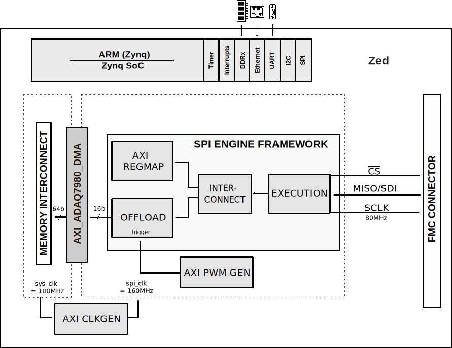

.. _eval-adaq7980-sdz:

EVAL-ADAQ7980-SDZ
===============================================================================

16-Bit SAR ADC Subsystem with Integrated Signal Conditioning.

Overview
-------------------------------------------------------------------------------

The :adi:`EVAL-ADAQ7980-SDZ` evaluation board enables quick and easy evaluation
of the performance and features of the :adi:`ADAQ7980` and :adi:`ADAQ7988`
16-bit analog-to-digital converter (ADC) subsystems.

The :adi:`ADAQ7980`/:adi:`ADAQ7988` are 16-bit analog-to-digital converter (ADC)
subsystems that integrate four common signal processing and conditioning blocks
into a system in package (SiP) design that supports a variety of applications.
These devices contain the most critical passive components, eliminating many of
the design challenges associated with traditional signal chains that use
successive approximation register (SAR) ADCs. These passive components are
crucial to achieving the specified device performance.

The :adi:`ADAQ7980`/:adi:`ADAQ7988` contain a high accuracy, low power, 16-bit
SAR ADC, a low power, high bandwidth, high input impedance ADC driver, a low
power, stable reference buffer, and an efficient power management block. Housed
within a tiny, 5 mm x 4 mm LGA package, these systems simplify the design
process for data acquisition systems. The level of system integration of the
:adi:`ADAQ7980`/:adi:`ADAQ7988` solves many design challenges, while the devices
still provide the flexibility of a configurable ADC driver feedback loop to
allow gain and/or common-mode adjustments. A set of four device supplies
provides optimal system performance; however, single-supply operation is
possible with minimal impact on device operating specifications.

Using the SDI input, the SPI-compatible serial interface features the ability to
daisy-chain multiple devices on a single, 3-wire bus and provides an optional
busy indicator. The user interface is compatible with 1.8 V, 2.5 V, 3 V, or 5 V
logic. Specified operation of these devices is from -55°C to +125°C.

This user guide will discuss how to use the ZedBoard FPGA development board and
evaluation software to configure and collect data from the :adi:`EVAL-ADAQ7980-SDZ`.

.. image:: images/eval-angle.png
   :align: center
   :width: 500

Features:

- High accuracy 16-bit SAR ADC subsystem
- Integrated ADC driver with configurable feedback loop
- Low power, stable reference buffer
- Efficient power management block
- SPI-compatible serial interface with daisy-chain capability
- Wide supply voltage compatibility (1.8 V to 5 V logic)
- Extended temperature range (-55°C to +125°C)

Applications:

- Automated test equipment (ATE)
- Battery powered instrumentation
- Communications
- Data acquisition
- Process control
- Medical instruments

.. toctree::
   :hidden:

   user-guide
   prerequisites
   quickstart/index

Recommendations
-------------------------------------------------------------------------------

People who follow the flow that is outlined, have a much better experience with
things. However, like many things, documentation is never as complete as it
should be. If you have any questions, feel free to ask on our
:ref:`EngineerZone forums <help-and-support>`, but before that, please make
sure you read our documentation thoroughly.

Table of Contents
-------------------------------------------------------------------------------

#. **Getting Started with the Evaluation Board**

   #. :ref:`eval-adaq7980-sdz user-guide` - evaluation board overview
   #. :ref:`eval-adaq7980-sdz prerequisites` - required hardware and software
   #. :ref:`eval-adaq7980-sdz quickstart` - step-by-step setup with :ref:`ZedBoard <eval-adaq7980-sdz quickstart zedboard>`

#. **Understanding the Design**

   #. :ref:`eval-adaq7980-sdz block-diagram` - system architecture overview
   #. :external+hdl:ref:`SPI Engine Framework <spi_engine>` - communication interface

#. **Designing Custom Platforms**

   #. :git-hdl:`HDL Reference Design <projects/adaq7980_sdz>` and :external+hdl:ref:`Documentation <adaq7980_sdz>`
   #. :git-no-OS:`No-OS Driver <drivers/adc/adaq7980>` and :git-no-OS:`Project <projects/adaq7980_sdz>`

#. **Product Resources**

   #. :adi:`ADAQ7980 Product Page <ADAQ7980>`
   #. :adi:`ADAQ7988 Product Page <ADAQ7988>`

.. _eval-adaq7980-sdz block-diagram:

Simplified functional block diagram
-------------------------------------------------------------------------------

The reference design uses the standard :external+hdl:ref:`SPI Engine Framework <spi_engine>`
with an integrated pulse generator, which provides the required conversion rate
for the ADC.

More Information and Useful Links
-------------------------------------------------------------------------------

- :adi:`ADAQ7980 Product Page <ADAQ7980>`
- :adi:`ADAQ7988 Product Page <ADAQ7988>`
- :adi:`EVAL-ADAQ7980 Evaluation Board Page <EVAL-ADAQ7980>`

Software Projects and Platforms
-------------------------------------------------------------------------------

- :ref:`ADAQ7980 + ZedBoard FPGA <eval-adaq7980-sdz quickstart zedboard>`

Warning
-------------------------------------------------------------------------------

.. esd-warning::
