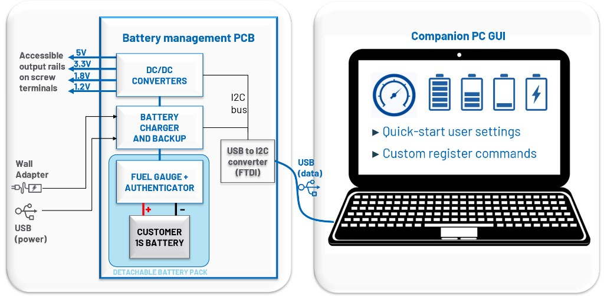

.. _adps40099-rd:

ADPS40099-RD
============

Power Supply Reference Design

Overview
--------

.. figure:: 081852c_iso.jpeg
    :alt: ADPS40099-RD

The :adi:`ADPS40099-RD` is a fully integrated battery management
system reference design for portable applications. It combines a complete
power solution for handheld and portable devices, using the latest components
from ADI’s power portfolio.

The solution features the MAX77958 USB-C power delivery controller for flexible
input options, paired with the MAX77786 1S battery charger to manage charging
from a single-cell lithium-ion battery. The MAX17300 provides advanced fuel
gauging, battery protection, and authentication capabilities, ensuring safe and
reliable operation.

To support diverse power requirements, the design includes the MAX77857
buck-boost regulator and the MAX77542 multi-phase buck converter, enabling up to
five individually configurable outputs. The design also integrates the MAX14727
for power path control. For backup power, the MAX38889 uses supercapacitor
technology to maintain system operation during power interruptions and battery
replacements. Additionally, the MAX14611 logic-level translator ensures seamless
communication between components operating at different voltage levels.

This compact, cohesive single-board implementation delivers a robust,
space-efficient, and scalable battery management solution ideal for modern
portable electronic systems.

.. figure:: adps40099-rd_block_diagram.png
  :width: 1000px

System Features
---------------

  - Power Supply Options: Supports both USB-C with Power Delivery and 12V DC input
  - Input Priority: USB-C takes precedence over DC input
  - Battery Type: Single-cell (1S) Lithium-Ion
  - Charging Current: Up to 5A, user-configurable via I²C
  - Battery Authentication: Ensures secure battery identification
  - Backup Power: Supercapacitor-supported battery backup with up to 2.5A output
  - System Output: Integrated buck-boost converter and multi-phase buck converter
  - Programmable Outputs:

    - Up to 4A per output
    - Maximum 6A total in buck mode
    - Up to 4A in boost mode

  - System Communication:

    - Utilizes MAXUSB interface
    - Supports I²C communication for system commands, battery state-of-charge
      (SoC), charging current, and more

Hardware Components
-------------------

.. figure:: primary.jpg
   :alt: Primary side
   :width: 800px

.. figure:: secondary.jpg
   :alt: Secondary side
   :width: 800px

Jumper Configuration Guide
--------------------------

Power and Core Supply Paths
~~~~~~~~~~~~~~~~~~~~~~~~~~~

+--------+------------------------+----------------+------------------------+
| Jumper | Node/Function          | Shunt Position | What it does           |
+========+========================+================+========================+
| P4     | Multiphase Input       | 1-2*           | Supplies 5V input to   |
|        |                        |                | MAX77542               |
+--------+------------------------+----------------+------------------------+
| P12    | Buck input             | 1-2*           | Connects Buck VIN to   |
|        |                        |                | VSYS                   |
+--------+------------------------+----------------+------------------------+
| P13    | USB-C PD controller    | 1-2*           | Supplies 5V from USB-C |
|        | SYS pin                |                | to USB-C SYS pin       |
+--------+------------------------+----------------+------------------------+
| P30    | Charger input path     | 1-2*           | Connects power         |
|        |                        |                | prioritizer to charger |
+--------+------------------------+----------------+------------------------+
| P35    | Buck-boost input       | 1-2*           | Connects VSYS to       |
|        |                        |                | buck-boost input       |
+--------+------------------------+----------------+------------------------+
| P46    | Boost input            | 1-2*           | Connects Boost VIN to  |
|        |                        |                | VSYS                   |
+--------+------------------------+----------------+------------------------+

Battery and Charger Controls
~~~~~~~~~~~~~~~~~~~~~~~~~~~~

+--------+-----------------------+----------------+----------------------------------------+
| Jumper | Node/Function         | Shunt Position | What it does                           |
+========+=======================+================+========================================+
| P11    | Battery charger VIO   | 1-2*           | Enables charger using BATT_P           |
+--------+-----------------------+----------------+----------------------------------------+
| P16    | QBEXT control         | 1-2*           | Sets QBEXT as PGOOD (disables ext FET) |
+--------+-----------------------+----------------+----------------------------------------+
| \      | \                     | 2-3            | Enables external BATT-to-SYS FET       |
+--------+-----------------------+----------------+----------------------------------------+
| P19    | Battery backup input  | 1-2*           | Connects backup regulator to VSYS      |
+--------+-----------------------+----------------+----------------------------------------+
| P20    | Battery sense routing | 1-2*           | Sense via fuel gauge                   |
+--------+-----------------------+----------------+----------------------------------------+
| \      | \                     | 2-3            | Sense directly from battery            |
+--------+-----------------------+----------------+----------------------------------------+

Regulator Enable / Control
~~~~~~~~~~~~~~~~~~~~~~~~~~

====== ================= ============== =====================================
Jumper Node/Function     Shunt Position What it does
====== ================= ============== =====================================
P3     Multiphase enable  1-2*           Enables MAX77542 (5V logic HIGH)
P17    Buck-boost enable  1-2*           Auto-enable via VIN (standalone mode)
\      \                  2-3            Requires VIN + VIO to enable
P39    Buck enable        1-2*           Enable LTC3621
\      \                  2-3            Shutdown buck
====== ================= ============== =====================================

Logic Supply (VIO) Configuration
~~~~~~~~~~~~~~~~~~~~~~~~~~~~~~~~

*Important for bring-up, I²C, and digital stability*

+--------+------------------------+----------------+------------------------+
| Jumper | Node/Function          | Shunt Position | What it does           |
+========+========================+================+========================+
| P10    | EEPROM supply          | 1-2*           | Uses 1.8V supply       |
+--------+------------------------+----------------+------------------------+
| P18    | Buck-boost VIO source  | 1-2*           | VIO powered from VL    |
+--------+------------------------+----------------+------------------------+
| \      | \                      | Open           | Requires external VIO  |
+--------+------------------------+----------------+------------------------+
| P22    | USB-C PD controller    | 1-2*           | 1.8V logic supply      |
|        | VIO1                   |                |                        |
+--------+------------------------+----------------+------------------------+
| P23    | USB-C PD controller    | 1-2            | VIO for I²C if USB-C   |
|        | VIO2                   |                | PD controller is       |
|        |                        |                | master                 |
+--------+------------------------+----------------+------------------------+
| P24    | Buck-boost VIO         | 1-2            | Optional 1.8V logic    |
+--------+------------------------+----------------+------------------------+
| P26    | Charger VIO            | 1-2*           | 1.8V logic supply      |
+--------+------------------------+----------------+------------------------+
| P27    | Fuel gauge VIO         | 1-2*           | 1.8V logic supply      |
+--------+------------------------+----------------+------------------------+
| P29    | Multiphase MFIO        | 1-2*           | MFIO pins tied to 1.8V |
+--------+------------------------+----------------+------------------------+
| P50    | VCONN / MTP            | Open*          | Disabled               |
+--------+------------------------+----------------+------------------------+
| \      | \                      | 1-2            | Enable MTP programming |
|        |                        |                | / Vconn supply         |
+--------+------------------------+----------------+------------------------+

Indicators and Auxiliary Control
~~~~~~~~~~~~~~~~~~~~~~~~~~~~~~~~

====== ============== ============== =============================
Jumper Node/Function  Shunt Position What it does
====== ============== ============== =============================
P21    LED indicator  1-2            Enables power prioritizer LED
P40    Switch routing 1-2*           Battery → BATT path
\      \              2-3            Battery → PCKP path
====== ============== ============== =============================

EEPROM Control
~~~~~~~~~~~~~~~

====== ============= ============== ===============================
Jumper Node/Function Shunt Position What it does
====== ============= ============== ===============================
P47    Write protect 1-2*           Write disabled (read-only mode)
\    \               2-3            Write enabled
====== ============= ============== ===============================

Jumper Solder
~~~~~~~~~~~~~

+---------------+-------------------+-------------------+-------------------+
| Jumper solder | Node/Function     | Default           | Function          |
|               |                   | Connection        |                   |
+===============+===================+===================+===================+
| P5            | Power Prioritizer | open              | EN = HIGH → both  |
|               | – Active-Low      |                   | channels OFF; EN  |
|               | Enable (Both OVP) |                   | = LOW → both      |
|               |                   |                   | channels ON       |
+---------------+-------------------+-------------------+-------------------+
| P6            | Power Prioritizer | open              | LOW →             |
|               | – Path Overlap    |                   | break-before-make |
|               | Control (PCON)    |                   | (~8ms); HIGH → no |
|               |                   |                   | break-before-make |
+---------------+-------------------+-------------------+-------------------+
| P7            | Power Prioritizer | open              | LOW → OTG         |
|               | – OTG Enable      |                   | disabled; HIGH →  |
|               | (Channel A)       |                   | OTG enabled (OUT  |
|               |                   |                   | connected to INA) |
+---------------+-------------------+-------------------+-------------------+
| P8            | Power Prioritizer | open              | LOW → OTG         |
|               | – OTG Enable      |                   | disabled; HIGH →  |
|               | (Channel B)       |                   | OTG enabled (OUT  |
|               |                   |                   | connected to INB) |
+---------------+-------------------+-------------------+-------------------+
| P9            | Fuel Gauge –      | open              | Short to GND →    |
|               | Zero-Volt Charge  |                   | enable recovery;  |
|               | Recovery          |                   | open or 1MΩ to    |
|               |                   |                   | GND → disable     |
+---------------+-------------------+-------------------+-------------------+
| P25           | Battery Charger – | open              | HIGH → disables   |
|               | SUSPND            |                   | DC-DC from CHGIN  |
|               |                   |                   | to SYS            |
+---------------+-------------------+-------------------+-------------------+
| P28           | Buck Output       | short             | For 1V8 output    |
|               | Voltage Setting   |                   | setting (with P38 |
|               |                   |                   | open)             |
+---------------+-------------------+-------------------+-------------------+
| P31–P34       | SYS Node          | open              | Add external      |
|               | Capacitance       |                   | capacitance to    |
|               | (Additional)      |                   | SYS node for      |
|               |                   |                   | stability /       |
|               |                   |                   | higher load       |
|               |                   |                   | support           |
+---------------+-------------------+-------------------+-------------------+
| P36           | Battery Charger – | open              | HIGH → disables   |
|               | DISQBAT           |                   | internal QBATT    |
|               |                   |                   | FET (SYS ↔ BATT)  |
+---------------+-------------------+-------------------+-------------------+
| P37           | Charging LED      | open              | Enables charging  |
|               | Enable            |                   | status LED        |
|               |                   |                   | (low-side driver  |
|               |                   |                   | output)           |
+---------------+-------------------+-------------------+-------------------+
| P38           | Buck Output       | open              | For 5V output     |
|               | Voltage Setting   |                   | setting (with P28 |
|               |                   |                   | open)             |
+---------------+-------------------+-------------------+-------------------+
| P41           | Buck Mode – Burst | short             | Enables Burst     |
|               | Mode              |                   | Mode (optimized   |
|               |                   |                   | efficiency,       |
|               |                   |                   | ≥400mA peak       |
|               |                   |                   | current)          |
+---------------+-------------------+-------------------+-------------------+
| P42           | Buck Mode –       | open              | Short →           |
|               | Pulse-Skipping    |                   | pulse-skipping    |
|               | Mode              |                   | mode (lower       |
|               |                   |                   | ripple)           |
+---------------+-------------------+-------------------+-------------------+
| P41 & P42     | Buck Mode –       | open (both)       | Continuous        |
|               | Forced Continuous |                   | operation;        |
|               |                   |                   | supports          |
|               |                   |                   | zero-load         |
|               |                   |                   | condition         |
+---------------+-------------------+-------------------+-------------------+
| P43           | Alternative Buck  | open              | Connects buck     |
|               | Input             |                   | input directly to |
|               |                   |                   | battery positive  |
+---------------+-------------------+-------------------+-------------------+
| P44           | Alternative Buck  | open              | Connects buck     |
|               | Input             |                   | input directly to |
|               |                   |                   | MAXUSB interface  |
|               |                   |                   | supply            |
+---------------+-------------------+-------------------+-------------------+
| P45           | Alternative Buck  | open              | Connects buck     |
|               | Input             |                   | input to power    |
|               |                   |                   | prioritizer       |
|               |                   |                   | output            |
+---------------+-------------------+-------------------+-------------------+
| P48           | Alternative Boost | open              | Connects boost    |
|               | Input             |                   | input directly to |
|               |                   |                   | battery positive  |
+---------------+-------------------+-------------------+-------------------+
| P44           | Alternative Boost | open              | Connects boost    |
|               | Input             |                   | input directly to |
|               |                   |                   | MAXUSB interface  |
|               |                   |                   | supply            |
+---------------+-------------------+-------------------+-------------------+

Featured ADI Devices
--------------------

.. figure:: adps40099-rd_block_diagram.png
   :alt: Featured ADI Devices
   :width: 1000px

Power Prioritization and Protection
~~~~~~~~~~~~~~~~~~~~~~~~~~~~~~~~~~~

The :adi:`MAX14727` functions as both a power
prioritizer and protector on the board. It automatically selects USB-C (Channel
A) as the preferred input over 12V DC (Channel B), while protecting the system
from overvoltage conditions (up to +28V) and surge events (up to 100V). It also
prevents reverse current, supports OTG functionality, and includes adjustable
overvoltage thresholds and thermal shutdown for enhanced system reliability.

USB-C PD Controller
~~~~~~~~~~~~~~~~~~~

The :adi:`MAX77958` serves as the USB-C Power Delivery (PD) controller on the board. 
It handles USB-C CC detection, PD negotiation, overvoltage/overcurrent protection, 
and moisture detection. It also supports legacy USB standards, OTG, and 
alternate mode configuration. With built-in I²C master capability, 
it can autonomously configure related devices without host intervention.

1S Battery Charger
~~~~~~~~~~~~~~~~~~

The :adi:`MAX77786` is the board’s main battery
charger, supporting fast charging up to 5.5A with Smart Power Selector™. It
enables efficient charging, reverse-boost operation, and supports various
battery chemistries. The charger is highly configurable via I²C and includes
features such as BC1.2 detection, load disconnection, and dead-battery startup.

Battery Backup
~~~~~~~~~~~~~~

The :adi:`MAX38889` manages supercapacitor-based
backup power for the board. It charges the storage element when input power is
available and seamlessly boosts its voltage to maintain system operation during
power loss or battery swaps. It supports up to 3A peak current and is
configurable for a variety of backup voltage and current settings.

Fuel Gauge & Battery Authentication
~~~~~~~~~~~~~~~~~~~~~~~~~~~~~~~~~~~

The :adi:`MAX17300` is a low-power, pack-side fuel
gauge and SHA-256 battery authenticator for 1-cell Li-ion/polymer batteries. It
uses the ModelGauge m5 algorithm, combining coulomb counting and voltage-based
measurements for highly accurate state-of-charge (SOC) reporting. The device
also supports dynamic power reporting, providing real-time estimates of the
maximum power the battery can safely deliver. Communication and configuration
are handled via an I²C interface for secure and intelligent battery management.

5V Output Regulator
~~~~~~~~~~~~~~~~~~~

The :adi:`MAX77857` is a high-efficiency buck-boost
converter used to provide a regulated 5V output on the board. It supports a wide
input voltage range of 2.5V to 16V, delivering up to 6A in buck mode and 4A in
boost mode, with optional I²C control for dynamic voltage adjustment.

Multi-Rail Power Supply
~~~~~~~~~~~~~~~~~~~~~~~

The :adi:`MAX77542` is a high-efficiency step-down
converter used to generate key output rails (3.3V, 1.8V, 1.2V, and 0.9V)on the
board. It supports a wide input voltage range from 2.8V to 16V, making it
suitable for USB PD and Li-ion battery sources. Output voltages are preset via
resistors and adjustable through I²C from 0.3V to 5V.

Quick Start
-----------

Equipment Needed
~~~~~~~~~~~~~~~~

  - :adi:`ADPS40099-RD`
  - :adi:`MAXUSB Interface`
  - :adi:`USB-C cable/12V power jack`
  - :adi:`18650 battery`
  - :adi:`PC with GUI`

1. **Pre-Power Check**. Ensure all jumpers are set according to the default
   positions shown below.

  .. figure:: default_jumper.png
     :alt: Default Jumper Positions

2. **Interface Connection**. Connect the MAXUSB interface to connector P15.

3. **PC Connection**. Connect the MAXUSB interface to the PC using a USB micro
   cable.

4. **Powering the Board**. Power up the board using any of the following
   methods:

  - through USB-C cable
  - through 12V DC input
  - through battery (press S1 to wake up the board)

  .. figure:: hw_setup.png
     :alt: Hardware Setup

5. **Launching the GUI**. Open the appropriate GUI for the selected IC:

  .. admonition:: Download

    - :adi:`MAX77958 (USB-C PD Controller) <media/en/evaluation-boards-kits/evaluation-software/max77785_max77786_setup_v0.8.27.zip>`

    - :adi:`MAX77786 (1S Battery Charger) <media/en/evaluation-boards-kits/evaluation-software/max77785_max77786_setup_v0.8.27.zip>`

    - :adi:`MAX17300 (Fuel Gauge) <resources/evaluation-hardware-and-software/software/software-download.html?swpart=SFW0006130D>`

    - :adi:`MAX77857 (Buck-Boost Converter) <resources/evaluation-hardware-and-software/software/software-download.html?swpart=SFW0019190A>`

    - :adi:`MAX77542 (Multi-Phase Buck) <resources/evaluation-hardware-and-software/software/software-download?swpart=SD_B5ZOHPP>`

Resources
---------

ADI parts used in this reference design:

  - :adi:`MAX77958`
  - :adi:`MAX77786`
  - :adi:`MAX17300`
  - :adi:`MAX77857`
  - :adi:`MAX77542`
  - :adi:`MAX14727`
  - :adi:`MAX38889`
  - :adi:`MAX14611`
  - :adi:`LTC3621`
  - :adi:`MAX17224`

Support
-------

Analog Devices provides **limited** online support for users of this
reference design and its Analog Devices components through the
:ez:`Power Management` forum.

|

Note that older tool versions and release branches reduce the likelihood of
receiving support from ADI engineers.
