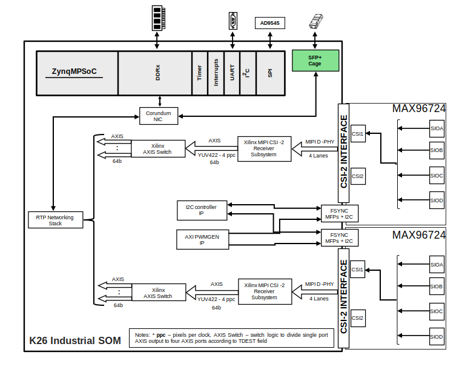
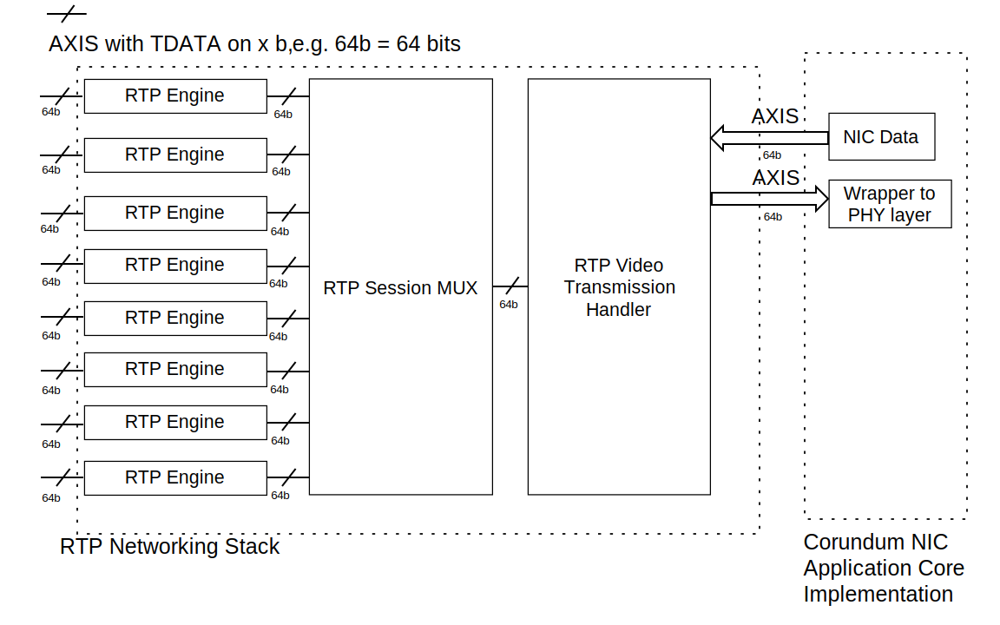

.. imported from: https://wiki.analog.com/resources/eval/user-guides/adrd8012-01z

ADRD8012-01Z
============

FPGA-based 8 x GMSL2 cameras to 10 Gb Ethernet Edge Compute Platform

Overview
---------

.. figure:: adrd8012-01z_angle-evaluation-board.jpg
   :width: 600 px

   ADRD8012-01Z board

**ADRD8012-01Z** is an edge compute platform enabling low latency data
transfer from two :adi:`Gigabit Multimedia Serial Link™ (GMSL) </product-category/gigabit-multimedia-serial-link.html>`
deserializers (resulting in an example of up to 8 GMSL2-enabled camera modules) on to a 10 Gb Ethernet link.
The target applications include autonomous robots and vehicles where machine vision and real-time sensor fusion
is critical. Some of the main features and benefits include:

-  2x GMSL2 deserializers with up to 6 Gbps/SerDes link
-  10 GbE-capable SFP+ connector
-  Precision Time Protocol (PTP) for synchronization with host systems and other edge devices
-  Embedded processing capabilities using the on-board 
   `AMD Kria K26 System-on-Module <https://www.amd.com/en/products/system-on-modules/kria/k26/k26i-industrial.html>`__
-  ROS2 compliant video streaming design
-  Open-source embedded Linux software and FPGA design
-  Advanced camera triggering functions and control features

The block design and the RTP networking stack made using the FPGA region are presented below:

   ADRD8012-01Z Block Design

   RTP networking stack

Specifications
--------------

+-----------------------+-----------------------------------------------------+
| Interfaces            |                                                     |
+=======================+=====================================================+
| SFP+                  | Supports 10 Gb Ethernet with IEEE 1588 hardware     |
|                       | timestamping                                        |
+-----------------------+-----------------------------------------------------+
| RS-232                | Serial interface for connecting UART peripherals,   |
|                       | e.g., GNSS devices                                  |
+-----------------------+-----------------------------------------------------+
| I/O                   | 16 general purpose I/O pins with software           |
|                       | configurable functionality, 3.3V voltage level      |
+-----------------------+-----------------------------------------------------+
| GMSL                  | 2x Quad Fakra connectors supporting 8 x GMSL2       |
|                       | camera interfaces                                   |
+-----------------------+-----------------------------------------------------+
| Processing            |                                                     |
+-----------------------+-----------------------------------------------------+
| AMD K26               | Industrial grade AMD K26 SoM                        |
+-----------------------+-----------------------------------------------------+
| Power & Thermal       |                                                     |
+-----------------------+-----------------------------------------------------+
| Power Supply          | Input voltage: 9V to 48V DC at 24W max              |
+-----------------------+-----------------------------------------------------+
| Operating Temperature | -40°C to 60°C                                       |
+-----------------------+-----------------------------------------------------+
| Software              |                                                     |
+-----------------------+-----------------------------------------------------+
| Operating System      | Linux OS                                            |
+-----------------------+-----------------------------------------------------+
| Network data protocol | Open-sourced FPGA-accelerated Real-Time Transport   |
|                       | for uncompressed video over UDP/IPv4 implementation |
+-----------------------+-----------------------------------------------------+

System Setup & Evaluation
-------------------------

Required Hardware
~~~~~~~~~~~~~~~~~~

- 1 x :adi:`ADRD8012-01Z </resources/evaluation-hardware-and-software/evaluation-boards-kits/ADRD8012-01Z.html>`
- Up to 8 x Fakra cables
- 2 x Quad-based mini-Fakra cables
- 1 x 16 GB SD card
- 1 x PC with 10 GbE NIC
- 1 x SFP+ Ethernet cable

Example GMSL2 camera options
~~~~~~~~~~~~~~~~~~~~~~~~~~~~

- up to 8 x `Tier IV C1 cameras <https://edge.auto/automotive-camera/#C1>`__
- up to 4 x `Tier IV C2 cameras <https://edge.auto/automotive-camera/#C2>`__
- `Intel RealSense D457 cameras <https://www.intel.com/content/www/us/en/products/sku/230571/intel-realsense-depth-camera-d457/specifications.html>`__

SD Card Image
~~~~~~~~~~~~~~~~~~~

.. admonition:: SD card image that contains example setups using previously mentioned GMSL2-enabled cameras

   `Download <https://swdownloads.analog.com/cse/gmsl/10G/gmsl-10g-fsync.tar.xz>`__

After downloading the file, extract the compressed image and write it to the SD
card using `Balena Etcher <https://www.balena.io/etcher>`__ or
`Win32-Disk-Imager <https://sourceforge.net/projects/win32diskimager/files/Archive/>`__.

More details on how to extract a compressed image and write it on the SD card on
Linux and Windows can be found here:
`Writing an image onto the SD card <http://github.com/analogdevicesinc/aditof_sdk/blob/master/doc/sdcard_burn.md>`__

System Setup
~~~~~~~~~~~~~

In order to boot using SD card, you will need to set the boot mode’s switches to
the corresponding position, as indicated in the following image:

.. figure:: img_1242_1_.jpg
   :width: 400 px

   Boot mode switches for SD card boot

Connect the Quad-based mini-Fakra cables to the corresponding connectors on the
board. These will connect the cameras to the corresponding deserializers.

.. figure:: img_1247_1_.jpg
   :width: 400 px

   Quad mini-Fakra cabbles connection to board's deserializers

Connect an SFP+ cable to the corresponding SFP+ port on the board.

.. figure:: img_1244_1_.jpg
   :width: 400 px

   SFP+ cable connection to board's cage

Finally, you will need to connect a USB/micro-USB cable to the micro-USB port
located on the board. After that, you will be able to connect to the first USB
COM port that appears on the serial terminal, with a baud rate of **115200**.
Besides this wired connection, after the Linux system on the board is
completely initialized, you will be able to use the network-related connection
through the 10 GbE interface (eth0 on the board) and leveraging ssh SW support.

.. note::

   Ubuntu credentials

   * username:analog
   * password:analog

.. shell::

   #eth0 - 10G ethernet interface
   $ls -l /sys/class/net/
    total 0
    lrwxrwxrwx 1 root root 0 Mar 20 16:32 eth0 -> ../../devices/platform/axi/a0000000.ethernet/net/eth0
    lrwxrwxrwx 1 root root 0 Mar 20 16:32 lo -> ../../devices/virtual/net/lo
    lrwxrwxrwx 1 root root 0 Mar 20 16:32 sit0 -> ../../devices/virtual/net/sit0

.. important::

   Both server and client should have the same MTU

.. shell::

   #Set the eth0's MTU and IP address
   $sudo ip link set mtu 9000 dev eth0 up
   $sudo ifconfig eth0 10.42.0.1
   $ip a
    1: lo: <LOOPBACK,UP,LOWER_UP> mtu 65536 qdisc noqueue state UNKNOWN group default qlen 1000
        link/loopback 00:00:00:00:00:00 brd 00:00:00:00:00:00
        inet 127.0.0.1/8 scope host lo
            valid_lft forever preferred_lft forever
        inet6 ::1/128 scope host
            valid_lft forever preferred_lft forever
    2: sit0@NONE: <NOARP> mtu 1480 qdisc noop state DOWN group default qlen 1000
        link/sit 0.0.0.0 brd 0.0.0.0
    3: eth0: <BROADCAST,MULTICAST,UP,LOWER_UP> mtu 9000 qdisc mq state UP group default qlen 1000
        link/ether a2:78:c4:14:da:c2 brd ff:ff:ff:ff:ff:ff
        inet 10.42.0.1/8 brd 10.255.255.255 scope global eth0
            valid_lft forever preferred_lft forever
        inet6 fe80::a078::c4ff:fe14:dac2/64 scope link
            valid_lft forever preferred_lft forever

.. shell::

   #(Optional, if you don't know the destination MAC address of the remote side - the NIC of the PC
   #which is locally connected to the board)
   #Ping the PC's IPv4 address
   $ping <board-ipv4-address>
   #Check the ARP table of the board's NIC
   $arp -a
   #You will see the matches between IPv4 and MAC addresses
   #IPv4  MAC
   
FPGA-accelerated RTP networking stack setup
~~~~~~~~~~~~~~~~~~~~~~~~~~~~~~~~~~~~~~~~~~~

.. shell::

   #Configure the instantiated RTP engines and RTP session mux logic
   #using the files created by the sysfs implementation - which represent
   #configurable fields of the implemented protocols
   #RTP engines - devices present in /sys/devices/
   #e.g. (L2) - MAC sublayer of Ethernet v2 standard
   $echo 0xaabbccddeeff > dest_mac_address
   $echo 0x010203040506 > src_mac_address
   #e.g. (L3) - IPv4
   $echo 0x0a2a0014 > dest_ipv4_address
   $echo 0x0a2a0018 > src_ipv4_address
   #e.g. (L4) - UDP
   $echo 5004 > dest_udp_port
   $echo 5004 > src_udp_port
   #e.g. (L7) - RTP
   $echo 1920 > num_pixels_per_line
   $echo 1280 > num_lines
   #In addition, the video format can be converted from YUYV to UYVY (as ordering methods
   #in YUV422)
   $echo 1 > convert_yuyv_to_uyvy

   #Start the video transmission using the FPGA-accelerated RTP stack by setting the
   #start_transfer bit of the RTP session mux driver
   $echo 1 > start_transfer

Video subsystem configuration and streaming startup
~~~~~~~~~~~~~~~~~~~~~~~~~~~~~~~~~~~~~~~~~~~~~~~~~~~

.. shell::

   #Configure the video image format for GMSL SerDes/MIPI CSI-2 receiver subdevices and FPS of the camera
   #module
   $cd /home/analog/Workspace/config_streaming
   $./media_cfg_des1/2/12.sh
   #(depending on the desired deserializer or 12 for the case when there are two deserializers with 4 cameras)

   #Start the transmission from the sensor devices
   $cd /home/analog/Workspace/config_streaming
   #(depending on the number of cameras - 4 or 8 cameras - 1 or 2 deserializers)
   $./stream_1des_4cams/2des_8cams.sh

.. note::

    The video streaming using the FPGA-accelerated RTP stack is started automatically when 
    the RTP engines and session mux instances are configured as indicated before. On the other side,
    the streaming from the sensors is realized  using the v4l2-ctl command executed on the corresponding
    video devices. The v4l2-related commands depending on the hardware connectivity are present in this
    SW configurations for video subsystem and streaming-related section. In order to stop all this 
    processes generated by the streaming-related scripts, you can use the Linux pidof command to see
    what are the IDs of this v4l2-ctl-related instaces, and after that kill these ones by using Linux kill
    command, in the following way:

.. shell::

   #Pidof output when having 2 video devices on which the streaming is started
   $pidof v4l2-ctl
   $800 799
   $sudo kill 800 799

The video streaming is done using the previously configured UDP source/destination ports.

Remote target setup
~~~~~~~~~~~~~~~~~~~

To decode the RTP-based video streaming from the ADRD8012-01z system, you can use various
video streaming frameworks which supports the RFC-compliant RTP for uncompressed video standard
(RFC4175). This section presents the example setup using the GStreamer framework running on an
Linux distro.
Depending on the Linux distribution of your x86/arm64 workstation, you can install
Gstreamer by using the corresponding package manager. For example, on Ubuntu
you can use the following command:

.. shell::

   $sudo apt-get install gstreamer1.0-tools gstreamer1.0-plugins-base
    gstreamer1.0-plugins-good gstreamer1.0-plugins-bad
    gstreamer1.0-plugins-ugly gstreamer1.0-libav

More details about Gstreamer installation can be found
`here <https://gstreamer.freedesktop.org/documentation/installing/index.html?gi-language=c>`__.

The following examples serves as commands used to decode the RTP-based video streaming from the
cameras from 1/2 deserializers [for a Tier IV C1 setup]

Single Deserializer (4 C1 cameras)
~~~~~~~~~~~~~~~~~~~~~~~~~~~~~~~~~~

If destination UDP ports were set to 5004-5007, use the following commands for 4 Tier IV C1s
[1920x1280]:

**On remote target**

.. shell::

   $gst-launch-1.0 udpsrc caps="application/x-rtp, sampling=YCbCr-4:2:2, \
    depth=(string)8, width=(string)1920, height=(string )1280" port="5004" ! \
    rtpvrawdepay ! videoconvert ! fpsdisplaysink video-sink=xvimagesink \
    text-overlay=true sync=false

   $gst-launch-1.0 udpsrc caps="application/x-rtp, sampling=YCbCr-4:2:2, \
    depth=(string)8, width=(string)1920, height=(string )1280" port="5005" ! \
    rtpvrawdepay ! videoconvert ! fpsdisplaysink video-sink=xvimagesink \
    text-overlay=true sync=false

   $gst-launch-1.0 udpsrc caps="application/x-rtp, sampling=YCbCr-4:2:2, \
    depth=(string)8, width=(string)1920, height=(string )1080” port="5006" ! \
    rtpvrawdepay ! videoconvert ! fpsdisplaysink video-sink=xvimagesink \
    text-overlay=true sync=false

   $gst-launch-1.0 udpsrc caps="application/x-rtp, sampling=YCbCr-4:2:2, \
    depth=(string)8, width=(string)1920, height=(string )1280" port="5007" ! \
    rtpvrawdepay ! videoconvert ! fpsdisplaysink video-sink=xvimagesink \
    text-overlay=true sync=false

Two Deserializers (8 C1 cameras)
~~~~~~~~~~~~~~~~~~~~~~~~~~~~~~~~

If destination UDP ports were set to 5004-5011, use the following commands for 8 Tier IV C1s
[1920x1280]:

**On remote target**

.. shell::

   $gst-launch-1.0 udpsrc caps="application/x-rtp, sampling=YCbCr-4:2:2, \
    depth=(string)8, width=(string)1920, height=(string )1280" port="5004" ! \
    rtpvrawdepay ! videoconvert ! fpsdisplaysink video-sink=xvimagesink \
    text-overlay=true sync=false

   $gst-launch-1.0 udpsrc caps="application/x-rtp, sampling=YCbCr-4:2:2, \
    depth=(string)8, width=(string)1920, height=(string )1280" port="5005" ! \
    rtpvrawdepay ! videoconvert ! fpsdisplaysink video-sink=xvimagesink \
    text-overlay=true sync=false

   $gst-launch-1.0 udpsrc caps="application/x-rtp, sampling=YCbCr-4:2:2, \
    depth=(string)8, width=(string)1920, height=(string )1280" port="5006" ! \
    rtpvrawdepay ! videoconvert ! fpsdisplaysink video-sink=xvimagesink \
    text-overlay=true sync=false

   $gst-launch-1.0 udpsrc caps="application/x-rtp, sampling=YCbCr-4:2:2, \
    depth=(string)8, width=(string)1920, height=(string )1280" port="5007" ! \
    rtpvrawdepay ! videoconvert ! fpsdisplaysink video-sink=xvimagesink \
    text-overlay=true sync=false

   $gst-launch-1.0 udpsrc caps="application/x-rtp, sampling=YCbCr-4:2:2, \
    depth=(string)8, width=(string)1920, height=(string )1280" port="5008" ! \
    rtpvrawdepay ! videoconvert ! fpsdisplaysink video-sink=xvimagesink \
    text-overlay=true sync=false

   $gst-launch-1.0 udpsrc caps="application/x-rtp, sampling=YCbCr-4:2:2, \
    depth=(string)8, width=(string)1920, height=(string )1280" port="5009" ! \
    rtpvrawdepay ! videoconvert ! fpsdisplaysink video-sink=xvimagesink \
    text-overlay=true sync=false

   $ gst-launch-1.0 udpsrc caps="application/x-rtp, sampling=YCbCr-4:2:2, \
    depth=(string)8, width=(string)1920, height=(string )1280" port="5010" ! \
    rtpvrawdepay ! videoconvert ! fpsdisplaysink video-sink=xvimagesink \
    text-overlay=true sync=false

   $gst-launch-1.0 udpsrc caps="application/x-rtp, sampling=YCbCr-4:2:2, \
    depth=(string)8, width=(string)1920, height=(string )1280" port="5011" ! \
    rtpvrawdepay ! videoconvert ! fpsdisplaysink video-sink=xvimagesink \
    text-overlay=true sync=false

User Guides
-----------

.. toctree::
   :titlesonly:
   :maxdepth: 1

   production_testing/index

Help and Support
----------------

For questions and more information, please visit the :ez:`/`.
