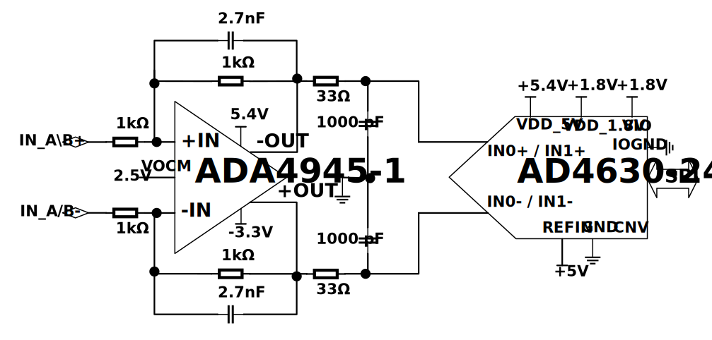
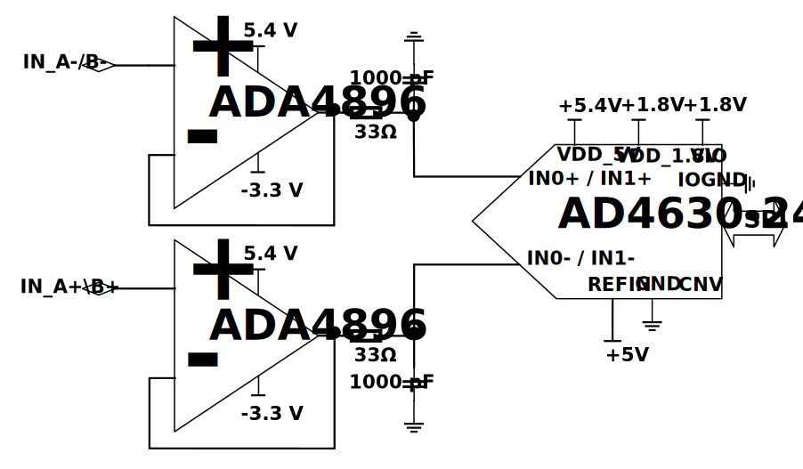
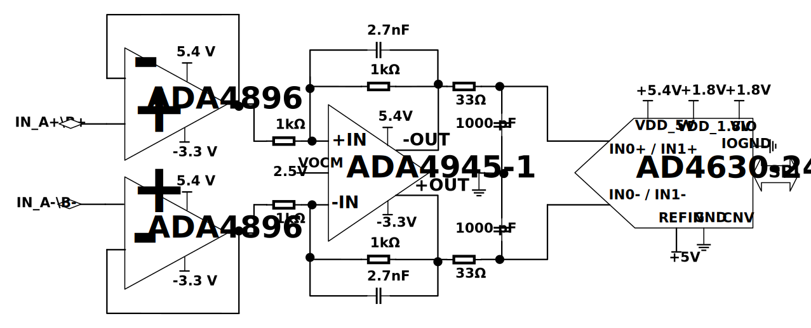

.. _eval-ad463x-user-guide:

User guide
===============================================================================

Evaluation boards available
-------------------------------------------------------------------------------

Two different EVAL board revisions have been released on the market for
AD4630-24
and AD4630-16, the old Rev C which is obsolete and the new revision, Rev E. On
the other hand, there is only one existing revision for AD4030-24, Rev A/B,
which is still available:

AD4630-24 and AD4630-16 Rev C (Obsolete)
~~~~~~~~~~~~~~~~~~~~~~~~~~~~~~~~~~~~~~~~~~~~~~~~~~~~~~~~~~~~~~~~~~~~~~~~~~~~~~~

-  Two differential input channels with SMA connectors
-  A high precision buffered band gap 5 V reference
   (:adi:`LTC6655 <en/products/ltc6655.html>`).
-  An analog front end (AFE) that provides signal conditioning and drive for the
   AD4630-24 and AD4630-16. The AFE can be configured to use either the
   :adi:`ADA4896-2 <en/products/ADA4896-2.html>` in a dual
   buffer configuration, or the
   :adi:`ADA4945-1 <en/products/ADA4945-1.html>`, a fully
   differential amplifier.
-  An optional 100 MHz clock source that provides a reference clock for the FPGA
   and ADC.
-  Full power supply solution that provides all the necessary voltage rails from
   a 12 V supply that is provided from the ZedBoard through the FMC connector.

.. figure:: images/eval_ad4630_16_top.jpg
   :align: center
   :width: 600

   EVAL-AD4630-24FMCZ and EVAL-AD4630-16FMCZ, Rev C

AD4630-24 and AD4630-16 Rev E
~~~~~~~~~~~~~~~~~~~~~~~~~~~~~~~~~~~~~~~~~~~~~~~~~~~~~~~~~~~~~~~~~~~~~~~~~~~~~~~

-  Two differential input channels with SMA connectors
-  A high precision, low power and low noise 5 V reference
   :adi:`ADR4550 <en/products/adr4550.html>`. There is also the option to mount
   a high precision buffered band gap 5 V reference, the
   :adi:`LTC6655 <en/products/ltc6655.html>`.
-  An analog front end (AFE) that provides signal conditioning and drive for the
   AD4630-24 and AD4630-16. The AFE can be configured to use either the
   :adi:`ADA4896-2 <en/products/ADA4896-2.html>` in a dual
   buffer configuration, or the
   :adi:`ADA4945-1 <en/products/ADA4945-1.html>`, a fully
   differential amplifier.
-  Multiple different input configurations with the amplifier
   :adi:`ADA4896-2 <en/products/ADA4896-2.html>`
-  An optional 100 MHz clock source that provides a reference clock for the FPGA
   and ADC.
-  New form factor and improved full power supply solution that provides all the
   necessary voltage rails from a 12 V supply that is provided from the ZedBoard
   through the FMC connector.
-  Extra connectors to supply the board externally if needed.

.. important::

   New boards EVAL-AD4630-24FMCZ and EVAL-AD4630-16FMCZ REV E have a date code
   bigger than DC>2435

.. figure:: images/cb_ad464030_24fmcz_top_evaluation_board.jpg
   :align: center
   :width: 600

   EVAL-AD4630-24FMCZ and EVAL-AD4630-16FMCZ, Rev E

AD4030-24 Rev A/B
~~~~~~~~~~~~~~~~~~~~~~~~~~~~~~~~~~~~~~~~~~~~~~~~~~~~~~~~~~~~~~~~~~~~~~~~~~~~~~~

-  One differential input channel with SMA connectors
-  A high precision buffered band gap 5 V reference
   (:adi:`LTC6655 <en/products/ltc6655.html>`).
-  An analog front end (AFE) that provides signal conditioning and drive for the
   AD4030-24. The AFE can be configured to use either the
   :adi:`ADA4896-2 <en/products/ADA4896-2.html>` in a dual
   buffer configuration, or the
   :adi:`ADA4945-1 <en/products/ADA4945-1.html>`, a fully
   differential amplifier.
-  An optional 100 MHz clock source that provides a reference clock for the FPGA
   and ADC.
-  Full power supply solution that provides all the necessary voltage rails from
   a 12 V supply that is provided from the ZedBoard through the FMC connector.

.. figure:: images/eval_ad4030_24_top.jpg
   :align: center
   :width: 400

   EVAL-AD4030-24FMCZ, Rev A/B

Full descriptions of these products are available in their respective data
sheets, which should be consulted when using the evaluation board.

Custom board design requirements
-------------------------------------------------------------------------------

The evaluation boards have been designed to work with off-the-shelf 3rd party
system boards that can be used to manage the data capture process as well as
host embedded applications development. The DUT board may be either the
evaluation board for the AD463x/AD403x, or a board that the user has designed.
The only requirements for the user-designed board are:

#. The board should have an FMC connector.
#. The digital interface through the FMC connector should use the
   same pin and signal assignments used on the
   EVAL-AD4630-24FMCZ/EVAL-AD4030-24FMCZ board (see
   :adi:`EVAL-AD4630-24 <en/design-center/evaluation-hardware-and-software/evaluation-boards-kits/EVAL-AD4630-24.html#eb-documentation>`
   /
   :adi:`EVAL-AD4030-24 <en/design-center/evaluation-hardware-and-software/evaluation-boards-kits/EVAL-AD4030-24.html>`
   for schematics). Otherwise, changing these assignments will
   require a modification of the HDL and a recompile. ADI provides
   the source files for the FPGA HDL, but it cannot support debug
   of user modifications to the source.
#. It is recommended that the board provide a reference clock
   (100 MHz or less); see the Clock Circuit section below for more
   information on the reference clock requirements.
#. It is recommended to derive the digital IO voltage from the
   ZedBoard. The EVAL-AD4630-24FMCZ schematics provide an example
   of this.
#. Optional: The ZedBoard provides a 12 V supply rail through the
   FMC connector which can be used to provide the main power supply
   for the user board. However, the latter may also be powered from
   a separate external supply.

Hardware guide
-------------------------------------------------------------------------------

Evaluation Board Hardware (Rev C and AD4030-24 Rev A/B)
~~~~~~~~~~~~~~~~~~~~~~~~~~~~~~~~~~~~~~~~~~~~~~~~~~~~~~~~~~~~~~~~~~~~~~~~~~~~~~~

.. figure:: images/zedboard_ad4630_16_setup.jpg
   :align: center
   :width: 600

   EVAL-AD4630-XXFMCZ Evaluation System

Power Supplies
^^^^^^^^^^^^^^^^^^^^^^^^^^^^^^^^^^^^^^^^^^^^^^^^^^^^^^^^^^^^^^^^^^^^^^^^^^^^^^^

The primary 12 V supply to the EVAL-AD4X30-XXFMCZ comes from the ZedBoard
through the FMC connector. 12 V is regulated down to an intermediate voltage
with a switcher and then is post regulated down to the various voltage rails.
12 V is also used to generate the negative rails for the buffers and final drive
amplifiers.

Each of the voltage rails are brought out to turrets so they can be easily
measured. A bench supply can be used to drive these turrets to supply the
evaluation board manually. This is useful if a current measurement is required.
Each supply is decoupled where it enters the board and at each device. A single
ground plane is used on this board to minimize the effect of high frequency
interference. The voltage ranges listed in the table below represent the
expected ranges for the board. If the user desires to connect external supplies
to the board, the amplifier data sheets and the
:adi:`AD4630-24 datasheet <en/products/AD4630-24.html>`,
:adi:`AD4030-24 datasheet <en/products/AD4030-24.html>` or
:adi:`AD4630-16 datasheet <en/products/AD4630-16.html>` should
be consulted to ensure that the external supply values comply with the device
requirements.

.. list-table:: On-Board Power Supplies (Rev C and AD4030-24 Rev A/B)
   :header-rows: 1
   :widths: 15 45 15 15

   * - Power Supply
     - Function
     - Min. (V)
     - Max. (V)
   * - +12V
     - 12 V primary supply via FMC connector
     - N/A
     - N/A
   * - GND
     - Ground connection
     - N/A
     - N/A
   * - +3.3V
     - 3.3 V for various digital logic
     - 3.26
     - 3.33
   * - +1.8V
     - 1.8 V for the ADC
     - 1.77
     - 1.81
   * - VIO
     - 1.8 V supply for the ADC digital I/O
     - 1.8
     - 1.87
   * - +5V
     - 5 V for the ADC
     - 5.26
     - 5.4
   * - REFIN
     - 5 V ADC reference input
     - 4.95
     - 5.05
   * - VAMP+
     - Positive supply for the amplifiers
     - 5.36
     - 5.47
   * - VAMP-
     - Negative supply for the amplifiers
     - -3.5
     - -3.28
   * - VP1
     - 5.7 V at the input of the switcher
     - 5.45
     - 5.75
   * - REF
     - 5 V at the ADC reference output
     - 4.95
     - 5.05
   * - EN
     - 1.8 V enable signal for the power supplies
     - 1.75
     - 1.85

Reference Circuit
^^^^^^^^^^^^^^^^^^^^^^^^^^^^^^^^^^^^^^^^^^^^^^^^^^^^^^^^^^^^^^^^^^^^^^^^^^^^^^^

By default, the on-board LTC6655 provides a 5 V reference to the AD4630-24,
AD4030-24 and AD4630-16. It drives the REFIN pin of the ADC through an R-C
filter (R=100 Ohm, C=1 uF) that reduces low frequency noise. The REFIN pin is
connected to an internal buffer, eliminating the need for an external buffer.
However, if the user desires to use an external reference that drives the
internal buffer, it can be attached to the EXT REF SMA connector (see figure
below). R137 should be populated with a zero ohm resistor, and R136 should be
open. The internal buffer can be bypassed by attaching an external reference to
the REF turret on the board. To reduce the ADC power consumption, the internal
reference buffer can be disabled (see respective product's data sheet).

.. figure:: images/ad4630_ref_ckt.png
   :align: center
   :width: 400

   EVAL-AD4X30-XXFMCZ reference circuit (AD4630-24 shown)

Clock Circuit
^^^^^^^^^^^^^^^^^^^^^^^^^^^^^^^^^^^^^^^^^^^^^^^^^^^^^^^^^^^^^^^^^^^^^^^^^^^^^^^

The ZedBoard uses a 100 MHz reference clock to generate its internal clocks as
well as the sample clock for the AD4630-24, AD4030-24 or AD4630-16. To simplify
system operation an on-board 100 MHz, low-jitter crystal oscillator (XO) on the
EVAL-AD4X30-XXFMCZ board supplies this clock as the default configuration, as
shown in the figure below. To use an external clock source, remove R55 and
connect an external clock source to J1, the CLK IN SMA. **The external clock
frequency must be < 100 MHz**. The user should take care to use a low jitter
clock source to achieve best system performance. The external clock level should
be 10 to 12 dBm.

.. figure:: images/eval_ad4630_24_clk_ckt.png
   :align: center
   :width: 400

   EVAL-AD4X30-XXFMCZ clock circuit (AD4630-24 shown)

Analog Front End
^^^^^^^^^^^^^^^^^^^^^^^^^^^^^^^^^^^^^^^^^^^^^^^^^^^^^^^^^^^^^^^^^^^^^^^^^^^^^^^

The EVAL-AD4X30-XXFMCZ has a flexible driver network that can be configured for
a variety of topologies. The default network is shown in
:numref:`fig-differential-afe-rev-c`, in which the
ADA4945-1 fully differential amplifier is driving the ADC. It can accommodate
both single-ended and differential signal sources, and drives the ADC
differentially. As populated, it has a unity gain. When using a single-ended
source, the unused input should be terminated with the equivalent source
impedance.

.. note::

   As implemented, the ADA4945-1 driver on the evaluation board preserves the
   differential value of IN+ - IN- (with appropriate gain scaling applied), but
   inverts the signal polarity that is injected to the ADC. Hence, if a positive
   DC signal is applied to the input, it should be attached to IN_A/B-, and
   likewise, a negative DC signal should be attached to IN_A/B+ to preserve the
   signal polarity.

   Differential Driver AFE, default (AD4630-24 shown)

.. list-table:: Default AFE Configuration
   :header-rows: 1
   :widths: 40 60

   * - Function
     - Single ended to differential via differential amplifier
   * - Comments
     - Best distortion
   * - Required changes from default configuration
     - No changes required

A second topology can be seen in
:numref:`fig-dual-buffer-afe-rev-c`. This topology consists of a pair of
unity gain buffers, the ADA4896-2. It also can be driven by either a
single-ended or differential source. This network is ideal for observing the
best noise performance of the AD4630-16, due to the low voltage and current
noise of the ADA4896-2 (1 nV/rtHz and 2.8 pA/rtHz, respectively). It also
offers a common mode input impedance of 10 MOhm and a wide input common mode
voltage range of -4.9 V to +4.1 V (when using +/- 5 V supplies).

.. note::

   This driver circuit also inverts the polarity of the input signal. To
   preserve polarity when measuring DC voltages, connect a positive voltage to
   IN_A/B-. Likewise, a negative DC voltage should be connected to IN_A/B+.

   Dual Buffer AFE (AD4630-24 shown)

.. list-table:: Unity Gain Dual Buffer Configuration
   :header-rows: 1
   :widths: 40 60

   * - Function
     - Differential input using buffer amplifiers
   * - Comments
     - Best noise and relaxed drive requirement for signal source
   * - Required changes from default configuration
     - Remove: R10, R12, R119, R120, R121 and R122 (Ch. A); R20, R22, R123,
       R124, R125 and R126 (Ch. B). Install: R31, R33, R47 and R49 (Ch. A);
       R60, R62, R75 and R78 (Ch. B)

:numref:`fig-high-impedance-afe-rev-c` shows a driver network which combines
the ADA4896-2 with the
ADA4945-1. This circuit is ideal for applications that require a high input
impedance along with gain to maximize the input range of the ADC. The gain of
the ADA4945-1 can be modified by changing either the feedback resistors or input
resistors.

   High Impedance Buffer with Gain AFE (AD4630-24 shown)

.. list-table:: High Impedance with Gain Configuration
   :header-rows: 1
   :widths: 40 60

   * - Function
     - High impedance input with gain
   * - Comments
     - Relaxed drive requirements from signal source plus signal scaling.
   * - Required changes from default configuration
     - Remove: R120, R121 (Ch. A); R124, R125 (Ch. B). Install: R31, R127, R28,
       R47, R128 and R43 (Ch. A); R60, R129, R57, R78, R130 and R72 (Ch. B)

:numref:`fig-direct-drive-rev-c` shows an input configuration that allows
the AD4630-16 to be directly driven from the SMA connectors. This enables
testing with alternative driver configurations mounted on an external PCB.

.. figure:: images/ad4630_direct_drive_ckt.png
   :align: center
   :width: 600
   :name: fig-direct-drive-rev-c

   Direct Driven Inputs (AD4630-24 shown)

.. list-table:: Direct Drive Configuration
   :header-rows: 1
   :widths: 40 60

   * - Function
     - Direct input path
   * - Comments
     - Supports evaluation with an alternative driver
   * - Required changes from default configuration
     - Remove: R10, R12, R119 and R122 (Ch A); R20, R22, R123, R126 (Ch B).
       Install: R28, R29, R120, R121, R43 and R44 (Ch A); R124, R57, R58,
       R125, R72 and R73 (Ch B)

Evaluation Board Hardware (Rev E)
~~~~~~~~~~~~~~~~~~~~~~~~~~~~~~~~~~~~~~~~~~~~~~~~~~~~~~~~~~~~~~~~~~~~~~~~~~~~~~~

.. figure:: images/zedboard_ad4630_24_setup.png
   :align: center
   :width: 600

   EVAL-AD4630-XXFMCZ Evaluation System (Rev E)

Power Supplies
^^^^^^^^^^^^^^^^^^^^^^^^^^^^^^^^^^^^^^^^^^^^^^^^^^^^^^^^^^^^^^^^^^^^^^^^^^^^^^^

The primary 12 V supply to the EVAL-AD4X30-XXFMCZ comes from the ZedBoard
through the FMC connector. 12 V is regulated down to an intermediate voltage,
+7.5 V, with a switcher and then is post regulated down to the various voltage
rails. 12 V is also used to generate the negative rails, -3.3 V for the buffers
and final drive amplifiers.

Each of the voltage rails are brought out to turrets so they can be easily
measured. A bench supply can be used to drive these turrets to supply the
evaluation board manually. This is useful if a current measurement is required.
Each supply is decoupled where it enters the board and at each device. A single
ground plane is used on this board to minimize the effect of high frequency
interference. The voltage ranges listed in the table below represent the
expected ranges for the board. If the user desires to connect external supplies
to the board, the amplifier data sheets and the
:adi:`AD4630-24 datasheet <en/products/AD4630-24.html>`,
:adi:`AD4030-24 datasheet <en/products/AD4030-24.html>` or
:adi:`AD4630-16 datasheet <en/products/AD4630-16.html>` should
be consulted to ensure that the external supply values comply with the device
requirements.

.. list-table:: On-Board Power Supplies (Rev E)
   :header-rows: 1
   :widths: 15 45 15 15

   * - Power Supply
     - Function
     - Min. (V)
     - Max. (V)
   * - +12V
     - 12 V primary supply via FMC connector
     - N/A
     - N/A
   * - GND
     - Ground connection
     - N/A
     - N/A
   * - +3.3V
     - 3.3 V for various digital logic
     - 3.26
     - 3.33
   * - +1.8V
     - 1.8 V for the ADC
     - 1.77
     - 1.81
   * - VIO
     - 1.8 V supply for the ADC digital I/O
     - 1.77
     - 1.81
   * - +5.4V
     - 5.4 V for the ADC
     - 5.34
     - 5.46
   * - REFIN
     - 5 V ADC reference input
     - 4.95
     - 5.05
   * - VAMP+
     - Positive supply for the amplifiers
     - 6.35
     - 6.5
   * - VAMP-
     - Negative supply for the amplifiers
     - -3.35
     - -3.28
   * - VP1
     - 7.5 V at the input of the switcher
     - 7.425
     - 7.575
   * - REF
     - 5 V at the ADC reference output
     - 4.95
     - 5.05
   * - EN
     - 1.8 V enable signal for the power supplies
     - 1.75
     - 1.85

The following block diagram shows all the different power supplies options
available in the new evaluation board. If necessary, it is possible to
supply all the LDOs directly with external power supplies via J7 and J8. There
are also two different options to generate the -3.3 V although only the LT3093
is mounted on the board.

.. figure:: images/powertree.png
   :align: center
   :width: 600

   Power-tree

Reference Circuit
^^^^^^^^^^^^^^^^^^^^^^^^^^^^^^^^^^^^^^^^^^^^^^^^^^^^^^^^^^^^^^^^^^^^^^^^^^^^^^^

By default, the on-board ADR4550 provides a 5 V reference to the AD4630-24 and
AD4630-16. It drives the REFIN pin of the ADC through an R-C filter (R=100 Ohm,
C=22 uF) that reduces the low frequency noise. The REFIN pin is connected to an
internal buffer, eliminating the need for an external buffer. However, if the
user desires to use an external reference that drives the internal buffer, it
can be attached to the J5 SMA connector (see figure below). R124 should be
populated with a zero ohm resistor, and R116 and R123 should be open. The
internal buffer can be bypassed by attaching an external reference to the REF
turret on the board. To reduce the ADC power consumption, the internal reference
buffer can be disabled (see respective product's data sheet). There is also the
option to mount the LTC6655 or the LTC6655LN reference which is suitable to use
together with the unbuffered input of the ADC.

.. figure:: images/reference2.png
   :align: center
   :width: 600

   EVAL-AD4630-XXFMCZ reference circuit (AD4630-24 shown)

Clock Circuit
^^^^^^^^^^^^^^^^^^^^^^^^^^^^^^^^^^^^^^^^^^^^^^^^^^^^^^^^^^^^^^^^^^^^^^^^^^^^^^^

The ZedBoard uses a 100 MHz reference clock to generate its internal clocks as
well as the sample clock for the AD4630-24 or AD4630-16. To simplify system
operation an on-board 100 MHz, low-jitter crystal oscillator (XO) on the
EVAL-AD4630-XXFMCZ board supplies this clock as the default configuration, as
shown in the figure below. To use an external clock source, remove R1 and
connect an external clock source to J6, the CLK IN SMA. **The external clock
frequency must be < 100 MHz**. The user should take care to use a low jitter
clock source to achieve best system performance. The external clock level should
be 10 to 12 dBm.

.. figure:: images/clock_diagram.png
   :align: center
   :width: 600

   EVAL-AD4630-XXFMCZ clock circuit (AD4630-24 shown)

Analog Front End
^^^^^^^^^^^^^^^^^^^^^^^^^^^^^^^^^^^^^^^^^^^^^^^^^^^^^^^^^^^^^^^^^^^^^^^^^^^^^^^

The EVAL-AD4630-XXFMCZ has a flexible driver network that can be configured for
a variety of topologies. The default network is shown in
:numref:`fig-differential-afe-rev-e`, in which the
ADA4945-1 fully differential amplifier is driving the ADC. It can accommodate
both single-ended and differential signal sources, and drives the ADC
differentially. As populated, it has a unity gain. When using a single-ended
source, the unused input should be terminated with the equivalent source
impedance.

.. note::

   As implemented, the ADA4945-1 driver on the evaluation board preserves the
   differential value of IN+ - IN- (with appropriate gain scaling applied), but
   inverts the signal polarity that is injected to the ADC. Hence, if a positive
   DC signal is applied to the input, it should be attached to IN_A/B-, and
   likewise, a negative DC signal should be attached to IN_A/B+ to preserve the
   signal polarity.

.. figure:: images/differential.png
   :align: center
   :width: 600
   :name: fig-differential-afe-rev-e

   Differential Driver AFE, default (AD4630-24 shown)

.. list-table:: Default AFE Configuration (Rev E)
   :header-rows: 1
   :widths: 40 60

   * - Function
     - Single ended to differential via differential amplifier
   * - Comments
     - Best distortion
   * - Required changes from default configuration
     - No changes required

There is one buffer used to generate common mode voltage, U26. The voltage can
be adjusted from 0 V to Vref by selecting correctly the ratio between R98,
(or R122 or R99) and R5.

.. figure:: images/vocm.png
   :align: center
   :width: 600

   Common mode voltage generation

A second topology can be seen in
:numref:`fig-dual-buffer-afe-rev-e`. This topology consists of a pair of
unity gain buffers, the ADA4896-2. It also can be driven by either a
single-ended or differential source. This network is ideal for observing the
best noise performance of the AD4630-16, due to the low voltage and current
noise of the ADA4896-2 (1 nV/rtHz and 2.8 pA/rtHz, respectively). It also
offers a common mode input impedance of 10 MOhm and a wide input common mode
voltage range of -4.9 V to +4.1 V (when using +/- 5 V supplies). To use the
full span of the ADC the input signal of each buffer needs to be centered at
2.5 V.

.. figure:: images/single_ended_config1.png
   :align: center
   :width: 600
   :name: fig-dual-buffer-afe-rev-e

   Dual Buffer AFE

.. list-table:: Unity Gain Dual Buffer Configuration (Rev E)
   :header-rows: 1
   :widths: 40 60

   * - Function
     - Differential input using buffer amplifiers
   * - Comments
     - Best noise and relaxed drive requirement for signal source
   * - Required changes from default configuration
     - Remove: R17, R23, R19, R25, R42, R45, R44 and R48. Install: R114, R108,
       R112, R106, R139, R136, R137 and R134

If the signal generator connected to the inputs of the ADC cannot generate a DC
offset, there is the option to use the VOCM buffer to create a DC offset and
connect it to the non-inverting input of the ADA4896 amplifiers like
:numref:`fig-vocm-buffer-rev-e`.

.. figure:: images/config2.png
   :align: center
   :width: 600
   :name: fig-vocm-buffer-rev-e

   High Impedance Buffer with VOCM generated internally

.. list-table:: High Impedance Buffer with VOCM
   :header-rows: 1
   :widths: 40 60

   * - Function
     - High impedance input with gain
   * - Comments
     - Relaxed drive requirements from signal source plus DC offset.
   * - Required changes from default configuration
     - Remove: R17, R23, R19, R25, R42, R45, R44 and R48. Install: R114, R108,
       R112, R106, R139, R136, R137, R134, R120, R119, R103, R102, R142, R141,
       R132 and R131

Another option available (:numref:`fig-inverting-buffer-rev-e`) on the board
is to use the ADA4896 in an
inverting configuration with the possibility of connecting a DC offset on the
non-inverting pin. In this case it is necessary to have two input signals
delayed 180 degrees and select the correct resistor values to generate a 2.5 V
(R98 and R3) as VOCM.

.. figure:: images/config3.png
   :align: center
   :width: 600
   :name: fig-inverting-buffer-rev-e

   Inverting Buffer with VOCM generated internally

.. list-table:: Inverting Buffer with VOCM
   :header-rows: 1
   :widths: 40 60

   * - Function
     - High impedance input with gain
   * - Comments
     - Relaxed drive requirements from signal source plus DC offset.
   * - Required changes from default configuration
     - Remove: R17, R23, R19, R25, R42, R45, R44 and R48. Install: R126, R96,
       R112, R106, R145, R129, R137, R134, R120, R119, R103, R102, R142, R141,
       R132 and R131

:numref:`fig-direct-drive-rev-e` shows an input configuration that allows
the AD4630-16 to be directly driven from the SMA connectors. This enables
testing with alternative driver configurations mounted on an external PCB.

.. figure:: images/ad4630_direct_drive_ckt.png
   :align: center
   :width: 600
   :name: fig-direct-drive-rev-e

   Direct Driven Inputs (AD4630-24 shown)

.. list-table:: Direct Drive Configuration (Rev E)
   :header-rows: 1
   :widths: 40 60

   * - Function
     - Direct input path
   * - Comments
     - Supports evaluation with an alternative driver
   * - Required changes from default configuration
     - Remove: R17, R23, R19, R25, R42, R45, R44 and R48. Install: R121, R118,
       R104, R105, R143, R140, R133 and R130.

Controller board
~~~~~~~~~~~~~~~~~~~~~~~~~~~~~~~~~~~~~~~~~~~~~~~~~~~~~~~~~~~~~~~~~~~~~~~~~~~~~~~

The ZedBoard, which is the system controller board, enables the configuration of
the ADC and capture of data from the evaluation board by the PC via USB (or
Ethernet). The AD4X30-XX family of parts support a multi-lane serial port
interface (SPI) for each data converter channel. The SPI interface for each
channel is connected to the ZedBoard via the FMC connector (P1). The ZedBoard
functions as the communication link between the PC and connected evaluation
board. It buffers samples captured from the evaluation board in its DDR3 memory.
The ZedBoard requires power from a 12 V wall adapter (included with the
ZedBoard). It hosts a Xilinx Zynq 7020 SoC, which contains two ARM Cortex-A9
Processors and a Series-7 FPGA with 85k Programmable Logic cells. A Linux OS
runs on the host processor system. It communicates with the PC through either a
USB 2.0 high speed port or a 10/100/1000 Ethernet port. The default software
configuration uses USB.

Schematic, PCB Layout, Bill of Materials
-------------------------------------------------------------------------------

-  :adi:`EVAL-AD4630-24 Rev E Design Files <media/en/evaluation-documentation/evaluation-design-files/eval-ad4630-24-fmcz-design-files.zip>`
-  :adi:`EVAL-AD4630-16/24 Design Files <media/en/evaluation-documentation/evaluation-design-files/eval-ad4630-24-design-files.zip>`
-  :adi:`EVAL-AD4030-24 Design Files <media/en/evaluation-documentation/evaluation-design-files/eval-ad4030-24-design-files.zip>`

The design file package contains the following:

-  Schematics
-  PCB Layout
-  Bill of Materials

The evaluation board schematic and other board files can also be found on the
:adi:`EVAL-AD4630-16`, :adi:`EVAL-AD4630-24` and :adi:`EVAL-AD4030-24` web
pages.

Software guide
-------------------------------------------------------------------------------

Basic SW architecture
~~~~~~~~~~~~~~~~~~~~~~~~~~~~~~~~~~~~~~~~~~~~~~~~~~~~~~~~~~~~~~~~~~~~~~~~~~~~~~~

The AD463x evaluation board connects to the ZedBoard through an FMC connector.
This connector hosts the following signal groups:

-  The digital interface between the ADC and the host processor (SoC).
-  The digital I/O power supply rail.
-  12 V power from the ZedBoard to the evaluation board.
-  A high speed system clock used by the SoC, sourced on the evaluation board.

The ZedBoard hosts a Xilinx Zynq7000 class SoC with dual ARM Cortex-A9 hard
processors and FPGA fabric. The board boots from an SD card that is shipped
with each evaluation board.

Two use cases are supported for developing a custom application using the
EVAL-AD463x system. They are basically distinguished by the nature of the host
processor for the ADC. ADI provides software components that support both use
cases. The following table summarizes the use cases and ADI software components.

.. list-table:: Use cases and supporting SW components
   :header-rows: 1
   :widths: 25 25 50

   * - Host processor
     - Host Environment
     - Available SW Components
   * - SoC + FPGA
     - Embedded Linux
     - Linux image, Linux device drivers, HDL
   * - Microcontroller
     - Embedded RTOS/No RTOS
     - No OS drivers

The **SD card** image that ships with the evaluation board contains multiple
files that can be used to reconfigure the personality of the system to match one
of the valid operating modes of the ADC. The /boot directory contains a Linux
image (see below), a boot.bin file which contains the FPGA configuration (among
other files), and a device tree file (device.dtb). The latter two files together
define the operating configuration of the system. For most user-developed
applications, the configuration files provided on the SD card, along with tools
that can be used to set the desired configuration, are sufficient, meaning the
user should not need to build a unique Linux image, rebuild HDL, or manually
modify the devicetree.dtb file.

The following paragraphs provide additional details on the nature of
these files.

-  An ADI-maintained Kuiper **Linux** distribution (uImage). Currently, the
   version that is installed on the SD card is customized to support product
   evaluation and has features that enable compatibility with
   :adi:`ACE <en/design-center/evaluation-hardware-and-software/evaluation-development-platforms/ace-software.html>`.
   Like the standard Kuiper Linux image, it also includes IIO support, which
   consists of:

   -  **LibIIO subsystem** - a library of IIO functions that are used to create
      custom device drivers that run within the Linux system (see
      :doc:`LibIIO </software/libiio/index>`
      for more details). These drivers have already been generated for the
      AD463x/AD4030x and incorporated in the uImage file.
   -  **IIOD** - An IIO daemon that exposes IIO devices over a network
      connection to a remote host.

More information on the general Kuiper Linux distribution can be found at
:doc:`ADI Kuiper Linux </linux/kuiper/index>`.

-  **Device tree file** that describes the attributes of the AD4630/AD4030
   configuration. The attributes of the ADC node in the device tree set the
   clocking mode (SPI or Echo), data rate (single or dual edge), output data
   format (see data sheet), and number of active lanes per channel (1, 2, or 4).
   During boot, the system loads the device.dtb file contained in the boot
   directory. If the operating configuration of the ADC needs to be changed, the
   device tree must be updated with the new ADC attributes.

-  **BOOT.BIN** files that are used to configure the FPGA. The default boot.bin
   file in the boot directory will correspond to a specific interface operating
   mode, distinguished by clocking mode (SPI vs. Echo), number of active lanes
   per channel (1, 2, or 4), and data rate (SDR vs. DDR). **The boot.bin must
   be synchronized to the ADC attributes in the device tree**. Unique boot.bin
   files have been pre-generated and stored on the SD card for several different
   configurations. :numref:`table-bootbin-configurations` lists the available
   configurations (boot.bin files) that correspond to clocking modes, lanes,
   data rate mode. These files are
   available on the SD card in sub-directories that are labeled according to the
   configuration. This simplifies the HDL architecture and avoids the
   introduction of bugs due to unnecessary complexity.

.. list-table:: BOOT.BIN configurations for AD4630/AD4030
   :name: table-bootbin-configurations
   :header-rows: 1
   :widths: 20 30 20 30

   * - Clocking Mode
     - Lane Mode (per channel)
     - Data Rate
     - Requires unique BOOT.BIN
   * - SPI
     - 1
     - Single (SDR)
     - X
   * -
     - 2
     - SDR
     - X
   * -
     - 4
     - SDR
     - X
   * - Echo Clock
     - 1
     - SDR
     - X
   * -
     -
     - Dual (DDR)
     - X
   * -
     - 2
     - SDR
     - X
   * -
     -
     - DDR
     - X
   * -
     - 4
     - SDR
     - X
   * -
     -
     - DDR
     - X

Linux Driver
~~~~~~~~~~~~~~~~~~~~~~~~~~~~~~~~~~~~~~~~~~~~~~~~~~~~~~~~~~~~~~~~~~~~~~~~~~~~~~~

The user guide for the AD463x family Linux driver can be found here:
:external+linux:doc:`AD463x Linux Driver User Guide <drivers/iio-adc/ad463x>`.
The user guide provides:

-  links to the driver source code and device tree;
-  an overview of the AD463x device tree options and their attributes;
-  examples of how to test the driver using console commands;
-  examples on how to directly access device registers for debug;
-  other links to resources that have more information on IIO usage.

HDL
~~~~~~~~~~~~~~~~~~~~~~~~~~~~~~~~~~~~~~~~~~~~~~~~~~~~~~~~~~~~~~~~~~~~~~~~~~~~~~~

The AD463x HDL user guide can be found here:
:external+hdl:ref:`ad4630_fmc`.
The HDL user guide provides a high level description of the AD4630 HDL
architecture, functionality, a link to the source file repository, and how to
build a desired boot.bin configuration.
:numref:`table-bootbin-configurations` lists all of the
preconfigured modes, so in most cases it is not necessary for the user to build
a unique boot.bin file.

.. note::

   The currently available boot.bin options only support **Zone 2 capture**, as
   this enables relaxed timing requirements for the interface. See the ADC data
   sheet for a description of Zone 2 capture.

No-OS Drivers
~~~~~~~~~~~~~~~~~~~~~~~~~~~~~~~~~~~~~~~~~~~~~~~~~~~~~~~~~~~~~~~~~~~~~~~~~~~~~~~

The No-OS driver can be used in a bare metal application or in a non-Linux RTOS
environment. Some customization, or creation of an adaptation layer for the
specific platform may be required. The
:external+no-OS:doc:`projects/adc/ad463x_fmcz`
provides a general description of the driver, code documentation, and source
code links.

How to modify the SD card image
~~~~~~~~~~~~~~~~~~~~~~~~~~~~~~~~~~~~~~~~~~~~~~~~~~~~~~~~~~~~~~~~~~~~~~~~~~~~~~~

Users that are developing a custom application for the AD4630/AD4030 outside the
ACE environment, using the ZedBoard running Linux, can modify the boot image to
match one of the existing configurations listed in
:numref:`table-bootbin-configurations`. You can alter the
configuration inside of the board view of the AD4630-24 ACE plugin, click apply,
wait 30 seconds and the new configuration will load.

If SD card contents have been corrupted, or the user desires to create another
copy of the SD card image, instructions on how to program the SD card with a
replacement/new image can be found at
:external+kuiper:ref:`use-kuiper-image`.

System operational constraints
~~~~~~~~~~~~~~~~~~~~~~~~~~~~~~~~~~~~~~~~~~~~~~~~~~~~~~~~~~~~~~~~~~~~~~~~~~~~~~~

Sampling Frequency
^^^^^^^^^^^^^^^^^^^^^^^^^^^^^^^^^^^^^^^^^^^^^^^^^^^^^^^^^^^^^^^^^^^^^^^^^^^^^^^

The following table illustrates the maximum sampling rates that can be achieved
based on the device configuration. Note that the FPGA SPI engine only supports
Zone 2 data transfers from the AD4630/AD4030.

.. list-table:: Maximum sampling rate by device configuration
   :header-rows: 1
   :widths: 20 20 15 20 20

   * - Clocking Mode
     - Lane Mode (per channel)
     - Data Rate
     - Data Format
     - Max Sampling Rate
   * - SPI
     - 1
     - Single (SDR)
     - 32-bit
     - 1.75 MSPS :superscript:`1`
   * -
     -
     - SDR
     - 24-bit
     - 2 MSPS
   * -
     -
     - Dual (DDR)
     - 32 or 24-bit
     - 2 MSPS
   * -
     - 2
     - SDR or DDR
     - 32 or 24-bit
     - 2 MSPS
   * -
     - 4
     - SDR or DDR
     - 32 or 24-bit
     - 2 MSPS
   * - Echo Clock
     - 1
     - SDR
     - 32-bit
     - 1.75 MSPS :superscript:`1`
   * -
     -
     - SDR
     - 24-bit
     - 2 MSPS
   * -
     -
     - DDR
     - 32 or 24-bit
     - 2 MSPS
   * -
     - 2
     - SDR or DDR
     - 32 or 24-bit
     - 2 MSPS
   * -
     - 4
     - SDR or DDR
     - 32 or 24-bit
     - 2 MSPS

:superscript:`1` The sampling rate in Single lane, 32-bit output formats in SDR
mode are limited by the FPGA SPI engine. This is not a limitation of the
AD4630/AD4030 device.

The hardware is controlled and configured through the
:adi:`ACE Software <en/resources/evaluation-hardware-and-software/evaluation-development-platforms/ace-software.html>`.
ACE is a desktop software application that allows the evaluation and control of
multiple evaluation systems.

The evaluation board is also supported with the Libiio library. This library is
cross-platform (Windows, Linux, Mac) with language bindings for C, C#, Python,
and others. Applications that can be used with it are:

.. include-template:: ../common/using-iio-osc.rst.jinja

   has_linux: true
   has_no_os: false

.. include-template:: ../common/using-scopy.rst.jinja

Python
~~~~~~~~~~~~~~~~~~~~~~~~~~~~~~~~~~~~~~~~~~~~~~~~~~~~~~~~~~~~~~~~~~~~~~~~~~~~~~~

PyADI-IIO is an ADI maintained Python library of device specific abstraction
modules. Each device module supports the simplified development of Python
applications that use IIO by providing an API that takes care of many of the
underlying IIO details. This section describes information on using the PyADI
bindings for the AD4630/AD4030 family.

Installation
^^^^^^^^^^^^^^^^^^^^^^^^^^^^^^^^^^^^^^^^^^^^^^^^^^^^^^^^^^^^^^^^^^^^^^^^^^^^^^^

These instructions assume a fresh installation of all required software:

-  Download `latest version <https://www.python.org/downloads/>`_ of python3.
   The Python downloader should recognize the host operating system and then
   download the appropriate installer. If downloading for a different machine
   select the Python installer accordingly. (Do not run installer yet)
-  Run the installer as Administrator. During installation, **check "Add Python
   3.x.x to PATH" before clicking "Install Now"**

.. image:: images/ad4630_python_installation.png
   :align: center
   :width: 800

-  Optional Python install: download and install a Python distribution such as
   `Anaconda <https://www.anaconda.com/products/distribution>`_. Ensure to
   select the proper Python version and host operating system. Recommended -
   install a Python editor (eg.
   `PyCharm <https://www.jetbrains.com/pycharm/download/#section=windows>`_
   **community version**). One can also use
   `Spyder <https://www.spyder-ide.org/>`_ that comes with Anaconda.
-  Recommended - If using Anaconda, create a virtual environment for each
   project. Once the environment is created and activated, then:
-  Install **pyadi-iio**. If running Anaconda in Windows, run the Anaconda
   prompt and enter ``pip install pyadi-iio``. Detailed py-adi installation
   guide can be found
   :doc:`here </software/pyadi-iio/index>`.
-  PyADI-IIO updates are published quarterly. It is recommended to run **pip**
   quarterly to get the latest updates.

Running the AD463x/AD403x example Python scripts
^^^^^^^^^^^^^^^^^^^^^^^^^^^^^^^^^^^^^^^^^^^^^^^^^^^^^^^^^^^^^^^^^^^^^^^^^^^^^^^

Generic examples for AD463x/AD403x are available in the
:git-pyadi-iio:`source repo <examples/ad4630>`. The example code can be used for
either AD4630-24 or AD4030-24 (and derivatives). Set the device_name parameter
to ensure that channel operations are appropriately handled. Basic documentation
can be found at
`API documentation <https://analogdevicesinc.github.io/pyadi-iio/devices/>`_.

Note that python does not automatically scan for usb context or an IP address
unless a scan is embedded in the python script. If a ZedBoard is connected via
an ethernet cable, then the argument passed in the ADC device instantiation
statement is ``uri="ip:analog.local"`` which is the default host name for the
ZedBoard (see code example below). If the default hostname of the board has been
changed, this should be used instead. If using a USB connection to the board,
then pass the IP address for the USB port (see code example for alternative USB
connection below). The USB context/IP address can be read from the board by
opening a terminal/command-prompt on the PC and entering:

.. code-block:: bash

   iio_info -s

.. image:: images/ad4630_scan_usb_context.jpg
   :align: center
   :width: 800

As seen above, the USB argument can be either ``"usb:1.17.6"``, or
``"ip:169.254.26.1"`` to instantiate the device.

The generic examples can be downloaded and executed, or custom code (see below)
can be created.

.. code-block:: python

   # Import library
   import adi

   # Setup actual device from ad463x family
   device_name = "ad4630-24"

   # Instantiate ADC if using Ethernet connection
   adc = adi.ad4630(uri="ip:analog.local", device_name=device_name)
   # ADC instantiation if using USB
   # adc = adi.ad4630(uri="usb:1.17.6", device_name=device_name)

   # Configure properties
   adc.rx_buffer_size = 2**12  # Rx Buffer Size
   adc.sample_rate = 2000000  # Sampling Frequency

   # Get data
   data = adc.rx()

Troubleshooting
-------------------------------------------------------------------------------

A troubleshooting guide can be found at:
:external+kuiper:ref:`troubleshooting`.
The latter covers some tips related to ZedBoard startup and the SD card
containing the Kuiper Linux image.
