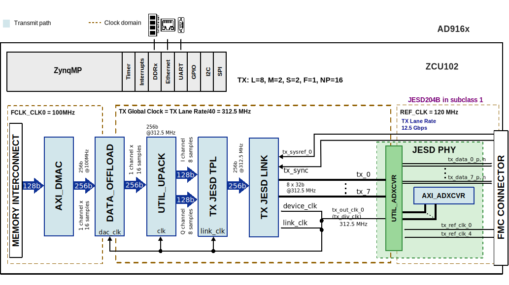

.. _eval-ad916x user-guide:

User guide
===============================================================================

This page summarizes the AD916x evaluation flow using the ADI HDL reference
design and links to the original board and project documentation.

Hardware guide
-------------------------------------------------------------------------------

.. figure:: images/eval-ad9162-top.PNG
   :align: center

   AD9162 Evaluation Board

General setup
~~~~~~~~~~~~~~~~~~~~~~~~~~~~~~~~~~~~~~~~~~~~~~~~~~~~~~~~~~~~~~~~~~~~~~~~~~~~~~~

The AD916x-FMC setup is validated on
:xilinx:`ZCU102 <products/boards-and-kits/ek-u1-zcu102-g.html>` through HPC0.
The evaluation board can be operated from the on-board clock generator or an
external clock source, depending on the JESD mode and lane-rate target.

   AD916x-FMC ZCU102 Block Diagram

Clock source selection
^^^^^^^^^^^^^^^^^^^^^^^^^^^^^^^^^^^^^^^^^^^^^^^^^^^^^^^^^^^^^^^^^^^^^^^^^^^^^^^

The HDL project documentation defines clock source jumper use for EVAL-AD916x:

.. list-table::
   :header-rows: 1

   * - Jumper
     - Position
     - Function
   * - JP1
     - Mounted
     - Use on-board clock generator
   * - JP1
     - Unmounted
     - Use external clock source

For example, AD9163 mode 2 builds at high lane rate may require external
clocking with JP1 removed.

SPI and control connectivity
^^^^^^^^^^^^^^^^^^^^^^^^^^^^^^^^^^^^^^^^^^^^^^^^^^^^^^^^^^^^^^^^^^^^^^^^^^^^^^^

In the AD916x HDL design on ZCU102, PS SPI0 is used to control these devices:

- AD9508
- ADF4355
- AD916x device

The HDL project also defines GPIO and interrupt mappings for ZCU102, including
DMA interrupt and JESD link interrupt paths.

Reference details are documented in the
:external+hdl:doc:`AD916x HDL project <projects/ad916x_fmc/index>` SPI section.

Schematic, PCB Layout, Bill of Materials
~~~~~~~~~~~~~~~~~~~~~~~~~~~~~~~~~~~~~~~~~~~~~~~~~~~~~~~~~~~~~~~~~~~~~~~~~~~~~~~

Design files for the EVAL-AD916X evaluation board include:

- Schematics
- PCB Layout
- Bill of Materials
- Design package

Please refer to the :adi:`EVAL-AD916X Product Page <EVAL-AD916X>` for
downloadable design files.

Software guide
-------------------------------------------------------------------------------

The evaluation board is supported with the Libiio library. This library is
cross-platform (Windows, Linux, Mac) with language bindings for C, C#, Python,
MATLAB, and others. One easy to example that can be used with it is:

- :ref:`iio-oscilloscope`
