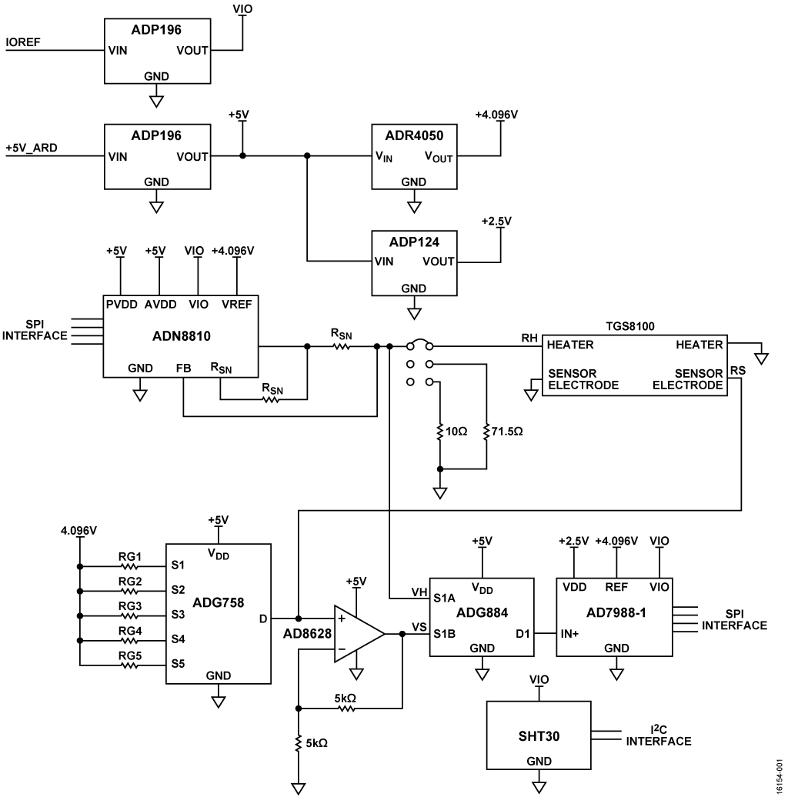

.. imported from: https://wiki.analog.com/resources/eval/user-guides/arduino-uno/reference_designs/demo_cn0395

.. _eval-cn0395-ardz:

EVAL-CN0395-ARDZ
=================

Volatile Organic Compound (VOC) Detector.

The :adi:`EVAL-CN0395-ARDZ <CN0395>` is an Arduino-compatible, single-supply,
16-bit volatile organic compound (VOC) detector using a metal oxide sensor.

   EVAL-CN0395-ARDZ functional block diagram

.. toctree::
   :hidden:

   hardware
   software

Table of Contents
-----------------

#. :doc:`Hardware Guide <hardware>`
#. :doc:`Software Demo <software>`

Overview
--------

:adi:`CN0395` measures indoor air quality by utilizing a metal oxide sensor to
detect gases composed of volatile organic compounds. The sensor is composed of a
heating resistor and a sensing resistor. When the sense resistor is heated, its
value changes as a function of the concentrations of different gases.

.. figure:: eval-cn0395-ardz.jpg
   :align: center
   :width: 500

   EVAL-CN0395-ARDZ evaluation board

The circuit uses the :adi:`ADN8810` current-output DAC to precisely control the
current running through the sensor to achieve within 1% voltage accuracy needed
for the heating element. The :adi:`AD7988-1` 16-bit SAR ADC measures the heater
voltage or sensor voltage, switched via the :adi:`ADG884` analog switch. The
:adi:`ADG758` 8-channel multiplexer provides gain ranging for the sensor
resistance measurement.

The default sensor is the Figaro TGS8100 metal oxide sensor. The sensor
requires two voltage inputs: heater voltage (VH) and circuit voltage (VC). The
heater voltage is applied to the integrated heater to maintain the sensing
element at a specific temperature optimal for sensing.

The hardware also includes a Sensirion SHT-30 temperature and humidity sensor
on the I2C bus for temperature compensation, since the TGS8100 sensor has
temperature and humidity dependency.

Supported Devices
-----------------

- :adi:`ADN8810` -- Programmable Current Source DAC
- :adi:`AD7988-1` -- 16-bit SAR ADC
- :adi:`ADG884` -- Analog Switch
- :adi:`ADG758` -- 8-Channel Multiplexer

Required Equipment
------------------

- EVAL-CN0395-ARDZ evaluation board (Arduino shield)
- :adi:`EVAL-ADICUP360` development board or Arduino R3 compatible processor
- Micro USB to USB cable
- PC or laptop with a USB port

For detailed hardware setup and connector configuration, see :doc:`hardware`.
For software demo and operating modes, see :doc:`software`.

Documents
---------

- :adi:`CN0395 Circuit Note <CN0395>`

Schematic, PCB Layout, Bill of Materials
----------------------------------------

.. admonition:: Download

   `EVAL-CN0395-ARDZ Design & Integration Files
   <https://www.analog.com/cn0395-designsupport>`__

   - Schematics
   - PCB Layout
   - Bill of Materials
   - Allegro Project

Help and Support
----------------

For questions and more information about this product, connect with us through
the Analog Devices :ez:`EngineerZone <ez/reference-designs>`.
