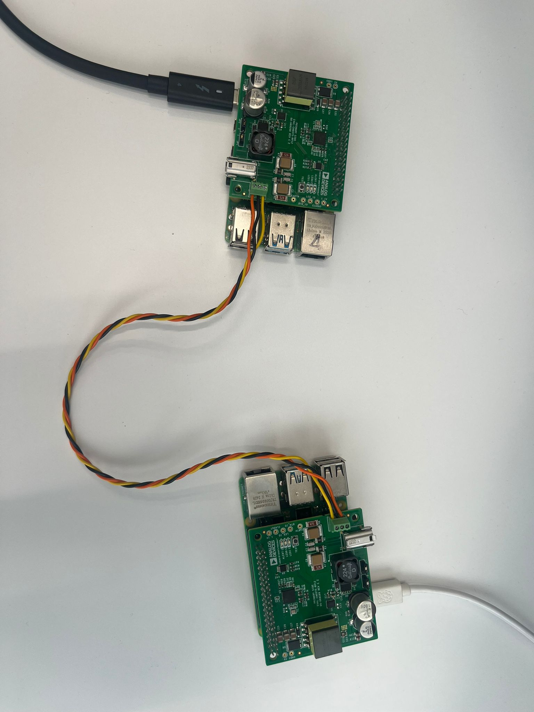

Blinky Application
=================

This sample application demonstrates a basic Blinky application using two :adi:`AD-CN0575-RPIZ` HATs 
interfaced with two Raspberry Pi computers. The application toggles the on-board LEDs of a HAT when 
the button is pressed on the other HAT.

Prerequisites
-------------

- Python 3.8 or newer (3.8–3.11 tested with pyadi-iio).  
  Ensure that a compatible version is installed on your system before continuing.  
  Older versions (<3.8) may not work reliably with pyadi-iio.

- Git command-line tools installed.

- Two Raspberry Pi computers with :adi:`Kuiper 2` image installed.
  Follow the instructions in the `Kuiper 2 User Guide <https://github.com/analogdevicesinc/adi-kuiper-gen/releases>`_
  to prepare the Raspberry Pi.

Hardware Setup
--------------

   Hardware Setup for Blinky Application

**Equipment Needed**

- 2x :adi:`AD-CN0575-RPIZ` Boards

- 2x Raspberry Pi 4 Model B running Kuiper 2

- 2x Raspberry Pi USB Type-C Power Supply (5V, 3A)

- 1x T1L Cable

**Setup Procedure**

1. Connect the power supply to each Raspberry Pi using the USB Type-C port.

2. Connect each :adi:`AD-CN0575-RPIZ` board to a Raspberry Pi via the 40-pin header.

3. Connect the two Raspberry Pi computers to the same network (Ethernet or Wi-Fi).

4. Connect the T1L cable between the two :adi:`AD-CN0575-RPIZ` boards.

5. Power on both Raspberry Pi computers with a 5V, 3A USB Type-C power supply.

Software Setup
--------------

Repository Cloning
~~~~~~~~~~~~~~~~~~

1. Clone the repository on both Raspberry Pi computers and checkout the *swiot* branch:

   .. shell::
      :user: analog
      :group: analog
      :show-user:

      $ git clone https://github.com/analogdevicesinc/pyadi-iio.git
      $ cd pyadi-iio
      $ git checkout swiot

2. Install Python dependencies:

   .. shell::
      :user: analog
      :group: analog
      :show-user:

      $ python3 -m venv ./venv
      $ source venv/bin/activate
      $ pip install -e .

Network Setup
~~~~~~~~~~~~~

The CN0575 HATs communicate over a network using UDP sockets. 
Each Raspberry Pi must be configured with a static IP address to ensure reliable communication.

You can configure the CN0575 HATs in two ways:

- **Manual static IP** 

These steps have to be repeated on both Raspberry Pi computers.

1. The set up a static IP address for the CN0575, the user has to modify the IPv4 address of the chosen network 
interface. This can be done using the *Advanced Network Configuration* application in the taskbar of the Kuiper 2 OS.

   .. figure:: eval-cn0575-rpiz-sample-application-static-network-settings-location.png

      :align: center
      :width: 500

      Network Settings Location

2. Next to the **interface** field select Wired connection corresponding to the wanted interface 
(e.g. **eth1**) and type in the chosen IP address in the IPv4 section as shown below:

   .. figure:: eval-cn0575-rpiz-sample-application-static-ip-addr-config.png
      :align: center
      :width: 500

      Static IP Address Configuration

3. The next step is to reset the ip link, which can be done by entering the following commands in a terminal:

   .. shell::
      :user: analog
      :group: analog
      :show-user:

      $ sudo ip link set eth1 down
      $ sudo ip link set eth1 up

   .. figure:: eval-cn0575-rpiz-sample-application-static-ip-link-reset.png
      :align: center
      :width: 500

      Result of resetting the ip link

4. If everything was done correctly, the interface should be up and running with the static IP address set. 
To verify this, enter the following command in the console, which should return the interface details:

   .. shell::
      :user: analog
      :group: analog
      :show-user:

      $ ip addr show eth1

   .. figure:: eval-cn0575-rpiz-sample-application-static-eth-result.png
      :align: center
      :width: 500

      Result of verifying the static IP address

- **NetworkManager profiles**

1. From the project folder, navigate to the ``host_setup`` directory on each Raspberry Pi.

2. Copy the connection profiles into NetworkManager's system folder:

- On the first Raspberry Pi

   .. shell::
      :user: analog
      :group: analog
      :show-user:

      $ sudo cp -v "Wired connection 2.nmconnection" /etc/NetworkManager/system-connections/

- On the second Raspberry Pi

   .. shell::
      :user: analog
      :group: analog
      :show-user:

      $ sudo cp -v "Wired connection 3.nmconnection" /etc/NetworkManager/system-connections/

   .. figure:: eval-cn0575-rpiz-sample-application-nm-network-setup.png
      :align: center
      :width: 500

      Result of copying the NetworkManager profiles

3. Ensure correct permissions:

- On the first Raspberry Pi

   .. shell::
      :user: analog
      :group: analog
      :show-user:

      $ sudo chmod 600 /etc/NetworkManager/system-connections/Wired\ connection\ 2.nmconnection

- On the second Raspberry Pi

   .. shell::
      :user: analog
      :group: analog
      :show-user:

      $ sudo chmod 600 /etc/NetworkManager/system-connections/Wired\ connection\ 3.nmconnection

   .. figure:: eval-cn0575-rpiz-sample-application-nm-network-chmod.png
      :align: center
      :width: 500

      Result of changing permissions on the NetworkManager profiles

4. Set autoconnect for the connections:

- On the first Raspberry Pi

   .. shell::
      :user: analog
      :group: analog
      :show-user:

      $ sudo nmcli connection modify "Wired connection 2.nmconnection" connection.autoconnect yes 

- On the second Raspberry Pi

   .. shell::
      :user: analog
      :group: analog
      :show-user:

      $ sudo nmcli connection modify "Wired connection 3.nmconnection" connection.autoconnect yes 

5. Reload NetworkManager on each Raspberry Pi:

   .. shell::
      :user: analog
      :group: analog
      :show-user:

      $ sudo nmcli connection reload

6. Verify the connections are active on each Raspberry Pi:

   .. shell::
      :user: analog
      :group: analog
      :show-user:

      $ nmcli connection show

   .. figure:: eval-cn0575-rpiz-sample-application-nm-nmcli-conn-show.png
      :align: center
      :width: 500

      Example of active NetworkManager connections

Application Execution
~~~~~~~~~~~~~~~~~~~~~

When executed, the demo continously reads the button state from one CN0575 HAT and 
toggles the LED state on the other CN0575 HAT accordingly, specifying 
the IP addresses and any changes that might have occurred to the button state on the 
terminal screen of each Raspberry Pi.

The IP addresses and UDP ports of both CN0575 HATs must be specified in the script.

Run the application on both Raspberry Pi computers:

- On the first Raspberry Pi:

   .. shell::
      :user: analog
      :group: analog
      :show-user:

      $ cd examples/cn0575
      $ source venv/bin/activate
      $ sudo python3 cn0591_2x_cn0575_button_blinky.py 192.168.97.10 5005 5006

- On the second Raspberry Pi:

   .. shell::
      :user: analog
      :group: analog
      :show-user:

      $ cd examples/cn0575
      $ source venv/bin/activate
      $ sudo python3 cn0591_2x_cn0575_button_blinky.py 192.168.97.11 5006 5005
      
   .. figure:: eval-cn0575-rpiz-sample-application-terminal-result.png
      :align: center
      :width: 500

      Example of terminal output showing button state changes

   .. figure:: eval-cn0575-rpiz-sample-application-terminal-result.gif
      :align: center
      :width: 500

      Running Blinky Application with Button Presses
