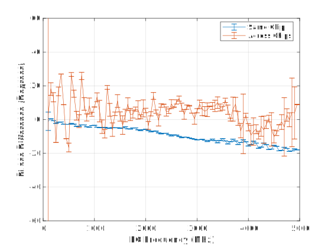
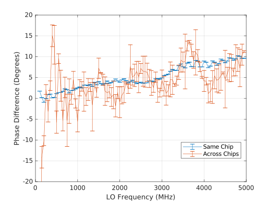
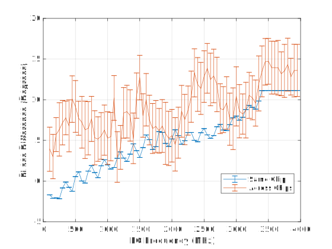

.. imported from: https://wiki.analog.com/resources/eval/user-guides/ad-fmcomms5-ebz/phase-sync

.. _ad-fmcomms5-ebz-phase-sync:

FMComms5 Phase Synchronization
==============================

Theory of Operation
-------------------

The AD9361 transceiver has no built-in functionality to provide phase
synchronization, but through external equipment and additional software and HDL
phase alignment can be achieved across multiple transceiver chips. The
calibration process is documented on the :doc:`multi-chip-sync`
page and as well in a whitepaper (may be available on the
:adi:`AD-FMCOMMS5-EBZ <AD-FMCOMMS5-EBZ>` product page) in the "Phase
Alignment" discussion.

The calibration procedures are implemented in both IIO-Scope and in a C library
libad9361. It can be useful to see how they are implemented, or if end-users
want additional debug to be extracted start at the following linked lines:

- :git-iio-oscilloscope:`IIO-Scope <plugins/fmcomms2_adv.c#L830>`
- :git-libad9361-iio:`libad9361 <ad9361_fmcomms5_phase_sync.c#L507>`

Note that both designs are implemented in slightly different ways.

External LO (ADF5355) vs Internal LO Generation
-----------------------------------------------

The AD9361 has no mechanism to phase align multiple transceivers together, even
when using an external LO. When using the internal LOs multiple transceivers
will have a random phase relationship, which will change when LO is changed,
sample rate is changed, gain (in some cases) is changed, and even during
quadrature tracking. When an external LO is used, like with the ADF5355 on the
FMComms5 development system, the transceiver still will have a random phase
relation, but it is limited to an 0 or 180 degree offset. This offset is due to
the input divider on the external LO input pins and cannot be bypassed. This
phase relationship is randomized when the transceivers are power cycled or the
power of the external LO is reduced to a certain point. This can happen even
with an unmuted ADF5355 during large frequency changes.

IIO-Scope Example Implementation
--------------------------------

For Rev-A and Rev-B FMComms5 boards, low LOs are recommended due to severe
attenuation from onboard RF switches used for calibration above 1 GHz. Be aware
on Rev-B and earlier, traces from the transceivers to the SMA connectors are
not matched. This can cause residual phase ambiguity depending on LO frequency
and tolerances required.

The following example assumes the board is brought up in the standard
configuration used by the driver. To guarantee this make sure IIO-Scope
profiles have been removed from the board. Close IIO-Scope on the development
system and removed the profile with command:

::

   rm ~/.osc_profile.ini

Then reboot the board.

On your host machine, run the same command as above for Linux and on Windows
remove the same file from:

::

   C:\Users\<username>\AppData\Local

Close IIO-Scope and reopen it once the board it booted. To verify the default
configuration, the sample rate should be at 30.72 MSPS with RF Bandwidth 18.00
MHz. All LOs should be at 2.4 GHz by default.

To calibrate FMComms5, perform the following within IIO-Scope:

- From the FMComms5 panel, match all LOs to the same frequency for all four
  datapaths
- Disable all receiver trackings: Quadrature, RF DC, and BB DC
- Put all receivers into **manual** Gain Control Mode
- Set manual hardware gains for all receivers to the same level within a
  reasonable range. With loopback cables connecting RX and TX and DDSs set to
  -18 dB RSSI should be ~37-43 dB. You should have something similar to the
  below figure.

.. image:: images/screenshot_20190530_143140.png
   :alt: Example Configuration
   :align: center
   :width: 1000

- From the FMComms2/3/4/5 Advanced (or AD936X Advanced) panel, select the
  FMComms5 tab. From here click the "Reset Calibration" button
- Click the "MCS Sync" button at the bottom
- Click the "Calibrate" button which will launch the procedure
- To maintain minimal ambiguity over time disable Quadrature tracking again in
  the FMComms5 panel

Once this completes, the DDSs used for calibration will remain on. To view the
relative sync, you can open a capture window to view received data on the SMA
connected receivers. The figure below was created with a FMComms5 configuration
with a matched splitter feeding into 3 channels driven by a single receiver.
SMA 4 was left disconnected. Standard SMA cables were used, not matched length
cables which will provide better performance.

.. image:: images/screenshot_20190530_141142.png
   :alt: Capture window showing relative phase sync across channels
   :align: center
   :width: 1000

libad9361 Example Implementation
--------------------------------

Trace Differences
-----------------

On Rev-A and Rev-B boards there are trace differences to the SMA which can
cause phase rotation. This rotation will be based on the operation frequency
of the LO unless you sample rate is close to the LO. We can calculate the
theoretical phase for what the maximum phase shift will be depending on your LO
with the following equation:

.. math::

   \phi = 360 \times D \times f/c

where :math:`\phi` is the phase difference in degrees, :math:`D` is the
distance in meters, :math:`f` is the frequency in hertz, and :math:`c` is
the speed of light through a specific medium in meters per second. For
FMComms5 :math:`c=15 cm/nsec` which is in reference to FR4. Grab the
:doc:`board files </solutions/reference-designs/fmcomms5/hardware>` for your
specific revision to get the actual trace lengths for specific channels, which
will determine :math:`D` . Below is a plot of possible offsets across frequency
and trace distance deltas.

.. image:: images/phasediff.png
   :alt: Phase difference over frequency and distance
   :align: center
   :width: 600

MATLAB code for plot

::

   dmils = (0:0.01:10).';
   meters = dmils\*2.54e-5;

   % Speed of light in FR4 15 cm/nsec
   c = 0.15; % m/nsec
   c = c\*1e9; % m/nsec * nsec/s
   f = [1,3,5,6,7,9].*1e9;
   phase = 180/pi\*meters\*2*pi\*f/c;

   %% Plot
   plot(dmils,phase);
   xlabel('Distance mil');
   ylabel('Phase Difference (Degrees)');
   grid on;
   l = {};
   for k = 1:length(f)
       l = [l(:)',{['F= ',num2str(f(k)/1e9),' GHz']}];
   end
   legend(l,'Location','best')
   xlim([0,8])
   title('$$\phi = \frac{180}{\pi} \times \frac{2 \pi D f}{c} =\frac{360 D f}{c}, c = 15 cm/nsec$$','interpreter','latex');

These phase estimates can be used to correct for trace mismatches, which can be
applied through internal phase shifters with the HDL reference designs'
:dokuwiki:`ADC </resources/tools-software/linux-drivers/iio-adc/axi-adc-hdl>`
and :dokuwiki:`DAC cores </resources/tools-software/linux-drivers/iio-dds/axi-dac-dds-hdl>`
by the calibphase properties.

Phase Performance: Rev B vs. Rev C
----------------------------------

Phase performance across frequency of phase difference with channel 1 as
reference. Note that matched cables were not used resulting in phase biasing.

Internal LO Rev B

Internal LO Rev C

External LO Rev C with ADF5355

